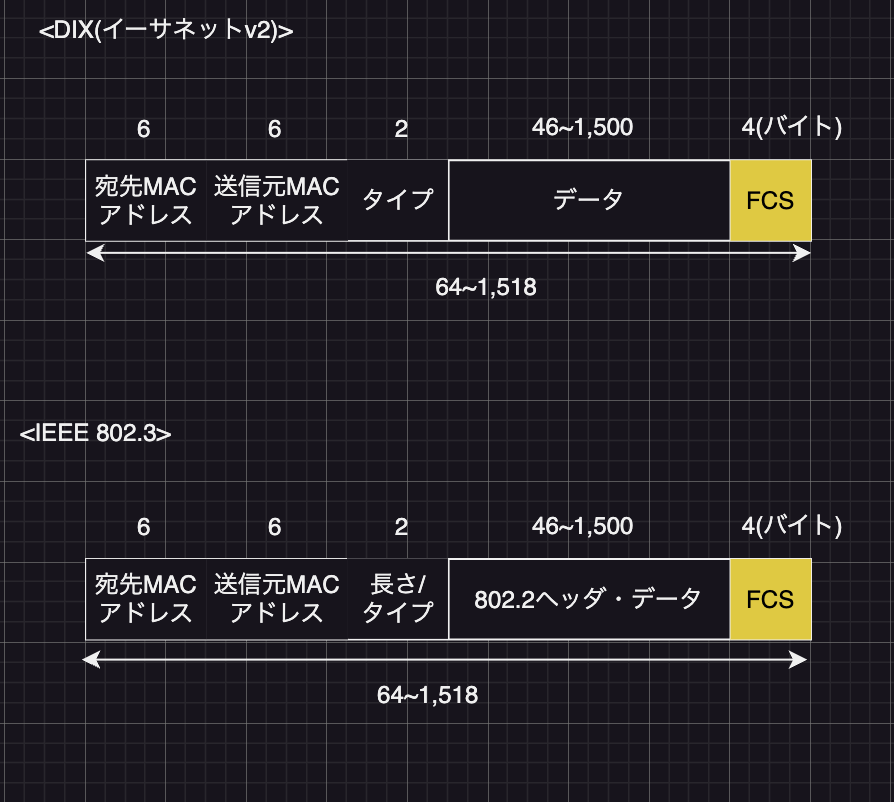

# イーサネット
コンピュータやネットワークの規格の一つ。現在のLANで最もよく使用されている

### `イーサネットの概要`
基本仕様は、OSI参照モデルの物理層とデータリンク層を規定している。原型は1970年代に米のロバート・メトカーフによって開発された。その後DEC、Intelも開発に加わりイーサネットの使用をまとめる。この仕様は3社の頭文字を取って**DIXイーサネット**と呼ばれ、1980年に標準規格として公開された。いくつかの仕様が改訂され最終的には1982年DIXイーサネットVer2.0の仕様が公開された。  
LANの標準化を推進するIEEE(米国電気電子技術者会)では、プロジェクトを発見した1980年2月にちなんで規格の名称を802とし、イーサネットに関する仕様は**IEEE802.3**で標準化している。  
イーサネットは当初、太い同軸ケーブルを使い建物内などの比較的狭い空間にある複数のコンピュータを相互接続するためのネットワークとして利用された。当時の伝送速度は最高10Mbps(当時は十分)。1990年代に入りPCの高速化と小型化が進み取り扱うデータが増えたことで、1995年に100Mbpsの伝送速度に対応するイーサネットを標準化。1998年には1Gbps、2002年には10Gbps、2010年には40Gbpsおよび100Gbpsを標準化し、イーサネット規格の高速化が進んでいる。  
現在ではLANだけでなく広域イーサネットのようなWANにおいても利用されている。

### `MAC副層とLLC副層`
イーサネットの仕様には最初に公開されたDIXイーサネットとIEEE 802.3の2種類がある。IEEEの仕様では、データリンク層をMAC副層とLCC副層の2つに分け、他のLAN規格と共通する部分については802.2で標準化している。
- **MAC副層**:MAC(*Media Access Control*)は媒体アクセス制御の意味。ケーブルなどの媒体にどのようにしてフレームに転送するかを定義している。
- **LCC副層**:LCC(*Logical Link Control*)は論理リンク制御の意味。イーサネットやトークンリングなどLANの種類に依存することなく、ネットワーク層のプロトコルから同じ手順で利用できる定義している。  

DIXイーサネットとIEE 802
|OSI参照モデル          |DIX         |IEEE 802                    |
|---------------------|------------|----------------------------|
|アプリケーション層      |            |                            |
|プレゼンテーション層    |            |                            |
|セッション層           |            |                            |
|トランスポート層       |            |                             |
|ネットワーク層        |             |                             |
|データリンク層・LLC副層|DIXイーサネット|IEEE 802.2                   |
|データリンク層・MAC副層|DIXイーサネット|IEEE 802.3, 802.5, 802.11 など|
|物理層               |DIXイーサネット|IEEE 802.3, 802.5, 802.11 など|

IEEE802.2:MAC副層に依存しない共通の規格  
IEEE802.3:イーサネット  
IEEE802.5:トークンリング  
IEEE802.11:無線LAN  

### `イーサネットフレーム`
イーサネットのフレームフォーマットには、DIX仕様とIEEE 802.3仕様の2種類がある。イーサネット上に接続される全てのノードは両方のフレームフォーマットを扱うことができる。TCP/IPではDIX仕様を使用するため、LAN上ではイーサネットv2フレームフォーマットが最もよく使われている。イーサネットの最小フレームサイズは64バイトで、1つのフレームはいくつかのフィールドと呼ばれるセクションで構成されている。  
\[イーサネットのフレームフォーマット]

 
 

・宛先MACアドレス:宛先のMACアドレス  
・送信元MACアドレス:送信元のMACアドレス  
・タイプ:上位層のプロトコルを識別するための番号。IPv4は0x0800、ARPは0x0806、IPv6は0x86DD  
・長さ / タイプ:データフィールドの長さ。値は0x0600(1536)未満でDIXイーサネットのタイプと重複しない  
・データ:イーサネットフレームで使われるデータ部分。データサイズは46\~1,500バイトの可変長。データが短すぎて最小フレームサイズに満たない場合は、データの後ろに46バイトに達するまで0を補って調整する。イーサネットのMTU(最大伝送ユニット一度に転送できるデータの最大値を示す値)は1,500バイトであり、これを超えることはできない  
・802ヘッダ:IEEE 802.2規格でリンクするサービスの識別情報などを含む  
・FCS:*Frame Check Sequence*。フレームのエラーチェックを行うためのCRC(巡回情緒検査。)値。送信側でフレームヘッダとデータに含まれる情報で計算したCRC値を格納し、受信側でも同様の判断を行って値が一致する場合伝送中のエラーはないと判断される。不一致の場合、エラーが発生したと判断してフレームを破棄する

### `MACアドレス`
イーサネットや無線LANにおいてフレームの送信元や宛先を識別するためのアドレス。コンピュータのNICやネットワーク機器などにあらかじめ割り当てられているためハードウェアアドレス、または物理アドレスとも呼ばれている。長さは48ビット(6バイト)であり、ハイフンやコロン、ドットで区切って16進数で表記する。「00-00-0C-12-34-56」のように表記する。  
・1バイト = 8ビット(2進数) = 8桁(2進数)
- MACアドレスの構成:MACアドレスの前半24ビット(3バイト、つまり2進数で24桁、16進数で6桁)は**OUI**(*Organizationally Unique Identifier*)と呼び、MACアドレスを持つ機器のベンダを占める識別子である。OUIはベンダコードと呼ばれ、IEEEが各ベンダに異なる値を割り当てて管理をしている。  
\[主なOUI]

|OUI     |ベンダ名       |
|--------|-------------|
|00-00-0C|シスコシステムズ|
|00-00-0E|富士通         |
|00-00-4C|NEC           |
|00-A0-24|3COM          |
|00-AA-00|Intel         |

後半24ビットはベンダが自由に割り当てできる製品番号。各ベンダは製造した機器に製造番号を重複しないように割り当てる。これにより、MACアドレスは一意であり、LAN上の全てのノードは異なるMACアドレスを持つことができる。先頭1バイトの下位2ビットは特別な用途に予約されているため、実際は22ビットでベンダに割り当てている。
- MACアドレス3種類  
・ユニキャストMACアドレス:特定ノードへの通信(1対1)に使用  
・マルチキャストMACアドレス:特定グループへの通信(1対n)に使用  
・ブロードキャストMACアドレス:全ノード宛の通信(1対全)に使用  
NICやネットワーク機器にあらかじめ割り当てられているMACアドレスはユニキャスト用のアドレス。通信の種類がマルチキャスト、ブロードキャストの場合、それぞれで定義されている専用のMACアドレスを宛先アドレスとして使用する。

### `イーサネット規格の命名規則`
例:100 BASE-TXの場合  
100:通信速度。単位はMbpsとして表す  
BASE:伝送方式:BASEの場合はデジタル信号をそのまま送信する「ベースバンド方式」を表す。現在のLANのほとんどがこれを採用している。アナログ信号に変換して送信する場合はBROADと表記される  
TX:ケーブルの種類。5と2の場合は最大ケーブル長を表し、その他の数字やアルファベットの場合はケーブルの種類や符号化などを示す。Tはツイストペアケーブル、XはANSIの技術仕様を一部利用していることを示す
Mbps:メガビーピーエス。通信回線などのデータ転速速度の単位。1秒間に100万(10の6乗)ビットのデータを送れることを示す。1Mbpsは125kbytes/s(キロバイト毎秒)に相当する。

### `イーサネットの規格`
IEEEは最初にIEEE 802.3の10BASE5を標準化した。IEEE 802.3uやIEEE 803.2abのように、英小文字のついた規格はIEEE 802.3の拡張規格になる。
- イーサネット(10Mbps)
10BASE5は、直径の大きい1本の同軸ケーブル(Thickケーブル)に複数のコンピュータを接続するバス型トポロジの規格。後に直径の小さい同軸ケーブル(Thinケーブル)が登場し、ケーブルが以前に比べて少し扱いやすくなった。10BASE-Tでは、ハブと呼ばれる集線装置にスター型でコンピュータを接続する。安価で扱いやすいツイストペアケーブルを使うため敷設時の負担も軽く、ネットワーク導入が容易になった。  
主な10Mbpsのイーサネット規格

|策定年 |規格名   |IEEE標準    |ケーブル      |トポロジ|最大ケーブル長|
|------|--------|-----------|-------------|-------|------------|
|1983年|10BASE5 |IEEE 802.3 |太い同軸(Thick)|バス型  |500m        |
|1988年|10BASE2 |IEEE 802.3a|細い同軸(Thin) |バス型  |185m        |
|1990年|10BASE-T|IEEE 802.3i|UTPカテゴリ3以上|スター型|100m        |
|1993年|10BASE-F|IEEE 802.3j|光ファイバ(MMF) |スター型|2km         |

- ファストイーサネット(100Mbps)
伝送速度が100Mbpsのイーサネット規格のこと。  
主な100Mbpsのイーサネット規格

|策定年 |規格名    |IEEE標準    |ケーブル      |最大ケーブル長|
|------|---------|-----------|-------------|------------|
|1995年|100BASE-TX|IEEE 802.3u|UTP(2対Cat5) |100m        |
|1995年|100BASE-FX|IEEE 802.3u|光ファイバ(MMF)|2km        |
|1995年|100BASE-FX|IEEE 802.3u|光ファイバ(SMF)|20km       |

- ギガビットイーサネット(1Gbps)
伝送速度が1,000Mbpsのイーサネット規格のこと。  
主な1,000Mbpsのイーサネット規格

|策定年 |規格名      |IEEE標準     |ケーブル      |符号化          |最大ケーブル長|
|------|-----------|------------|-------------|---------------|------------|
|1998年|1000BASE-SX|IEEE 802.3z |光ファイバ(MMF)|8B10B / NRZ    |550m        |
|1998年|1000BASE-LX|IEEE 802.3z |光ファイバ(MMF)|8B10B / NRZ    |550m        |
|1998年|1000BASE-LX|IEEE 802.3z |光ファイバ(SMF)|8B10B / NRZ    |5km         |
|1999年|1000BASE-T |IEEE 802.3ab|UTP(4対Cat5e) |8B1Q4 / 4D-PAM5|100m        |
|2004年|1000BASE-BX|IEEE 802.3ah|光ファイバ(SMF)|8B10B / NRZ     |10km       |

- 10ギガビットイーサネット(10Gbps)
伝送速度が10Gbpsのイーサネット規格。初期のイーサネットでアクセス制御に使用されていたCSMA / CDは、10ギガネットイーサネットでは完全に削除された。光ファイバケーブルを使用した10ギガビットイーサネットは、LANだけではなくWANのバックボーンにおいても利用できるように、用途別に企画が定義されている。これまで同様にMAC副層と物理層の仕様を定義している。MAC副層ではフレームの生成や送出速度の調整などの取り決めを行い、物理層ではフレームを符号化して実際に送信する信号を作るためのPHY(ファイ)チップや、電気信号と光信号を相互変換するためのトランシーバなどの企画を定めている。物理層は用途に合わせて、LAN向けのLAN PHYとWAN向けのWAN PHYの2つのグループに分けられている。LAN PHY、従来のイーサネットとの互換性を重視し、WAN PHYはSONET / SDHと(光ファイバによる高速デジタル通信方式の国際規格)の接続性を重視している。符号化方式や光信号(レーザー)の波長の組み合わせから7種類の規格が定義されており、ユーザは用途、距離、コストに合わせて使い分けることが可能。  
10Gbpsのイーサネット規格

|策定年 |規格名     |IEEE標準     |ケーブル       |符号化                 |最大ケーブル長|
|------|----------|------------|--------------|----------------------|------------|
|2002年|10GBASE-SR|IEEE 802.3ae|MMF(LAN PHY)   |64B / 66B            |300m        |
|2002年|10GBASE-LR|IEEE 802.3ae|SMF(LAN PHY)   |64B / 66B            |10km        |
|2002年|10GBASE-ER|IEEE 802.3ae|SMF(LAN PHY)   |64B / 66B            |40km        |
|2002年|10GBASE-SW|IEEE 802.3ae|MMF(WAN PHY)   |64B / 66B            |300m        |
|2002年|10GBASE-LW|IEEE 802.3ae|SMF(WAN PHY)   |64B / 66B            |10km        |
|2002年|10GBASE-SW|IEEE 802.3ae|SMF(WAN PHY)   |64B / 66B            |40km        |
|2006年|10GBASE-T |IEEE 802.3ah|UTP / STP(Cat6)|LDPC(低密度パリティ検査)|100m        |

> ### データリンク層:`ヘッダとトレーラを付与`、データは最大1,500バイト、FCSはエラーチェックで使用

> ### MACアドレスの特徴 
> ### `データリンク層(レイヤ2)のアドレス`
> ### `前半24ビットは「OUI」、機器のベンダの識別子`
> ### `重複しないように割り当てられる`
> ### `48ビット、2進数で48桁、16進数で12桁`
> ### `ブロードキャストの場合、「FFFF.FFFF.FFFF」`
