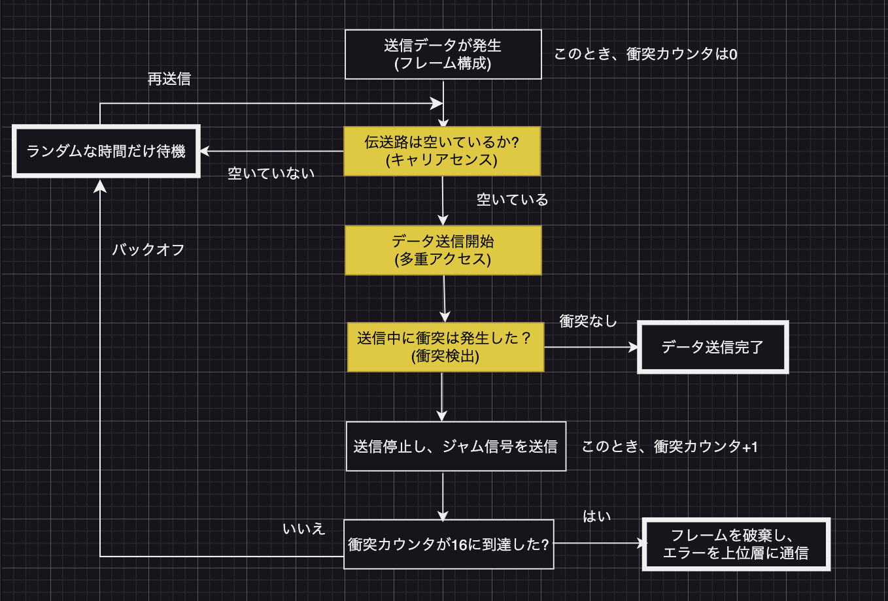

# CSMA / CD
IEEE 802.3標準の媒体アクセス制御方式であるCSMA / CDでは、送信前にケーブルの空きを確認してから送信を開始し、衝突を検出した場合はランダムな時間だけ待ってから再送信を行う。CSMA / CDではどのホストにも平等に送信権を与え、再送信による衝突が起こる可能性を抑えるよう工夫がなされている。

### `CSMA / CD`
CSMA / CD(*Carrier Sense Multiple Access with Collision Detection*):搬送波感知多重アクセス / 衝突検出方式の略。イーサネットで採用されている媒体アクセス制御(*Media Access Control*)方式。媒体へのフレーム送出(アクセス)をコントロールするための仕組みのことを媒体アクセス制御と呼ぶ。つまり、複数のホスト(ステーション)で共有しているケーブルなどの電装媒体にどのようなタイミングでフレームを送信するかなどを決めている。媒体アクセス制御方式は、LANの規格によって異なる。イーサネットはCSMA / CD、トークンリングやFDDIではトークンバッシング(同時にデータを送信させない制御)と呼ばれる方式を規定しており、3つの要素で構成されている。
- CS(キャリアセンス):キャリアはネットワーク媒体上に流れている信号で、伝送媒体(ケーブル)上に信号が流れていないか確認する処理をキャリアセンス(*Carrier Sense*)と呼ぶ。信号が流れていない状態をアイドルといい、ホストはアイドル状態がIFGと呼ばれるフレーム間隔時間だけ継続するとデータ送信を開始できる。  
IFG(*Interframe Gap*):フレーム間隔時間。イーサネットでフレームを連続して伝送する場合に、最小限空けなければならない時間間隔のこと。
- MA(多重アクセス, *Multiple Access*):全てのホストに対して送信権利が平等に与えられていること。伝送路が空いていることを確認すると、ネットワーク上のどのホストも送信を開始することができる。
- CD(衝突検出):2台以上のホストが同じタイミングでキャリアセンスを行ってデータを送信してしまうと衝突(コリジョン)が発生する。衝突の発生を検出することを**衝突検出**(*Collision Detection*)と呼ぶ。ホストはデータ送信中に衝突を検出すると送信を停止し、衝突が発生したことをネットワーク上の全てのホストに認識させるために32ビット長のジャム信号を送信する。ジャム信号の送出が終わると、ホストはランダムな待ち時間を選択し、その待ち時間のあとで再送を試みる。衝突によるこの処理を**バックオフ**と呼ぶ。衝突を起こした全てのホストが待ち時間をランダムに選択することによって、再送信で再び衝突が起こる可能性は低くなる。再送信でも衝突が発生した場合はバックオフを繰り返し、16回目のバックオフでフレームは破棄され、上位層にエラーが通知される。  
CSMA / CD

### `CSMA / CDの動作`
初期のイーサネットワークである10BASE5や10BASE2は、一芯の同軸ケーブルに複数のホストを接続し、全ノードで帯域を共有する共有ネットワーク。以下、バス型トポロジにおけるCSMA / CDの通信手順。  
1. **キャリアセンスしてから、フレーム送信開始**:ホストAは、上位層からデータをカプセル化してフレームを作成して送信データの準備を行うと、伝送路の空きを確認する(キャリアセンス)。伝送路が空いている(アイドル状態がIFGの間接続)と、フレームの送信を開始する。
2. **多重アクセス**:ホストCも同じ瞬間にキャリアセンスを行ってアイドル状態が継続したためデータの送信を開始した(多重アクセス)。
3. **衝突(コリジョン)の検出**:ホストAとCは、データ送信中にケーブル上を監視している。送信中に衝突を検出すると送信するのを停止し、代わりに**ジャム信号**を送信する。データが衝突するとケーブル上に異常な信号波形が発生する。各ホストは異常な信号波形を感知すると、ジャム信号を待つことなく衝突を検出することができるが、ジャム信号を送信することによって、衝突が発生したことを全てのホストに確実に伝えることができる。ジャム信号を受信した各ホストは、データの受信処理を中断しデータを破棄する。ホストAとCはランダムな時間だけ待機してから再度データの送信を試みる。待ち時間はランダムなため、再送信で衝突が起こる確率は低い。ネットワークに障害が発生している場合、バックオフを繰り返しても意味がないため16回目にフレームは破棄される。

### `リピータハブを使用した10BASE-TにおけるCSMA / CD`
### `全二重のイーサネット`

> ### CSMA / CDの概要・動作
> ### ・`媒体アクセス制御方式のひとつ`
> ### ・`半二重通信で使用(全二重の通信では不要)`
> ### ・`ケーブルが空いているか確認してから送信する`
> ### ・`コリジョンが発生したらランダム時間だけ待機`
