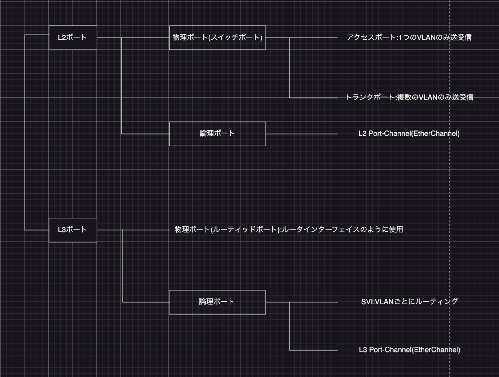

# VLAN間ルーティング
VLANはレイヤ2のレベルで論理的にネットワークを分割する技術。異なるVLANに所属するホスト間の通信にはルーティングデバイスが必要になる。

### `VLAN間ルーティングの概要`
VLAN間で接続をする行うには、ルーティングデバイス(ルータまたはL3スイッチ)を使用して相互に接続する必要がある。ルーティングはIPアドレスを基に行われるため、各LANにはそれぞれネットワークアドレスを割り当てる必要がある。  
ルータはルーティングテーブルに直接接続ネットワークを登録する。各サブネットのホストは、外部ネットワークと通信するためのデフォルトゲートウェイとして、自身のサブネットを接続しているルータインターフェイスに割り当てられているIPアドレスを指定する。VLAN間を相互に接続する場合も同じような環境が必要になり、ルーティングの実装には「ルータを使用」「L3スイッチ(レイヤ3スイッチ)を使用」を行う。

### `ルータを使用したVLAN間ルーティング`
L2スイッチのアクセスポートとルータのインターフェイスを接続する構成。ルータのFa0/0インターフェイスをVLAN1のアクセスポートと接続し、Fa0/1インターフェイスをVLAN2のアクセスポートと接続することができる。ただ、この構成だとVLANと同じ数のスイッチポートとルータインターフェイスが物理的に必要になり、スケーラブル(拡張性)ではない。この問題は、スイッチのトランクポートとルータのインターフェイスを接続することで解決する。この場合はルータに必要なインターフェイスは1つだけ。L2スイッチで作成したVLAN間をトランクポートで接続した外部ルータでルーティングする構成をシスコでは**Router on a stick**と呼ぶ。  
この構成はL2スイッチやルータをそのまま利用できる点。安価で設定が容易なスイッチとルータを使用してVLAN間の相互通信が実現可能。反面、スイッチとルータ間のトランク接続がシングルトラフィックパスになることで、遅延が発生する(L3スイッチの使用で解決)。  
1.VLAN1のPCからスイッチへパケットが届く  
2.スイッチはトランク経由でルータへパケットを転送する  
3.ルータは受信したパケットをルーティングする  
4.ルータはトランク経由でスイッチへパケットを転送する  
5.スイッチはVLAN2のPCへパケットを転送する  
ルータでVLAN間ルーティングを行うため、トラフィックが同じトランクリンクを通ることで混雑し、通信に遅延が発生する可能性がある。L3スイッチを使用すると、これらの機能は1台の機器で提供されるためパケットはより高速に処理できる。

- Router on a stickの設定  
次の3つの構成要素に対して設定を行う。  
ルータ:サブインターフェイスの設定  
スイッチ:トランク設定の設定  
PC:デフォルトゲートウェイの設定  
ルータとスイッチ間のトランクプロトコルにはIEEE 802.1Qを使用する。シスコ独自のISLでRouter on a stickを構成することも可能だが現在はIEEE 802.1Qが主流。  
ルータの物理インターフェイスには**サブインターフェイス**を設定する。サブインターフェイスは、1つの物理インターフェイスを論理的に複数に分割するための仮想的なインターフェイスのこと。ルータの1つの物理インターフェイスをVLANの数だけサブインターフェイスに分割し、それぞれにVLAN IDとIPアドレスを割り当てる。以下がその手順。  
1.サブインターフェイスの作成  
2.トランクプロトコルとVLAN IDの指定  
3.IPアドレスの割り当て  
1.**interface \<interface-id>** コマンドの後にドットと1番以降の整数を指定する。これでサブインターフェイスのコンフィギュレーションモードへ移行する。作成したサブインターフェイスを削除するには先頭にnoを付けて再起動。サブインターフェイスとVLAN IDは1対1で割り当てるため、VLANと同じ数のサブインターフェイスを作成する。サブインターフェイスの番号とVLAN IDは揃っている必要はない。  
**サブインターフェイスの作成**  
`(config)#interface <interface-id>.<subinterface number>`  
`(config-subif)#`  
subinterface number:サブインターフェイスの番号を1 ~ 4294967293の範囲で指定  
2.サブインターフェイスのコンフィギュレーションモードでは、**encapsulation**コマンドでサブインターフェイス上で使用するトランクプロトコルとVLAN IDを指定する  
**トランクプロトコルとVLAN IDの指定**  
`(config-subif)#encapsulation dot1q <vlan-id> [native]`  
vlan-id:VLAN IDを1 ~ 4094の範囲で指定  
native:指定したVLAN IDがネイティブVLANの場合に指定(オプション)  
3.サブインターフェイスにIPアドレスとサブネットマスクを割り当てるには、物理インターフェイスのときと同様に**ip address**コマンドを使用する。  
**サブインターフェイスにIPアドレスを割り当てる**  
`(config-subif)#ip address <ip^address> <subnet-mask>`  
スイッチのトランクポートのネイティブVLANをデフォルト(VLAN1)のままにしている場合、ルータのFa0/0.1サブインターフェイスには、**encapsulation dot1q 1 native**コマンドを設定する必要がある。これによってルータはスイッチから転送されたタグなしフレームをVLAN1トラフィックとして扱うことができる。また、ネイティブVLANは、物理インターフェイスに対して設定することができる。この場合はVLAN IDの指定医は必要ないため、物理インターフェイス上でencapsulationコマンドはサポートされない。

- Router on a stickの検証  
Router on a stickの設定を確認するには各ノードでコマンドを実行する。  
 
ルータ  
`show ip interface [brief]`  
`show ip route`  
`show vlans`  
 
スイッチ  
`show interfaces trunk`  
`show interfaces switchport`  
`show vlan [brief]`  
`show interfaces vlan <vlan-id>`  
`show running-config`  
 
PC(Windowsの場合はコマンドプロンプトを使用)  
`ipconfig`  
`ping<ip-address>`

- ルータの検証  
サブインターフェイスの設定は`show ip interface brief`コマンドを使用して各インターフェイスに割り当てたIPアドレスとup / down状態を確認する。サブネットマスクも表示したい場合はbriefオプションなしで実行する。

- スイッチの検証  
トランクポートの設定は**show interfaces trunk**コマンドを利用して適切なポートがトランクポートとして正しく動作しているか確認する。DTPネゴシエーションが無効になっているかは**show interfaces switchport**コマンドで確認できる。  
表示される情報:明示的にトランク設定  
Mode:トランクプロトコルの種類  
Encapsulation:トランクポートとして動作  
Status:動作  
Native vlan:ネイティブVLAN  
作成したVLANとアクセスポートの設定は**show vlan**コマンドで確認できる。  
管理目的のためにスイッチとTCP / IP通信を行うには、スイッチに管理VLANインターフェイスとデフォルトゲートウェイの設定が必要。管理VLANインターフェイスの状態確認は**show interfaces vlan \<vlan-id>** コマンド、デフォルトゲートウェイの設定確認は**show running-config**コマンドを使用する。

- PCの検証  
ルータとスイッチの設定が正しければ、この状態で各PCが所属するVLANのデフォルトゲートウェイが適切に設定されていれば、異なるVLANの相手とのエンドツーエンド通信が可能になる。エンドホストがWindows PCの場合、**inconfig**コマンドで自身のIPアドレス、サブネットマスク、デフォルトゲートウェイを確認できる。ルータで**show vlans**コマンドを実行するとVLANサブインターフェイスに関する情報が表示され、各サブインターフェイスで送受信されたパケット数を確認できる。  
**VLANサブインターフェイスの情報を表示(mode:>, #)**  
`#show vlans [<vlan-id>]`  
VLAN関連の情報を確認するときスイッチでは`show vlan`コマンドを使用し、ルータでは`show vlan-switch`コマンドを使用する。

### `L3スイッチを使用したVLAN間ルーティング`  
**L3スイッチ**(マルチレイヤスイッチ・レイヤ3スイッチ)は、L2スイッチ機能とルータ機能の両方を併せ持つ機能。Router on a stick構成ではL2スイッチとルータを接続して別々に処理してきたVLAN分離とVLAN間ルーティングの両方をL3スイッチでは1台で実装できる。  
スイッチポートに割り当てられているVLANをルーティングするために、VLANが内部ルータと接続する仮想的なインターフェイスを**SVI**(*Switch Virtual Interface*)と呼ぶ。SVIにIPアドレスを割り当てて有効にすることで、内部ルータは直接接続ネットワークをルーティングテーブルに登録し、VLAN間ルーティングを行う。SVIはVLANにレイヤ3機能を関連づける仮想のインターフェイス。ルーティング対象となるVLANごとにSVIを作成し、SVIに接続先VLAN(サブネット)のIPアドレスを割り当てる。物理ポート(ルーティッドポート)単位またはSVIを用いたVLAN単位でルーティングできるため、物理的な接続に依存しない柔軟なサブネット構成を利用できる。企業のキャンパスネットワークにおけるVLAN間ルーティングの実装には、一般的にL3スイッチが使用されている。

- L3スイッチを使用したVLAN間ルーティングの設定  
L3スイッチでVLAN間ルーティングの設定手順は以下の通り。  
1.IPルーティングの有効化  
2.SVIの設定  
1.ほとんどのCatalystスイッチのL3スイッチでは、デフォルトでルーティング機能が無効になっている。IPv4のルーティング機能を有効にするには、**ip routing**コマンドを実行する。IPルーティング機能を無効にする場合は先頭にnoを付ける。レイヤ2スイッチは、このコマンドをサポートしていない。  
**IPルーティングの有効化**  
`(config)#ip routing`  
2.CatalystスイッチのデフォルトVLAN(VLAN1)は、初期状態でSVIも作成されている。その他のVLANのSVIは**interface vlan**コマンドで作成する。インターフェイスコンフィギュレーションモードに移行する。SVIインターフェイスにIPアドレスを割り当て、スイッチ内部のルーティング機能とSVIを関連づける。  
**SVIの作成**  
`(config)#interface vlan <vlan-id>`  
`(config-if)#ip address <ip-address> <subnet-mask>`

---
> Router on a stickは、ルータ1つのインターフェイスを使用して複数のサブネット間のルーティングを行う

> IEEE 802.1Qを使用するRouter on a stickの構成には2つの方法がある  
> ネイティブVLANもサブインターフェイスに設定する:nativeオプションを付加  
> ネイティブVLANは物理インターフェイスに設定する:encapsulationコマンドは不要
