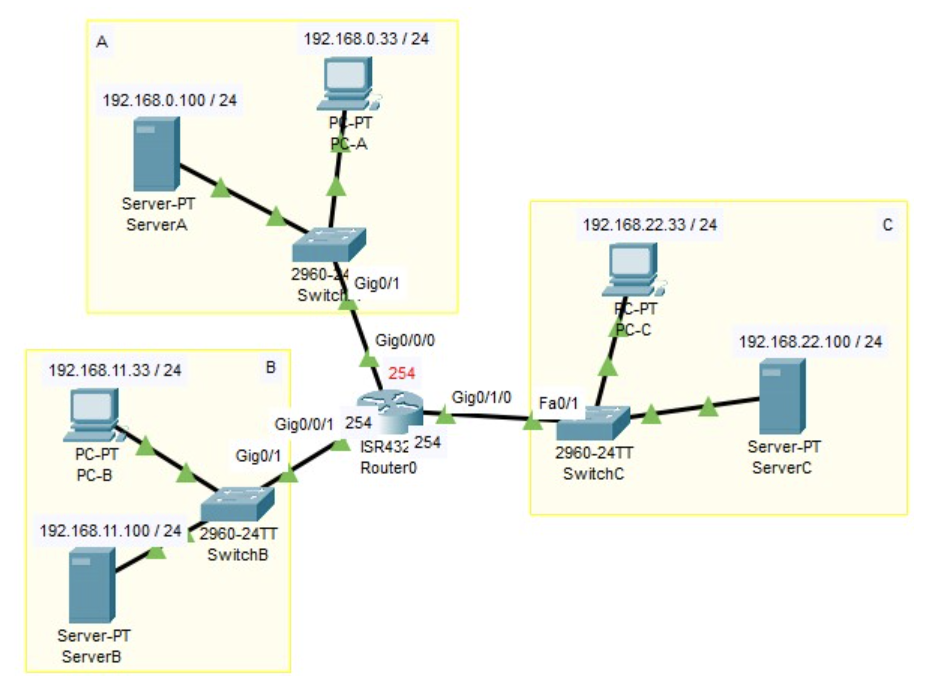

URL:https://network00.net/category/ciscoios/

# Cisco IOS

---
### `IOS入門`

- モード変更のコマンド 
 
ユーザモード:統計情報を表示。ルータの基本的な状態の確認が可能  
特権モード:ルータの設定を表示。詳細な状態の確認やファイルの移動等が行える  
グローバルコンフィギュレーションモード:ルータに全体的な設定・変更を苦悪ことができる  
項目別の設定モード:項目別に詳細な設定・変更を行うことができる(インターフェイス設定モード、ルータ設定モード等)

- パスワードの設定  
Enable password  
`Router(config)#enable secret xxx`
ユーザモードパスワード(コンソール)  
`Router(config)#line console 0`  
`Router(config-line)#password xxxx`  
`Router(config-line)#login`  
ユーザモードパスワード(Telnet)  
`Router(config)#line vty 0 4`  
`Router(config-line)#password xxxx`  
`Router(config-line)#login`  
パスワードの設定確認  
`Router#show running-config`  
(表示されるパスワードを無効にしたい場合は以下のコマンドを実行)  
`Router(config)#service password-encryption`  
ユーザ名を用いたローカル認証  
`Router(config)#line console 0`  
`Router(config-line)#username yyyy password xxxx`  
(コンソールでこの認証を有効にする場合)  
`Router(config)#line console 0` => 遠隔接続の場合は`Router(config)#line vty 0 4`  
`Router(config-line)#login local`

- その他の基本的なコマンド  
ルータのホスト名を設定  
`Router(config)#hostname xxxx`  
設定の表示と保存  
`Router#show running-config`  
`Router#copy running-config startup-config`  
保存した設定の削除、ルータの再起動  
`Router#write erase`  
`Router#reload` => 組み合わせることで工場出荷状態へ戻すことが可能

---
### `インターフェイスの設定`

- インターフェイスの設定  
インターフェイス設定モード  
`(config)#interface [type] [port]`  
IPアドレスの設定  
`(config-if)#ip address [ip-address] [subnet-mask]`  
インターフェイスの有効化  
`(config-if)#no shutdown`

- 設定例の構成

- ルータ:R1のインターフェイス設定  
`R1(config)#interface fastethernet 0/0` => インターフェイス設定  
`R1(config-if)#ip address 192.168.10.1 255.255.255.0` => IPアドレスの設定  
`R1(config-if)#no shutdown` => インターフェイスの有効化  
`R1(config-if)#interface serial 0/0`  
`R1(config-if)#ip address 192.168.20.1 255.255.255.0`  
`R1(config-if)#no shutdown`  
`R1(config-if)#interface serial 0/1`  
`R1(config-if)#ip address 192.168.30.1 255.255.255.0`  
`R1(config-if)#no shutdown`

- ルータ:R2のインターフェイス設定  
`R2(config)#interface fastethernet 0/0`  
`R2(config-if)#ip address 192.168.40.1 255.255.255.0`  
`R2(config-if)#no shutdown`  
`R2(config-if)#interface serial 0/0`  
`R2(config-if)#ip address 192.168.20.2 255.255.255.0`  
`R2(config-if)#no shutdown`

- ルータ:R3のインターフェイス設定  
`R3(config)#interface fastethernet 0/0`  
`R2(config-if)#ip address 192.168.50.1 255.255.255.0`  
`R2(config-if)#no shutdown`  
`R2(config-if)#interface serial 0/0`  
`R2(config-if)#ip address 192.168.30.2 255.255.255.0`  
`R2(config-if)#no shutdown`

- インターフェイス状態の確認

`#show ip interface brief` => インターフェイスの要約情報を表示。Statusは物理層の状態、Protocolはレイヤ2(データリンク層)の状態を判断できる  
`#show ip interface` => インターフェイスに対して適用したアクセスリストを確認する

---
### `スタティックルート`
ルータでは、経路制御を行っており、宛先IPアドレスに対して最適な経路をルーティングテーブルから探してネクストホップアドレスを決めている。

- スタティックルートの設定コマンド  
`(config)#ip route [network] [subnet-mask] [interface] [next_hop] [AD] [permanent]`  
network:宛先ネットワーク  
mask:サブネットマスク  
interface:次のルータへ送出する際のインターフェイス  
next_hop:宛先ネットワークへ転送するための次のルータのアドレス  
AD:スタティックルートの場合は1  
permanent:状態に無関係でルーティングテーブルに保持される

- スタティックルートの設定例

・ルータ:R1のスタティックルートの設定  
`R1(config)#ip route 192.168.40.0 255.255.255.0 Serial0/0 192.168.20.2` => それぞれの方向に向いているインターフェイスを記述する  
`R1(config)#ip route 192.168.50.0 255.255.255.0 Serial0/1 192.168.30.2`

・ルータ:R2のスタティックルートの設定  
`R2(config)#ip route 192.168.10.0 255.255.255.0 Serial0/0 192.168.20.1`  
`R2(config)#ip route 192.168.30.0 255.255.255.0 Serial0/0 192.168.20.1`  
`R2(config)#ip route 192.168.50.0 255.255.255.0 Serial0/0 192.168.20.1`

・ルータ:R3のスタティックルートの設定  
`R2(config)#ip route 192.168.10.0 255.255.255.0 Serial0/0 192.168.30.1`  
`R2(config)#ip route 192.168.20.0 255.255.255.0 Serial0/0 192.168.30.1`  
`R2(config)#ip route 192.168.40.0 255.255.255.0 Serial0/0 192.168.30.1`

- ルーティングテーブルの見方

ルータ:R3のルーティングテーブル  
`R3#show ip route` => ルーティングテーブルの表示

C 192.168.50.0 is directly connected, FastEthernet0/0  
S 192.168.40.0 [1/0] via 192.168.30.1  
C 192.168.30.0 is directly connected, Serial0/0  
S 192.168.20.0 [1/0] via 192.168.30.1  
S 192.168.10.0 [1/0] via 192.168.30.1

via 192.168.30.1 => ネクストホップアドレス  
[1/0] => アドミニストレーティブディスタンス値  
Cは直接接続されたネットワーク、SはRIPルート

- デフォルトルートの設定

ルーティングテーブルに存在しないネットワークを宛先とするパケットを、次のホップのルータへ送信するために使用する。  
デフォルトルートの設定:  
`R3(config)#ip route 0.0.0.0 0.0.0.0 [next-hop]`

---
### `VLAN`

- VLANの種類  
スタティックVLAN  
ポートベースVLANと呼ばれる方式。手動でポートごとにVLANを定義する  
ダイナミックVLAN
VLANの割り当てを自動的に決定する。MAC(アドレス)ベースVLAN、プロトコルベースVLANなどの方式が該当する。

- VLANの識別  
アクセスリンク:1つのVLANだけに属しており、PC等の機器を接続するリンクに適用する。  
トランクリンク:複数のVLANに属しており、スイッチ間を接続するリンクに適用する。  
ISL(*Inter-Switch Link*):シスコ独自のトラッキングプロトコル  
IEEE802.1Q:IEEE標準のトラッキングプロトコル

- VLANの設定コマンド  
VLANの作成  
`(config)#vlan [vlan-id]`  
`(config-vlan)name [vlan-name]` (名前設定は必須ではない)  
インターフェイスへの適用  
`(config-if)#switchport mode access`  
`(config-if)#switchport access vlan [vlan-id]`  
トランクリンクの設定  
`(config-if)#switchport trunk encapsulation [dot1q | isl]`  
`(config-if)#switchport mode trunk`  

- VLANの設定例

・VLANの作成、スイッチ:SW1, SW2, SW3  
SW1:`(config)#vlan 10`  
SW1:`(config-vlan)#name GROUP10`
SW2:`(config)#vlan 20`  
SW2:`(config-vlan)#name GROUP20`  
・インターフェイスへの適用、スイッチ:SW1, SW2  
`SW1(config)#interface fastethernet0/0`  
`SW1(config-if)#switchport mode access`  
`SW1(config-if)#switchport access vlan 10`  
`SW1(config)#interface fastethernet0/1`  
`SW1(config-if)#switchport mode access`  
`SW1(config-if)#switchport access vlan 20`  
・トランクリンクの設定  
スイッチ:SW1, SW2  
`SW1(config)#interface fastethernet0/23`  
`SW1(config-if)#switchport trunk encapsulation dot1q` ※デフォルトのため省略可  
`SW1(config-if)#switchport mode trunk`  
スイッチ:SW3  
`SW3(config)#interface fastethernet0/0-1`  
`SW1(config-range)#switchport trunk encapsulation dot1q` ※デフォルトのため省略可  
`SW1(config-if)#switchport mode trunk`

- VLANの確認

`show vlan brief`:スイッチに存在する全てのVLANに関する情報を表示。briefで概要情報のみ表示

`show interface trunk`:トランクポートの設定や状態を表示

- ルータによるVLAN間ルーティング  
ルータのインターフェイス数よりも多くのVLANは使用できない。その場合は1つの物理インターフェイスだけでVLAN間ルーティングを可能にする方法がある(*router-on-a-stick*)。

・ルータの設定  
`R1(config)#interface gigabitEthernet0/0.1` => インターフェイスの設定  
`R1(config-subif)#encapsulation dot1Q 10`  
`R1(config-subif)#ip address 192.168.10.1 255.255.255.0`  
`R1(config)#interface gigabitEthernet0/0.2`
`R1(config-subif)#encapsulation dot1Q 20`  
`R1(config-subif)#ip address 192.168.20.1 255.255.255.0`

・スイッチ:SW3の設定  
`SW3(config)#interface gigabitEthernet3/3`  
`SW3(config-subif)#switchport trunk encapsulation dot1q` => トランクリンクの設定  
`SW3(config-subif)#switchport mode trunk`

---
### `ルーティング(RIP)`

・*Router Information Protocol*の略  
・中小規模のネットワーク向け  
・コンバージェンス(収束)に時間がかかる  
・ホップをメトリックとして使用  
・ディスタンベクター型のルーティングプロトコル

- RIPルーティングの設定例

・ルータ:R1のRIPルーティングの設定  
`R1(config)#router rip` => RIPプロセスの有効化  
`R1(config-router)#network 192.168.10.0` => RIPを有効にするインターフェイスの指定  
`R1(config-router)#network 192.168.20.0`  
`R1(config-router)#network 192.168.30.0`  
`R1(config-router)#passive-interface fastethernet0/0` => パッシブインターフェイスの設定(ルーティングアップデートの抑制)  
・ルータ:R2のRIPルーティングの設定  
`R2(config)#router rip`  
`R2(config-router)#network 192.168.20.0`  
`R2(config-router)#network 192.168.40.0`  
`R2(config-router)#passive-interface fastethernet0/0`  
・ルータ:R3のRIPルーティングの設定  
`R2(config)#router rip`  
`R2(config-router)#network 192.168.30.0`  
`R2(config-router)#network 192.168.50.0`  
`R2(config-router)#passive-interface fastethernet0/0`  
`(config-router)#auto-summary` => 自動集約を有効(デフォルトで有効)

- RIPルーティングの確認  
`show ip route` => ルーティングテーブルの確認  
`show ip protocols` => ルーティングプロトコルの確認。各種タイマ、RIPのバージョン、有効な設定したネットワークなどを確認できる  
`debug ip rip` => ルーティングプロトコルの確認(デバッグ)

---
### `ワイルドカードマスクとアクセスリスト`

- ワイルドカードマスク  
・192.168.10.0 / 26をチェック対象にした場合  
=> 192.168.10.0 0.0.0.63  
・192.168.10.1を指定したい場合  
=> host 192.168.10.1  
・全てのIPアドレスを指定  
0.0.0.0 255.255.255.255(省略でany)  
・192.168.0.0 / 24 ~ 192.168.3.0 / 24の4つを指定  
=> 192.168.0.0 0.0.3.255(22ビット目まで共通のため)

- ACL(アクセスリスト)  
ルータ上を通過するパケットの許可 / 拒否を制御する。パケットフィルタリングとも呼ばれる。  
・標準ACL:パケットの送信元IPアドレスを指定してパケットフィルタリングを行う。名前付きと番号付きがある。番号は1 ~ 99, 1300 ~ 1999。  
・拡張ACL:送信元IP、宛先IP、送信元ポート番号、宛先ポート番号、プロトコル等も指定してパケットフィルタリングを行う。番号は100 ~ 199, 2000 ~ 2699。  
・標準ACLの作成  
`(config)#access-list [number] [permit | deny] [source] [wildcard]`  
permit | deny:permitは許可、denyは拒否  
source:送信元IPアドレスを指定  
wildcard:ワイルドカードマスク  
・拡張ACLの作成  
`(config)#access-list [number] [permit | deny] [protocol] [source] [wildcard] [port] [dest] [wildcard] [port] [established | log | log-input]`  
protocol:プロトコル名を指定(ip, icmp, tcp, udp等)  
port:演算子の後にポート番号を指定する  
established:ACKまたはRSTビットの立っているパケットが対象  
log:ログが出力される  
log-input:送信元MACアドレスも出力される  
・ACLのインターフェイスへの適用  
`(config-if)#ip access-group [number] [in | out]`  
number:インターフェイスに適用するACLの番号  
in | out:inの場合はインターフェイスに到着するパケットを指定、outの場合はインターフェイスから発信するパケットを指定

- ACLの設定例

・A => Router0 => Cは許可し、それ以外 => Router0 => Cは拒否  
Router0の設定  
`(config)#access-list 11 permit 192.168.0.0 0.0.0.255` => 192.168.0から始まるアドレスを許可  
`(config)#access-list 11 deny any` => 暗黙のdeny。全て拒否する。anyは0.0.0.0 255.255.255.255と同義(j自動で挿入される)  
`(config)#interface Vlan1`  
`(config-if)#ip access-group 11 out` => 標準ACLは宛先に近い方に適用  
`(config-if)end`  
・C => Router0 => Aは許可し、それ以外は拒否  
Router0の設定  
`(config)#access-list 111 permit ip 192.168.22.0 0.0.0.255 192.168.11.0 0.0.0.255`  
`(config)#access-list 111 deny ip any any`  
`(config)#interface Vlan1`  
`(config)#ip access-group 111 in` => 拡張ACLは送信元に近い方に適用  
`(config-if)eit`

---
### `アドレス変換`

- NAT  
*Network Address Translation*の略で、IPアドレスを変換する技術。  
・ローカルIPとグローバルIPの対応を設定  
`(config)#ip nat [inside/outside] source static [local-ip][global-ip]`  
inside / outside:対象の機器が内部 / 外部のどちらにあるか  
・内部インターフェイスを指定  
`(config)#interface GigabitEthernet 0/0`  
`(config-if)#ip nat inside`
・外部インターフェイスを指定  
`(config)#interface GigabitEthernet 0/1`  
`(config-if)#ip nat outside`

- NATの設定例

・RT-Aの設定  
`RT-A(config)#ip nat inside source static 192.168.10.1 110.10.10.51`  
`RT-A(config)#ip nat inside source static 192.168.10.2 110.10.10.52`  
`RT-A(config)#interface GigabitEthernet 0/0`  
`RT-A(config)#ip nat inside`  
`RT-A(config)#interface GigabitEthernet 0/1`  
`RT-A(config)#ip nat outside`  
・RT-Bの設定  
`RT-B(config)#ip nat inside source static 192.168.20.21 120.20.20.62`  
`RT-B(config)#ip nat inside source static 192.168.20.22 110.10.20.63`  
`RT-B(config)#interface GigabitEthernet 0/0`  
`RT-B(config)#ip nat inside`  
`RT-B(config)#interface GigabitEthernet 0/1`  
`RT-B(config)#ip nat outside`

- PAT  
*Port Address Translation*の略で、1つのIPアドレスを複数のコンピュータで共有する技術。企業や大学、自宅のLANからインターネット通信する時に使用している技術。  
・IPアクセス制御リストを定義(拡張ACLも使える)  
`(config)#access-list [number] permit [source] [wildcard]`  
source:送信元IP  
・ローカルIPとグローバルIPの対応を設定  
`(config)#ip nat inside source list [number] interface [interface] overload`  
number:ACLの番号  
interface:外側インターフェイス  
・内部インターフェイスを指定  
`(config)#interface GigabitEthernet0/0`  
`(config-if)#ip nat inside`  
・外部インターフェイスを指定  
`(config)#interface GigabitEthernet0/0`  
`(config-if)#ip nat outside`

- PATの設定例

・RT-Aの設定  
`RT-A(config)#access-list 1 permit 192.168.10.0 0.0.0.255`  
`RT-A(config)#ip nat inside source list 1 interface GigabitEthernet0/1 overload`  
`RT-A(config)#interface GigabitEthernet0/0`  
`RT-A(config-if)#ip nat inside`
`RT-A(config)#interface GigabitEthernet0/1`  
`RT-A(config-if)#ip nat outside`  
・RT-Bの設定  
`RT-B(config)#access-list 1 permit 192.168.20.0 0.0.0.255`  
`RT-B(config)#ip nat inside source list 1 interface GigabitEthernet0/1 overload`  
`RT-B(config)#interface GigabitEthernet0/0`  
`RT-B(config-if)#ip nat inside`
`RT-B(config)#interface GigabitEthernet0/1`  
`RT-B(config-if)#ip nat outside`

---
### `ルーティング(OSPF)`
・*Open Shortest Path First*の略  
・中(大)規模ネットワーク向け、リンクステート型  
・追加ライセンスが必要な場合があり、コンバージェンスは比較的早い  
・ルータが増えると負荷が増える  
・コスト計算にルータ間の通信速度が含まれる

- OSPFの設定コマンド  
・OSPFの有効化  
`(config)#router ospf [process-id]`  
process-id:OSPFルーティングプロセスをしきべつするためのID(1 ~ 65535)。  
・OSPFで管理するネットワーク(インターフェイス)とエリアの指定  
`(config-router)#network [address] [wildcard] area [area-id]`  
address:ネットワークアドレスまたはインターフェイスのIPアドレスで指定  
area-id:割り当てたいエリアを指定

- OSPFルーティングの設定例

RIPルーティングの設定  
・ルータ:R1のOSPFルーティングの設定  
`Router(config)router ospf1`  
`Router(config-router)network 192.168.10.0 0.0.0.255 area 0`  
`Router(config-router)network 192.168.20.0 0.0.0.255 area 0`  
`Router(config-router)network 192.168.30.0 0.0.0.255 area 0`  
・ルータ:R2のOSPFルーティングの設定  
`Router(config)router ospf1`  
`Router(config-router)network 192.168.20.0 0.0.0.255 area 0`  
`Router(config-router)network 192.168.40.0 0.0.0.255 area 0`  
・ルータ:R3のOSPFルーティングの設定  
`Router(config)router ospf1`  
`Router(config-router)network 192.168.30.0 0.0.0.255 area 0`  
`Router(config-router)network 192.168.50.0 0.0.0.255 area 0`

RIPルーティングの確認  
`show ip route`:  
O:経路情報の情報源のものはOSPFエントリ。  
`#sh ip prot`:ルーティングをプロトコルを確認する

---
### `VPN`
*Virtual Private Network*の略で、仮想的なプライベートネットワーク接続のこと。企業の拠点間通信を実現できる。

- IPSec-VPN(サイト間)の設定  
・ISAKMPポリシーの設定  
`(config)#crypto isakmp policy [priority]`  
priority:1 ~ 10000で数値が小さいほど優先度が高い  
・暗号化アルゴリズムの設定(デフォルト値はdes)  
`(config-isakmp)#encryption [ des | 3des | aes 128 | aes 192 | aes 256 ]`  
・ISAKMP SAで使用するハッシュアルゴリズムを設定(デフォルトはsha)  
`(config-isakmp)#hash [ md5 | sha | sha256 | sha384 | sha512 ]`  
・認証方式の設定  
`(config-isakmp)#authentication [ rsa-sig | rsa-encr | pre-share ]`  
rsa-sig:RSA署名  
rsa-encr:RSA暗号化ナンス  
pre-share:事前共有鍵

- パスワードやモードの設定  
・事前共有鍵のピアアドレスとパスワード設定  
`(config)#crypto isakmp key [password] address [address]`  
・トランスフォームセットの定義  
`(config)#crypto ipsec transform-set [name] [transform1] [transform2]`  
name:名前  
Transform1:暗号化  
Transform2:認証  
・ISPec通信モードの指定  
`(cfg-crypto-trans)#mode [tunnel | transport]`  
デフォルト値：tunnel

- マップ関連設定  
・暗号マップの定義  
`(config)#crypto map [map-name] [seq-number] ipsec-isakmp`  
`(config-crypto-map)#match address [acl-number]`  
`(config-crypto-map)#set transform-set [name]`  
`(config-crypto-map)#set peer [address]`  
map-name:暗号マップの名前  
seq-number:番号(小さい値ほど優先度が高くなる)  
acl-number:IPsec対象雨を定義したACL  
name:定義済みのトランスフォーム名  
address:IPsecピアのアドレス  
・暗号マップのインターフェイスへの適用  
`(config)#interface [interface-id]`  
`(config-if)#crypto map [crypto-map-name]`  
crypto-map-name:暗号マップを定義したマップ名
