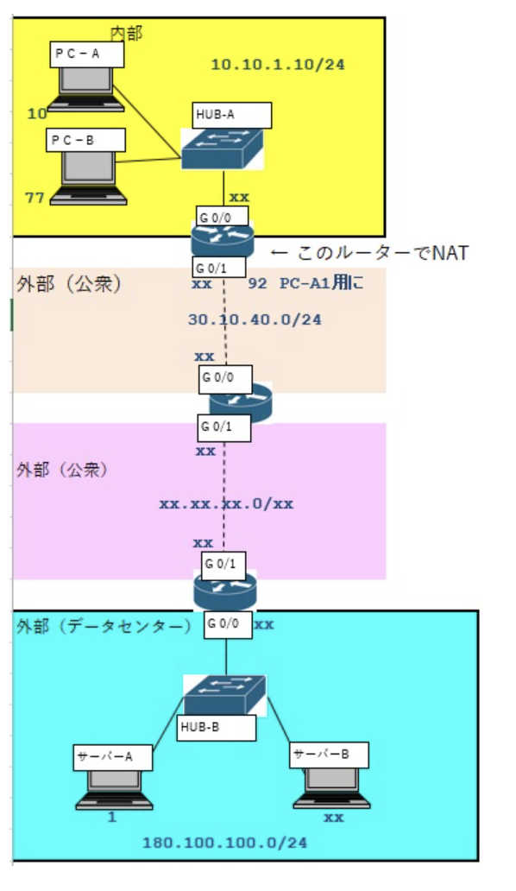

### `IP関連技術2`

`IPアドレスとMACアドレスの連携`

ARPの概要
- 宛先IPアドレスを手掛かりにしてMACアドレスを取得するプロトコル

- 同一ネットワーク内のホスト宛の場合は、宛先ホストのMACアドレスを得ることになる

- 異なるネットワークのホスト宛の場合は、次ホップ(デフォルトゲートウェイ)のルータのMACアドレスを得ることになる

- ARPはIPv4とセットで、IPv6では使用されない

- 宛先IPアドレスに対するMACアドレスを知らない場合にARPによる情報交換が行われる

- ARPはホストやルータのOS等に実装されている

ARPの要求と応用
- 1.送信元ホストからARP要求がブロードキャスト送信される

- 2.ブロードキャストなので、全てのノードのNICが受信する

- 3.宛先ホスト以外では、そのパケットを破棄する

- 4.宛先ホストでそのパケットを受け取り、送信元MACアドレスを取得しておく

- 5.宛先ホストはARP応答を送信元ホストへ返却する

- 6.送信元でARP応答を受け取り、宛先ホストのMACアドレスを得る

- 7.AROで取得した情報は数分間キャッシュする

IPアドレスとMACアドレスの併用
- 住所(宛先)を表現するのはあくまでもIPアドレス

- データリンク層のアドレスは無くても、全てブロードキャスト送信すれば送ることは可能。ただそれだと混乱してしまうため、データリンク層レベルでもMACアドレスを用いることで、ユニキャストの送信ができる様にしている

- MACアドレスは同じブロードキャストドメイン内で宛先を示すためのものであり、IPアドレスはブロードキャストドメインを跨いでも宛先を示すことできる

- IPアドレスは最終目的地を示し、MACアドレスは次の宛先を示す

`DHCP`  
IPアドレスを一括管理したり、自動的に設定するためのサービス。。DHCPを構築済の環境であれば、PC等をLANに接続するだけで、IPアドレスが自動的に割り振られて設定される

サーバとクライアント
- DHCPを利用するには、DHCPサーバを立ち上げる必要があり、予め使用するIPアドレスの範囲等を設定しておく。1台ずつノードのOSにDHCPクライアントが備わっており、サーバとクライアント間でやり取りをして自動割り当てが行われる

DHCP割り当ての流れ
- 1.DHCP要求をするときはDHCPサーバのIPアドレスを知らなくても良いようにブロードキャストアドレス(255.255.255.255)で送出する

- 2.DHCPサーバはクライアントに4情報を割り当てる。「IPアドレス」「サブネットマスク」「デフォルトゲートウェイ」「DNS」。また、DHCPサーバはMACアドレスを利用して固定的に割り当てることもできる

- DHCPクライアントとDHCPサーバ間で4つのメッセージをやり取りする。DISCOVER, OFFER, REQUEST, ACKの順。DISCOVERとREQUESTはクライアントからサーバへブロードキャストで、OFFERとACKはサーバからクライアントへ送信される

`NATとPAT`  
ルータのNAT機能は2つのIPアドレスを相互に変換する。グローバルIPアドレスであとうともプライベートIPアドレスであろうとも関係なく変換できる。ただ、一般的にはグローバルIPアドレスとプライベートIPアドレスを変換する

- 静的NAT  
グローバルIPとプライベートIPを1対1で割り当てる。管理者が一度登録したら管理者が変更するまで対応が変わらない

- 動的NAT  
グローバルIPとプライベートIPを1対1で割り当てるが、管理者は固定の設定はせず、空いているグローバルIPを都度割り当てる

- PAT(NAPT)  
グローバルIPとプライベートIP1対多で割り当てる。1つのグローバルIPでLAN内の何台ものPCをインターネット接続するときに役立つ

パソコンAがサーバAにアクセスする場合(NAT)

内部(パソコン側)  
内部ローカル:10.10.1.10  
内部グローバル:30.10.40.92

外部(サーバ側)  
外部ローカル:今回は無し  
外部グローバル:180.100.100.1

行き  
1.パソコンAからルータまで、宛先:180.100.100.1, 送信元:10.10.1.10  
2.ルータAからサーバA、宛先:180.100.100.1, 送信元:30.10.40.92  
帰り  
3.サーバAからルータA、宛先:30.10.40.92, 送信元:180.100.100.1  
4.ルータAからサーバA、宛先:10.10.1.10, 送信元:180.100.100.1  

パソコンAとパソコンBがサーバAにアクセスする場合(PAT(NAPT)の場合)  
パソコンAはポート24000に割り当て、パソコンBはポート49900に割り当てと仮定する

内部(パソコン側)  
内部ローカル(A):10.10.1.10 :24000  
内部ローカル(B):10.10.1.77 :49900  
内部グローバル(A):30.10.40.92 :26500  
内部グローバル(B):30.10.40.92 :50688

外部(サーバ側)  
外部ローカル:どちらも今回は無し  
外部グローバル(A):180.100.100.1 :80  
外部グローバル(B):180.100.100.1 :80
