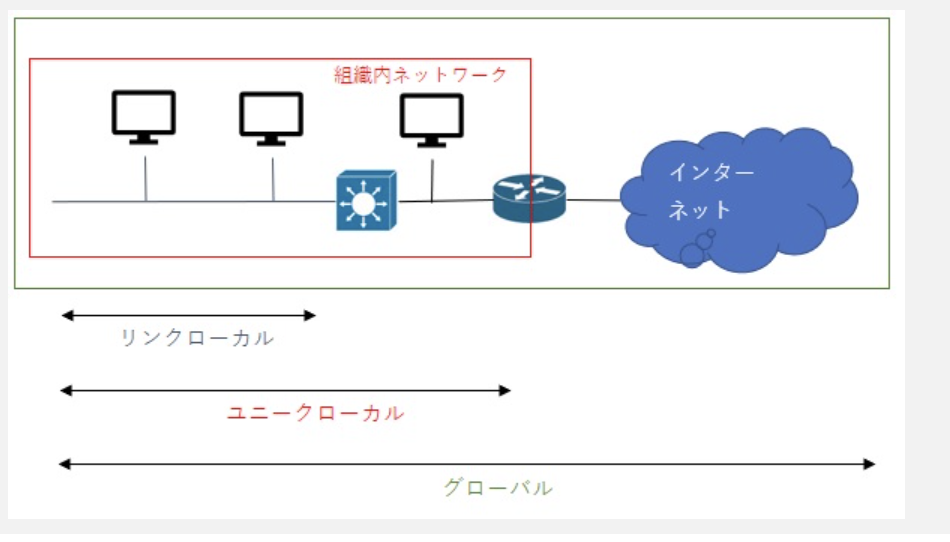

### `IPv6`

`リンクローカルアドレス`

- DHCPによるIPアドレスが取得できなかった時に、169.254 / 16のアドレスが設定されることがある。ルータによる転送を禁止されている

`ルート集約`

|第三オクテット|共通部分|10進数化|回答表記|
|------------|------|-------|-------|
|1000 1010 1001 0010 1001 0101|1|128|192.168.128.0 / 17|
|0100 0110 0110 0100|01|64|192.168.64.0 / 18|

`IPv6`  
IPv4アドレスの枯渇問題を解決するために作られた。128ビットのアドレスで、IPv4の2の96乗倍のアドレス数となる

IPv6の特徴

- アドレス数の増加と経路制御表の最適化  
インターネットに適した階層構造となっており、IPアドレスを計画的に配布し、経路制御表が大きくならない様にしている

- ルータの負荷の軽減  
ヘッダ長を固定(40オクテット)、ヘッダ構造を簡素化、ルータに分割処理をさせない、等によってルータの負荷を低減している

- プラグ&プレイ機能  
DHCPサーバがない環境でもIPアドレスを自動的に割り当てる

- 認証・暗号化機能  
IPアドレスの偽造に対するセキュリティ機能の提供や、盗聴防止機能を提供する

- 拡張機能  
複数端末へ同時送信するマルチキャストや、移動端末においてアクセス場所に依存しない端末固有のIPアドレスを使用できるMobile IPを備えている

IPv6の表記方法

- 128ビットを16ビットごとにコロン(:)で区切り8フィールドで表現

- 4ビット毎に16進数で表記する

- 1つのフィールド内で先頭の0を省略可能

- :0:が2フィールド以上連続して続く場合には、コロンを2つ続けて(::)で省略することも可能、ただし1箇所のみ

16進数  
1080:0000:0000:0000:0008:0800:200C:417A  
=> 1080:0:0:0:8:800:200C:417A(先頭の0を省略)  
=> 1080::8:800:200C:417A(0の連続を省略)

IPv6のスコープ

- グローバルユニキャストアドレス  
IPv4のグローバルIPアドレスに相当する。全てのIPv6ネットワークで一意となる。ローカル、組織内、インターネット等スコープの制限はなくどこでも利用可能

- リンクローカルユニキャストアドレス  
同一ネットワーク乗の端末を通信する場合に使用するアドレス。ルータによる転送を禁止されている

- ユニークローカルアドレス  
IPv4のプライベートIPアドレスに相当する。異なるネットワーク乗の端末と通信できるが組織内ネットワークでのみ有効なアドレス

IPv6の分割処理

- IPv6の分割処理は始点ホストでのみ行われ、ルータは分割処理をしない(経路MTU探索が必須)

- IPv6では最小のMTUが1280オクテットと決められている(最大伝送ユニット)。経路MTU探索ができない機器では1280オクテットに分割して送信する
