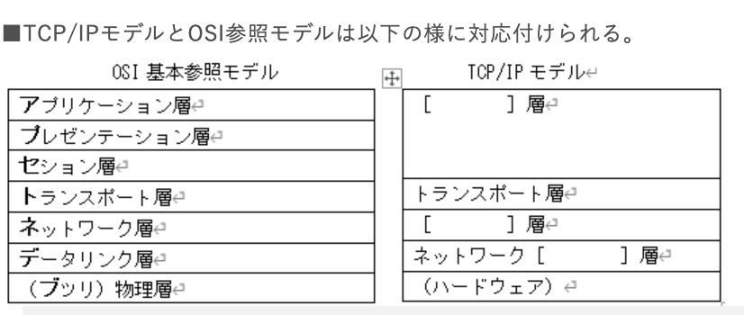

### `TCP / IP基礎1`

インターネット基礎

- インターネット:ARPANETから発展し、全世界を接続しているネットワークのこと

- TCP / IP:もともとインターネットを運用するために開発されたネットワークアーキテクチャでありプロトコル群

- キャリア:インターネットを利用するためには、回線業者が提供しているインターネット回線を利用する必要がある。NTTやケーブルテレビ会社系や電力会社系の企業などがある

- ISP:*Internet Service Provider*のとで、インターネット接続のサービスを提供している事業者のこと。インターネットに接続するにはISPと契約する必要があり、BIGLOBEやOCNなどがある。携帯電話事業者やモバイルWi-Fiルータの提供企業の中には、回線業者とプロバイダが一体化している事業者もある

- インターネットの構造;小さなネットワーク同士を接続し、その束なったネットワーク同士を接続詞、という様に断層的に接続して、最終的には地球規模で接続したものがインターネットとなっている。組織のネットワーク同士やISPのネットワーク同士をNOC(*Network Operation Center*)で接続しているそれらが集まり成している地域のネットワーク同士をIX(*Internet Exchange*)で接続している

OSI参照モデルとの対応

上から、「アプリケーション層」「インターネット層」「インターフェイス層」

TCP / IP(OSI参照)モデルの各階層

`ハードウェア`

- OSI参照モデルで言う所の物理層についてTCP / IPでは、ハードウェアと呼び特に制限や規則は設けていない

- 第1層に位置し、ネットワークインターフェイス層へ橋渡しする

- PDUは、ビット(ビット列、信号)となる

- OSIの物理僧として例えば、LANケーブルとして用いられるUTPケーブつの使用を決めていたり、無線通信における電波の周波数帯・方式を決めていたりする

- ハードウェア(物理層)として利用される機器は、**リピータ**や**ハブ**がある。

`ネットワークインターフェイス層`  
インターネットで言う所のMACアドレスを認識して宛先を判別している。パソコンではNICのデバイスドライバーがその役割を担っており、スイッチやルータ等のレイヤ2以上で働くネットワーク機器にもその役割が付与されている

- 第2層に位置し、物理層とインターネット層の橋渡しをする

- ネットワークに色々繋ぎ方がある。物理層には光、テレビ線、電話線など。また、同じ線を使っていても信号を流す方向が異なる場合がある。そのような違いをインターネット層以上の階層に意識させることを無くす

- PDUはフレーム

- ネットワークインターフェイス層として利用される機器は**スイッチ**や**ブリッジ**がある
