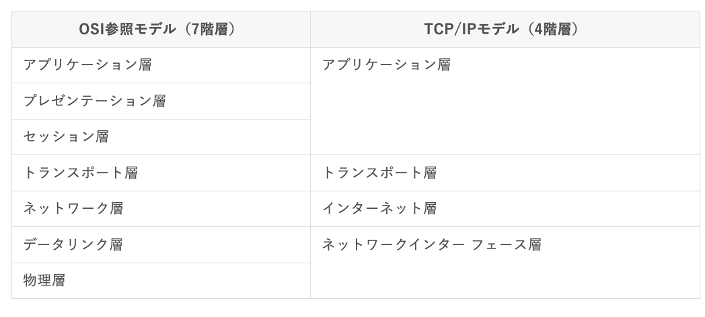

### `ネットワーク層の概要`

`ネットワーク層の概要`

- インターネット層(ネットワーク層)のプロトコル  
・IP:ネットワーク上に存在する全ての機器に割り振られている。IPv4とIPv6の2バージョンが使われており、現在はIPv4が主となっている  
・ICMP:パケットが届いているか調べるプロトコル  
・ARP:宛先IPアドレスからMACアドレスを取得するプロトコル  
・IPSec:IPパケットを暗号化する技術。VPNで用いられることが多い

- 各ネットワーク機器が働く階層

|レイヤ|機器|識別するもの|
|-----|---|----------|
|ネットワーク層|ルータ|IPアドレス(パケット)|
|データリンク層|スイッチ、ブリッジ|MACアドレス(フレーム)|
|物理層|ハブ、リピータ|電気信号||

- IPの概要  
・ホスト:パソコンやサーバ、スマホ等の機器のこと  
・ルータ:宛先IPアドレスを見て経路選択を行う機器  
・ノード:ホストやルータを併せた総称  
・IP:TCP / IP(OSI参照モデル)の心臓部ともいえるインターネット層のプロトコル  
・ネットワーク層の役割は、終点ノード間の通信を実現すること  
・終点ノード間を行き来する際に、別のデータリンク層を経由していくことになるが、それからは独立してIPという共通の規則を元に宛先や経路を認識しながら通信を行う。必要なタイミングにおいては、データリンク層との連携も行っている  
・データリンク層(MACアドレス等)は次の行き先を扱うが、IPは最終目的地を扱う  
・PDUはパケット若しくはIPデータグラム  
・コネクションレス型プロトコル、ベストエフォート方式  
・ネットワーク層で働くホストやルータ等にはIPアドレスを設定する必要がある  
・データリンク層で働くブリッジやスイッチ等にはIPアドレスを設定する必要はない

`ルータ・経路制御の概要`

ルータが働く階層はネットワーク層 / インターネット層

- ルータの動作に関して  
・ルータはネットワーク層のPDUであるIPパケットのヘッダ部に埋め込まれた宛先IPアドレスを、自身のルーティングテーブルと照らし合わせて、最適なインターフェイスから次のノードに送出する  
・ルータはネットワークの変化に柔軟に遅延なく対応する必要があるが、大規模であれば経理情報は隅々まで管理者は把握しているわけではない。そのため、ルータ同士で情報交換をして、ある程度自動的に経路が作成される。これをダイナミックルーティングと呼ぶ

- データリンク層の違いを吸収  
・IPを利用する通信で、途中イーサネット以外のデータリンク層を通ることがある。データリンク層によって、最大転送単位MTU(*Maximum Transmission Unit*)は異なる。それぞれに合わせるために、IPでは分割処理(フラグメンテーション)を行なっている  
・ルータで分割されたパケットは届いた先(ホスト)で1つにまとめられる。上位層(トランスポート層以上)ではデータリンク層の差を意識しない。フラグメンテーションが発生するとルータやホストに負荷がかかる

`ブロードキャストドメイン`

- ブロードキャストドメインの概要  
・同一LAN内全てのネットワークデバイスへの通信のこと  
・ブロードキャストが伝わる範囲をブロードキャストドメインと呼び、同一ネットワークと等価  
・ネットワークの境界には必ずルータが存在する。ルータはブロードキャストドメインを分割する機器ともいえる
