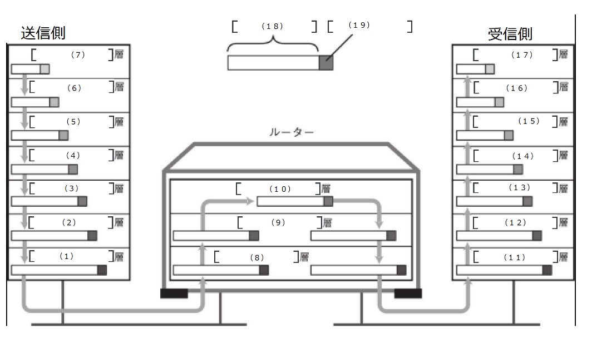

# ネットワーク問題集
https://network00.net/networkquestions/

### `ネットワーク基礎1`

プロトコル

- プロトコルとは、通信に関する「**規則**」である。

- ネットワークアーキテクチャとは、ネットワーク技術の総称。世界標準となっている「**TCP / IP**」以外に、(ほとんど使われていないが)IPX/SPXやApple Talkなど様々なものが存在する。

- メーカーやCPUやOSが違うコンピュータ同士でも、「**同じ**」プロトコルを使えば互いに通信することができる。逆に、「**kとなる**」プロトコルを使用すれば通信することはできない。

- パケット交換とは、大きなデータをパケットと呼ばれる単位で、「**小分け**」して送信する方法。

- 「**TCP / IP**」とは、コンピュータ(スマホ・ゲーム機等)の通信を行うために使用する技術の総称で、事実上の標準(デファクトスタンダード)となっている。

- 「**OSI参照モデル**」はネットアーキテクチャの一種で、TCP / IPモデルと並んでよく用いられる重要な概念である。国際標準規格としては普及していない。

階層間の通信の流れ

7, 17:アプリケーション  
6, 16:プレゼンテーション  
5, 15:セッション  
4, 14:トランスポート  
3, 13:ネットワーク  
2, 12.データリンク  
1, 11:物理  
10:ネットワーク  
9:データリンク  
8:物理  
18:データ  
19:ヘッダ
