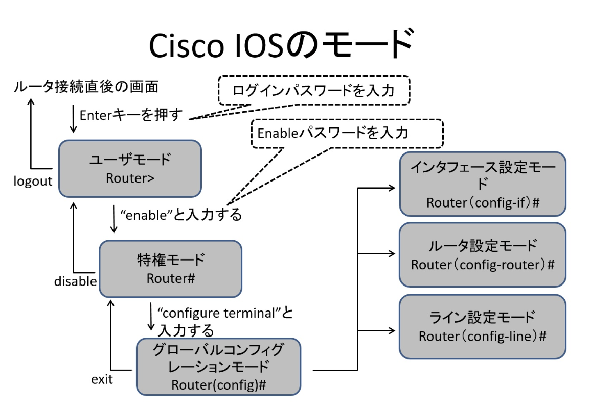

URL:https://network00.net/category/ciscoios/

# Cisco IOS

### `IOS入門`

- モード変更のコマンド 
 
ユーザモード:統計情報を表示。ルータの基本的な状態の確認が可能  
特権モード:ルータの設定を表示。詳細な状態の確認やファイルの移動等が行える  
グローバルコンフィギュレーションモード:ルータに全体的な設定・変更を苦悪ことができる  
項目別の設定モード:項目別に詳細な設定・変更を行うことができる(インターフェイス設定モード、ルータ設定モード等)

### `インターフェイスの設定`

- インターフェイス設定モード  
`(config)#interface [type] [port]`

- IPアドレスの設定  
`(config-if)#ip address [ip-address] [subnet-mask]`

- インターフェイスの有効化  
`(config-if)#no shutdown`

### `設定例の構成`

### `ルータ:R1のインターフェイス設定`
`R1(config)#interface fastethernet 0/0` => インターフェイス設定  
`R1(config-if)#ip address 192.168.10.1 255.255.255.0` => IPアドレスの設定  
`R1(config-if)#no shutdown` => インターフェイスの有効化

`R1(config-if)#interface serial 0/0`  
`R1(config-if)#ip address 192.168.20.1 255.255.255.0`  
`R1(config-if)#no shutdown`

`R1(config-if)#interface serial 0/1`  
`R1(config-if)#ip address 192.168.30.1 255.255.255.0`  
`R1(config-if)#no shutdown`

### `ルータ:R2のインターフェイス設定`
`R2(config)#interface fastethernet 0/0`  
`R2(config-if)#ip address 192.168.40.1 255.255.255.0`  
`R2(config-if)#no shutdown`

`R2(config-if)#interface serial 0/0`  
`R2(config-if)#ip address 192.168.20.2 255.255.255.0`  
`R2(config-if)#no shutdown`

### `ルータ:R3のインターフェイス設定`
`R3(config)#interface fastethernet 0/0`  
`R2(config-if)#ip address 192.168.50.1 255.255.255.0`  
`R2(config-if)#no shutdown`

`R2(config-if)#interface serial 0/0`  
`R2(config-if)#ip address 192.168.30.2 255.255.255.0`  
`R2(config-if)#no shutdown`

### `インターフェイス状態の確認`

`#show ip interface brief` => インターフェイスの要約情報を表示。Statusは物理層の状態、Protocolはレイヤ2(データリンク層)の状態を判断できる  
`#show ip interface` => インターフェイスに対して適用したアクセスリストを確認する
