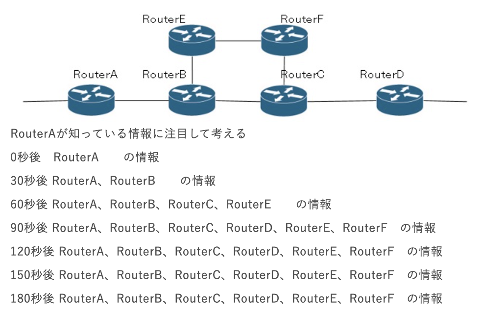

### `ルーティング1`

`経路制御(ルーティング)とは`
- ネットワーク層のPDUであるIPパケットのヘッダ部に埋め込まれた宛先IPアドレスを、自身のルーティングテーブルと照らし合わせて最適なインターフェイスから送出する

- ルータはネットワークの変化に柔軟かつ遅延なく対応する必要がある。ルータのルーティングテーブル等の経路情報は管理者が隅々まで把握しているわけではない

- ルータのルーティングテーブル等の経路情報は、ルータ同士で経路情報を交換していて、ある程度自動的に経路が作成される。これをダイナミックルーティングとも呼ぶ。一方で管理者が隅々まで管理する場合はスタティックルートと呼ぶ

`ダイナミックルーティング`
- IGP(*Interior Gateway Protocol*)地域やISP等の団体で管理している範囲内でルーティングテーブルを作成する。団体が運用する範囲を自立システム(*Autonomous System*)と呼ぶ

- EGP(*Exterior Gateway Protocol*)は、多数のAS間にルーティングテーブルを作成する

経路制御アルゴリズム

- ディスタンスベクター型  
・距離(メトリック)と方向によってルートを作成する  
・隣接ルータと情報交換を何度も繰り返し、情報が広がっていく手法をとっている  
・他のアルゴリズムと比べると、処理が簡単で、ルータが高性能でなくてもよく、設定も簡単  
・ネットワークの構造が複雑になると、経路の情報交換が安定する(コンバージェンス)までに時間がかかる  
・経路にループが発生しやすくなる  
・RIPやEIGRP(Cisco独自)がある

- リンクステート型  
・ルータがネットワーク全体の接続状態を理解してルートを作成する。すべてのルータが同じ情報をもつことになる  
・経路の情報交換が安定するまでの時間が短く出来る  
・処理が複雑で、CPUやメモリ等のリソースを多く消費する  
・代表的なものにはOSPFやIS-ISがある

`RIP(Routing Information Protocol)`
- サブネットマスクに対応したversion2が使われるようになった

- 距離(メトリック)の単位はホップ数。ホップ数とは通過するルータの数のこと。RIPではできるだけ少ない数のルータを通過して、宛先IPアドレスに到達するようにルートが作成される

- 経路情報が送信されるのは30s周期

- 6回(130s)待っても経路情報が送られてこない場合、接続が切れたと判断する

経路情報作成の概要

この場合、90sで全情報を交換しきっており、それ以上ルーティング情報は変化しない(コンバージェンス(収束))

ループの対策  
- 無限カウント:経路が切断された際、過去に伝えた情報を逆に教えられてしまう状態のこと。対策として、ホップ数16以上を通信不能としている

- スプリットホライズン:経路情報を受信したインターフェイスからは同じ情報を送り出さない

- ポイズンリバース:経路が切れたとき、その情報を流さないのではなく、ホップ数16として流すことで通信不能と伝える方法。スプリットホライズンよりも優先される挙動

- トリガーアップデート:経路に変化が生じたとき、30s待たずにすぐに伝える

- これらの機能が実装されているRIPでもルーティングループが発生してしまったり、コンバージェンスまでに時間がかかることがある
