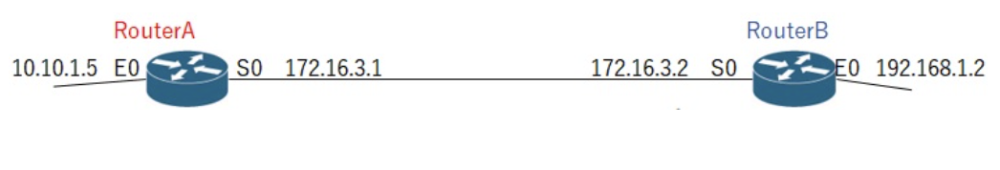

### `ルーティング2`

`RIPでの経路情報作成のやり取り`

RIP開始時

- RouterA

|宛先|インターフェイス|ネクストホップ|ホップ数|
|---|-------------|------------|-------|
|10.0.0.0/8|E0|直接接続|0|
|172.16.0.0/16|S0|直接接続|0|

- RouterB

|宛先|インターフェイス|ネクストホップ|ホップ数|
|---|-------------|------------|-------|
|172.16.0.0/16|S0|直接接続|0|
|192.168.1.0/24|E0|直接接続|0|

RIP開始後 BからAへの初回送信

- RouterBは、ホップ数を+1して下記情報を送る

|宛先|インターフェイス|ネクストホップ|ホップ数|
|---|-------------|------------|-------|
|172.16.0.0/16|S0より|RouterBより|1|
|192.168.1.0/24|S0より|RouterBより|1|

- RouterAでは、受け取った情報と自身のルーティングテーブルを比較し、同じ宛先が存在した場合はホップ数の小さい方を採用し、同じ宛先が無ければそのルートをルーティングテーブルに作成する

|宛先|インターフェイス|ネクストホップ|ホップ数|
|---|-------------|------------|-------|
|10.0.0.0/8|E0|直接接続|0|
|172.16.0.0/16|S0|直接接続|0|
|192.168.1.0/24|S0より|192.16.3.2|1|

次に  AからBへの送信

- RouterAはホップ数に+1した下記情報をRouterBに送る

|宛先|インターフェイス|ネクストホップ|ホップ数|
|---|-------------|------------|-------|
|10.0.0.0/8|S0より|RouterAより|1|
|172.16.0.0/16|S0より|RouterAより|1|
|192.168.1.0/24|S0より|RouterAより|2|

- RouterBでは、受け取った情報と自身のルーティングテーブルを比較し、同じ宛先が存在した場合はホップ数の小さい方を採用し、同じ宛先が無ければそのルートをルーティングテーブルに作成する

|宛先|インターフェイス|ネクストホップ|ホップ数|
|---|-------------|------------|-------|
|172.16.0.0/16|S0|直接接続|0|
|192.168.1.0/24|E0|直接接続|0|
|10.0.0.0/8|S0|172.16.3.1|1|
