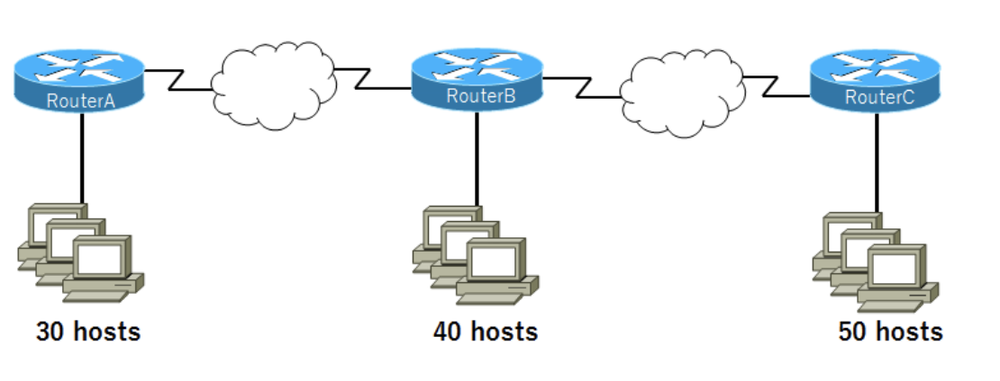
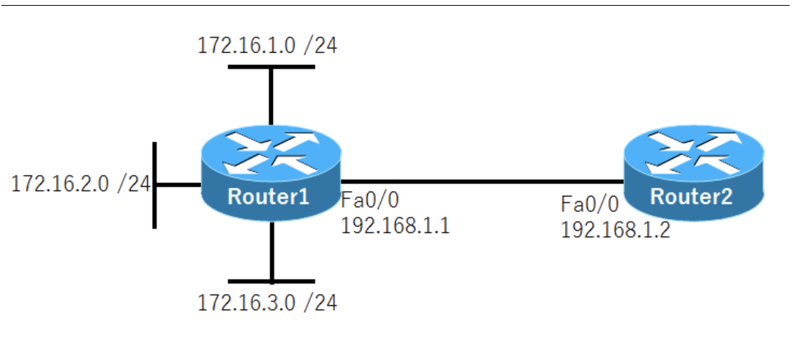

# IPアドレス計算問題
URL:https://www.n-study.com/ip-addressing/ip-address-calc-example-answer/#google_vignette

---
・10.1.160.0 / 20のサブネットに含まれる有効なホストのIPアドレスを3つ選択  
A.10.1.168.0  
C.10.1.174.255  
D.10.1.160.255

B.10.1.176.1 => 176は不適切  
E.10.1.160.0 => これはサブネットアドレス。これ + 1からがホストアドレスの範囲  
F.10.1.175.255 => ブロードキャストアドレス

サブネットマスクは「11111111.11111111.11110000.00000000」。160は「**1010**0000」。第3オクテットが160(**1010**0000) ~ 175(**1010**1111)、第4オクテットは0から255なものが正解  
10.1.160.0 / 20の次のサブネットは10.1.176.0 / 20。サブネットマスクが/20なので16の倍数で変化する。10.1.176.0から-1すると10.1.175.255であり、これがブロードキャストアドレス。つまり有効なIPアドレスの範囲は、10.1.160.1 ~ 10.1.175.254。ホストアドレスの範囲は、「**サブネットアドレス + 1 ~ ブロードキャストアドレス - 1**」

---
・192.168.1.42 255.255.255.248に対するサブネットのアドレス  
C.192.168.1.40/29  

A.192.168.1.8/29  
B.192.168.1.32/27  
D.192.168.1.16/28  
E.192.168.1.48/29

書き方を変えると、「192.168.1.42 / 29」。第4オクテットのサブネットマスクは「**11111**000」、42は「**00101**010」。つまり、第4オクテットは40、サブネットマスクは29

---
・サブネットマスク255.255.255.224を利用しているサブネットのIPアドレスのうち、最後の有効なIPアドレス  
B.192.168.2.62

A.192.168.2.63 => ブロードキャストアドレス  
C.192.168.2.61  
D.192.168.2.60  
E.192.168.2.32 => **001**00000。サブネットアドレスと考えられる

プレフィックス長は27。サブネットマスクの第4オクテットは11100000。先頭3桁は何でも良いとして、00001(1) ~ 11110が(62)有効。00000(0)はサブネットアドレス。11111(63)はブロードキャストアドレス。

---
・IPアドレス 172.16.159.159 / 22のネットワークアドレス  
C.172.16.156.0

A.172.16.0.0  
B.172.16.128.0  
D.172.16.159.0  
E.172.16.159.128  
F.172.16.192.0

プレフィックス長が22なので、サブネットマスクは「**11111111.11111111.111111**00.00000000」。第3オクテットと第4オクテット(159.159)は「**100111**11.10011111」。ホスト部を全て0にした場合、「10011100.00000000(156.0)」となる。

---
・IPアドレス192.168.23.61 / 28のネットワークアドレス  
C.192.168.23.48

A.192.168.23.0  
B.192.168.23.32  
D.192.168.23.56  
E.192.168.23.60

プレフィックス長が28なので、サブネットマスクは「**11111111.11111111.11111111.1111**0000」。第4オクテット(61)は「**0011**1101」。ホスト部を全て0にした場合、「**0011**0000(48)」となる。

---
・10.16.3.65 / 23について正しい記述を2つ  
A.サブネットの最も小さいIPアドレスは10.16.2.1 255.255.254.0  
D.サブネットのブロードキャストアドレスは10.16.3.255 255.255.254.0

B.サブネットの最後の有効なIPアドレスは10.16.2.254 255.255.254.0  
C.ネットワークはサブネッティングされていない  
E.サブネットアドレスは10.16.3.0 255.255.254.0

サブネットマスクは「**11111111.11111111.1111111**0.00000000」。第3オクテットと第4オクテット(3.65)は「**0000001**1.01000001」。サブネットアドレスは10.16.2.0、ブロードキャストアドレスは10.16.3.255。有効なIPアドレスは10.16.2.1 ~ 10.16.3.254

---
・172.16.0.0のネットワークをサブネットマスク255.255.255.192でサブネッティングしている。172.16.2.120のIPアドレスをホストに設定すると、IPアドレスの競合が検出された。ホストに172.16.2.120と同じサブネット上のIPアドレスを設定する。どのIPアドレスが適切か  
B.172.16.2.80  

A.172.16.1.80  
C.172.16.1.64 => これはサブネットアドレス  
D.172.16.2.64  
E.172.16.2.127 => これはブロードキャストアドレス  
F.172.16.2.128

プレフィックス長は/26。**172.16.2.120 / 26と同じネットワークのIPアドレスを考えれば良い**。サブネットアドレスは172.16.2.64、ブロードキャストアドレスは172.16.2.127。有効なIPアドレスは172.16.2.65 ~ 172.16.2.126

---
・サーバにスタティックにIPアドレスを割り当てる。ネットワークアドレスは192.168.20.24 / 29でルータには利用可能な最初のIPアドレスを割り当てる。サーバには利用可能な最後のIPアドレスを割り当てる。サーバの設定として適切なIPアドレス・サブネットマスク・デフォルトゲートウェイはどれか  
C.192.168.20.30, 255.255.255.248, 192.168.20.25

A.192.168.20.14, 255.255.255.248, 192.168.20.9  
B.192.168.20.254, 255.255.255.0, 192.168.20.1  
D.192.168.20.30, 255.255.255.240, 192.168.20.17  
E.192.168.20.30, 255.255.255.240, 192.168.20.25

192.168.20.24 / 29のIPアドレスの範囲を考える。サブネットマスクは「255.255.255.248」。サブネットアドレスは192.168.20.24、ブロードキャストアドレスは192.168.20.31。有効なIPアドレスは192.168.20.25 ~ 192.168.20.30

---
・サブネットマスク255.255.248.0のとき有効なホストアドレスを3つ選択  
A.172.16.9.0  
C.172.16.31.0  
D.172.16.20.0

B.172.16.8.0 => これはサブネットアドレス

プレフィックス長は/21。再3オクテットは11111000。9は「**00001**001」、8は「**00001**000」、31は「**00011**111」、20は「**00010**100」。有効なIPアドレスは3バイト目が8の倍数ではないアドレス。

---
・ホストBに設定できるIPアドレスを2つ選択  

B.192.168.10.38  
C.192.168.10.46

A.192.168.10.32 => これはサブネットアドレス  
D.192.168.10.47 => これはブロードキャストアドレス  
E.192.168.10.49  
F.192.168.10.51

ホストBが接続されている192.168.10.32 / 28のネットワークアドレスで使用できるIPアドレスの範囲を考える。32は「**0010**0000」なので、サブネットアドレスは192.168.10.32、ブロードキャストアドレスは192.168.10.47。有効なIPアドレスは192.168.10.33 ~ 192.168.10.46

---
---
URL:https://tech.pjin.jp/blog/2018/07/12/%e3%80%90ccna%e8%a9%a6%e9%a8%93%e5%af%be%e7%ad%96%e5%95%8f%e9%a1%8c%e3%80%91%e3%83%8d%e3%83%83%e3%83%88%e3%83%af%e3%83%bc%e3%82%af%e3%81%ae%e5%9f%ba%e7%a4%8e%e3%81%8b%e3%82%89%e5%ad%a6%e3%82%93-11/

---
・ルータのイーサネットポートに172.16.112.1 / 20のIPアドレスが割り当てられているとき、このサブネット内に接続することができる最大のホスト数はいくつか  
C.4094

A.2046 => プレフィックス長/21であれば正しい  
B.2048  
D.4096 => ネットワークアドレスとブロードキャストアドレスが除外されていない  
E.8190

2の12乗 - 2 = 4094。ホスト部は12ビット。112は「01110000」、172.16.112.0(ネットワークアドレス)と172.16.127.255(ブロードキャストアドレス)は除外する。

---
・/30サブネットマスクでサブネット化されたクラスCのIPアドレスが与えられた場合、各サブネットで有効なホストIPアドレスの数はいくつか  
B.2

A.1 D.8 E.252 F.254  
C.4 => 全てのIPアドレス  

ホスト部は2ビット。2の2乗個のIPアドレスが存在し、そこからサブネットアドレスとブロードキャストアドレスを除外する。

---
・次のIPアドレスのうち、どれがマスク255.255.255.224によってサブネット化されたサブネット内の最大の有効なホストか  
B.192.168.2.62

A.192.168.2.63 => **001**11111(63) => これはブロードキャストアドレス  
C.192.168.2.61 => **001**11101(61)  
D.192.168.2.60 => **001**11100(60)  
E.192.168.2.32 => **001**00000(32)

プレフィックス長は/27。ホスト部は5ビット。11111(31)はブロードキャストアドレスなので11110(30)となる。第4オクテットが**001**11110(62)であるものが正しい。

---
---
URL:https://tech.pjin.jp/blog/2018/07/20/%e3%80%90ccna%e8%a9%a6%e9%a8%93%e5%af%be%e7%ad%96%e5%95%8f%e9%a1%8c%e3%80%91%e3%83%8d%e3%83%83%e3%83%88%e3%83%af%e3%83%bc%e3%82%af%e3%81%ae%e5%9f%ba%e7%a4%8e%e3%81%8b%e3%82%89%e5%ad%a6%e3%82%93-12/

---
・企業はネットワークアドレス172.16.0.0を使用する。ネットワーク管理者は図示のように、30, 40, 50のホストを持つ3つのサブネットを収容するためのクラスフルなアドレス指定方式を設計する必要がある。このネットワークに対応するサブネットマスクは？

A.255.255.255.192(/26)

B.255.255.255.224(/27)  
C.255.255.255.240(/28)  
D.255.255.255.248(/29)  
E.255.255.255.252(/30)

**3つのサブネットを用意**し、**1つのサブネット当たりのホスト数が最大50を超える**ようなサブネットマスクを使用する必要がある。172.16.0.0のプレフィックス長は/16。/26であれば、4つのサブネットに分割でき、1サブネットあたり62個のホストを設定できる。

---
・10.1.160.0 / 20サブネットに属するホストに対して有効なIPアドレスは3つ選択  
A.10.1.168.0  
C.10.1.174.255  
D.10.1.160.255

B.10.1.176.1  
E.10.1.160.0 => ネットワークアドレス  
F.10.1.175.255 => ブロードキャストアドレス

160は「**1010**0000」。ネットワークアドレスは10.1.160.0、ブロードキャストアドレスは10.1.175.255。有効なIPアドレスの範囲は10.1.160.1 ~ 10.1.175.254。

---
・ネットワークが構成されている。ルータ1にスタティックルートを1つ設定して、172.16.1.0 / 24 ~ 172.16.3.0 / 24の3つのネットワーク全てをルータ2にアドバタイズしたい。このとき、手動集約に利用するサブネットマスクは次のうちどれになるか。

C.255.255.252.0

A.255.255.255.0  
B.255.255.254.0  
D.255.255.248.0  
E.255.255.240.0

手動集約で172.16.1.0 / 24から172.16.3.0 / 24までのルートを全てまとめて伝えたい場合、アドレスのどの部分が共通になっているかを確認する必要がある。第3オクテットの6ビット目までが共通となるので、255.255.252.0(/22)を使用する。

---
---
URL:https://network00.net/ipcalc/

---
・10.140.3.0 / 24を6つのサブネットに分割する、各サブネットに最大30までホストを接続するようにする場合のサブネットマスク

2の5乗 - 2 = 30。3ビットサブネット化するとサブネットマスクは255.255.255.224(/27)

---
・172.16.0.0 / 16をサブネット化して、各サブネットにホストアドレスを380ずつ用意する。サブネット数を多くするには、サブネットマスクをいくつに設定すれば良いか

2の9乗 - 2 = 510で足りる。ホスト部(16ビット)を7ビットサブネット化するとサブネットマスクは255.255.254.0(/23)

---
・ホストアドレスが10.15.0.1、サブネットマスクが255.255.0.0の場合のネットワークアドレス

書き換えると10.15.0.1 / 16。ホスト部を全て0に変えると10.15.0.0

---
・ホストアドレスが172.16.20.30、サブネットマスクが255.255.255.0の場合のネットワークアドレス

書き換えると172.16.20.30 / 24。ホスト部を全て0に変えると172.16.20.0

---
・192.168.10.45/28のネットワークアドレス

45 => **0010**1101。ホスト部を全て0に変えると192.168.10.32

---
・ホストアドレス10.18.20.89、ネットマスクが255.255.255.192の場合のダイレクトブロードキャストアドレス

プレフィックス長は/26。89 => **01**011001なので、ブロードキャストアドレスは「10.18.20.127」

---
・IPアドレスが172.16.82.40、サブネットマスクが255.255.240.0のサブネットでのホストアドレスの範囲

プレフィックス長は/20。82 => **0101**0010なので、ネットワークアドレスは172.16.80.0、ブロードキャストアドレスは172.16.95.255。ホストアドレスの範囲は「172.16.80.1 ~ 172.16.95.254」

---
---
URL:https://network00.net/ip3/

---
・ネットワークを6つに分割する。ネットワークアドレスは192.168.30.0 / 24である。どのように6分割されるか

サブネットマスクは「255.255.255.224」

1つ目のネットワーク:  
1つ目のネットワークアドレス:192.168.30.32  
1つ目のブロードキャストアドレス:192.168.30.63  
割り当てられるアドレス範囲:192.168.30.33 ~ 192.168.30.62

2つ目のネットワーク:  
2つ目のネットワークアドレス:192.168.30.64  
2つ目のブロードキャストアドレス:192.168.30.95  
割り当てられるアドレス範囲:192.168.30.65 ~ 192.168.30.94

3つ目のネットワーク:  
3つ目のネットワークアドレス:192.168.30.96  
3つ目のブロードキャストアドレス:192.168.30.127  
割り当てられるアドレス範囲:192.168.30.97 ~ 192.168.30.126

4つ目のネットワーク:  
4つ目のネットワークアドレス:192.168.30.128  
4つ目のブロードキャストアドレス:192.168.30.159  
割り当てられるアドレス範囲:192.168.30.129 ~ 192.168.30.158

5つ目のネットワーク:  
5つ目のネットワークアドレス:192.168.30.160  
5つ目のブロードキャストアドレス:192.168.30.191  
割り当てられるアドレス範囲:192.168.30.161 ~ 192.168.30.190

6つ目のネットワーク:  
6つ目のネットワークアドレス:192.168.30.192  
6つ目のブロードキャストアドレス:192.168.30.223  
割り当てられるアドレス範囲:192.168.30.193 ~ 192.168.30.222

6分割したいので、3ビットサブネット化する。そうするとプレフィックス長は/27。第3オクテットの3ビット目までがネットワーク部、それ以降がホスト部。

---
・ネットワークを4つに分割する。ネットワークアドレスは172.16.9.0 / 24である。どのように4分割されるか

サブネットマスクは「255.255.255.224」

1つ目のネットワーク:  
1つ目のネットワークアドレス:172.16.9.32  
1つ目のブロードキャストアドレス:172.16.9.63  
割り当てられるアドレス範囲:172.16.9.33 ~ 172.16.9.62

2つ目のネットワーク:  
2つ目のネットワークアドレス:172.16.9.64  
2つ目のブロードキャストアドレス:172.16.9.95  
割り当てられるアドレス範囲:172.16.9.65 ~ 172.16.9.94

3つ目のネットワーク:  
3つ目のネットワークアドレス:172.16.9.96  
3つ目のブロードキャストアドレス:172.16.9.127  
割り当てられるアドレス範囲:172.16.9.97 ~ 172.16.9.126

4つ目のネットワーク:  
4つ目のネットワークアドレス:172.16.9.128  
4つ目のブロードキャストアドレス:172.16.9.159  
割り当てられるアドレス範囲:172.16.9.129 ~ 172.16.9.158

4分割したいので、3ビットサブネット化する。そうするとプレフィックス長は/27。第3オクテットの3ビット目までがネットワーク部、それ以降がホスト部。

---
---
URl:https://network00.net/ip4/

---
・ネットワーク分割をし、IPアドレスを節約する。ネットワークアドレスは10.10.1.0 / 24である。どのように62分割するか

サブネットマスクは「255.255.255.252」

1つ目のネットワーク:  
1つ目のネットワークアドレス:10.10.1.4  
1つ目のブロードキャストアドレス:10.10.1.7  
割り当てられるアドレス範囲:10.10.1.5 ~ 10.10.1.6

2つ目のネットワーク:  
2つ目のネットワークアドレス:10.10.1.8  
2つ目のブロードキャストアドレス:10.10.1.11  
割り当てられるアドレス範囲:10.10.1.9 ~ 10.10.1.10

3つ目のネットワーク:  
3つ目のネットワークアドレス:10.10.1.12  
3つ目のブロードキャストアドレス:10.10.1.15  
割り当てられるアドレス範囲:10.10.1.13 ~ 10.10.1.14

61つ目のネットワーク:  
61つ目のネットワークアドレス:10.10.1.244  
61つ目のブロードキャストアドレス:10.10.1.247  
割り当てられるアドレス範囲:10.10.1.245 ~ 10.10.1.246

62つ目のネットワーク:  
62つ目のネットワークアドレス:10.10.1.248  
62つ目のブロードキャストアドレス:10.10.1.251  
割り当てられるアドレス範囲:10.10.1.249 ~ 10.10.1.250

62分割したいので、6ビットサブネット化してプレフィックス長は/30、第4オクテットの値は252。最後の2ビットが00がネットワークアドレス、11がブロードキャストアドレス

---
・クラスCではIPが足りない。IPは192.168.200.0 ~ 192.168.223.255。1つのネットワークに1000台のホストが割り当てられるようにして、ネットワーク数が最大になるようにする

サブネットマスク:255.255.252.0  
ネットワークアドレス:192.168.200.0  
ブロードキャストアドレス:192.168.203.255  
割り当てられるアドレス範囲:192.168.200.1 ~ 192.168.203.254

200 => 「**110010**00」、223は「**110111**11」、2の10乗が1024

---
・クラスCではIPが足りない。IPは192.168.156.0 ~ 192.168.174.255。1つのネットワークに600台のホストが割り当てられるようにして、ネットワーク数が最大になるようにする

サブネットマスク:255.255.252.0  
ネットワークアドレス:192.168.156.0  
ブロードキャストアドレス:192.168.159.255  
割り当てられるアドレス範囲:192.168.156.1 ~ 192.168.159.254

156 => 「**100111**00」、2の10乗が1024
