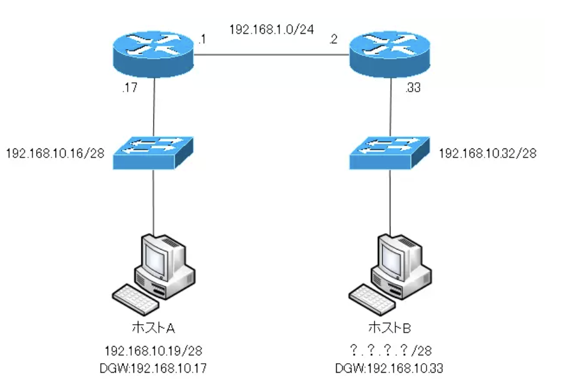

# IPアドレス計算問題
URL:https://www.n-study.com/ip-addressing/ip-address-calc-example-answer/#google_vignette

---
・10.1.160.0 / 20のサブネットに含まれる有効なホストのIPアドレスを3つ選択  
A.10.1.168.0  
C.10.1.174.255  
D.10.1.160.255

B.10.1.176.1 => 176は不適切  
E.10.1.160.0 => これはサブネットアドレス。これ + 1からがホストアドレスの範囲  
F.10.1.175.255 => ブロードキャストアドレス

サブネットマスクは「11111111.11111111.11110000.00000000」。160は「**1010**0000」。第3オクテットが160(**1010**0000) ~ 175(**1010**1111)、第4オクテットは0から255なものが正解  
10.1.160.0 / 20の次のサブネットは10.1.176.0 / 20。サブネットマスクが/20なので16の倍数で変化する。10.1.176.0から-1すると10.1.175.255であり、これがブロードキャストアドレス。つまり有効なIPアドレスの範囲は、10.1.160.1 ~ 10.1.175.254。ホストアドレスの範囲は、「**サブネットアドレス + 1 ~ ブロードキャストアドレス - 1**」

---
・192.168.1.42 255.255.255.248に対するサブネットのアドレス  
C.192.168.1.40/29  

A.192.168.1.8/29  
B.192.168.1.32/27  
D.192.168.1.16/28  
E.192.168.1.48/29

書き方を変えると、「192.168.1.42 / 29」。第4オクテットのサブネットマスクは「**11111**000」、42は「**00101**010」。つまり、第4オクテットは40、サブネットマスクは29

---
・サブネットマスク255.255.255.224を利用しているサブネットのIPアドレスのうち、最後の有効なIPアドレス  
B.192.168.2.62

A.192.168.2.63 => ブロードキャストアドレス  
C.192.168.2.61  
D.192.168.2.60  
E.192.168.2.32 => **001**00000。サブネットアドレスと考えられる

プレフィックス長は27。サブネットマスクの第4オクテットは11100000。先頭3桁は何でも良いとして、00001(1) ~ 11110が(62)有効。00000(0)はサブネットアドレス。11111(63)はブロードキャストアドレス。

---
・IPアドレス 172.16.159.159 / 22のネットワークアドレス  
C.172.16.156.0

A.172.16.0.0  
B.172.16.128.0  
D.172.16.159.0  
E.172.16.159.128  
F.172.16.192.0

プレフィックス長が22なので、サブネットマスクは「**11111111.11111111.111111**00.00000000」。第3オクテットと第4オクテット(159.159)は「**100111**11.10011111」。ホスト部を全て0にした場合、「10011100.00000000(156.0)」となる。

---
・IPアドレス192.168.23.61 / 28のネットワークアドレス  
C.192.168.23.48

A.192.168.23.0  
B.192.168.23.32  
D.192.168.23.56  
E.192.168.23.60

プレフィックス長が28なので、サブネットマスクは「**11111111.11111111.11111111.1111**0000」。第4オクテット(61)は「**0011**1101」。ホスト部を全て0にした場合、「**0011**0000(48)」となる。

---
・10.16.3.65 / 23について正しい記述を2つ  
A.サブネットの最も小さいIPアドレスは10.16.2.1 255.255.254.0  
D.サブネットのブロードキャストアドレスは10.16.3.255 255.255.254.0

B.サブネットの最後の有効なIPアドレスは10.16.2.254 255.255.254.0  
C.ネットワークはサブネッティングされていない  
E.サブネットアドレスは10.16.3.0 255.255.254.0

サブネットマスクは「**11111111.11111111.1111111**0.00000000」。第3オクテットと第4オクテット(3.65)は「**0000001**1.01000001」。サブネットアドレスは10.16.2.0、ブロードキャストアドレスは10.16.3.255。有効なIPアドレスは10.16.2.1 ~ 10.16.3.254

---
・172.16.0.0のネットワークをサブネットマスク255.255.255.192でサブネッティングしている。172.16.2.120のIPアドレスをホストに設定すると、IPアドレスの競合が検出された。ホストに172.16.2.120と同じサブネット上のIPアドレスを設定する。どのIPアドレスが適切か  
B.172.16.2.80  

A.172.16.1.80  
C.172.16.1.64 => これはサブネットアドレス  
D.172.16.2.64  
E.172.16.2.127 => これはブロードキャストアドレス  
F.172.16.2.128

プレフィックス長は/26。**172.16.2.120 / 26と同じネットワークのIPアドレスを考えれば良い**。サブネットアドレスは172.16.2.64、ブロードキャストアドレスは172.16.2.127。有効なIPアドレスは172.16.2.65 ~ 172.16.2.126

---
・サーバにスタティックにIPアドレスを割り当てる。ネットワークアドレスは192.168.20.24 / 29でルータには利用可能な最初のIPアドレスを割り当てる。サーバには利用可能な最後のIPアドレスを割り当てる。サーバの設定として適切なIPアドレス・サブネットマスク・デフォルトゲートウェイはどれか  
C.192.168.20.30, 255.255.255.248, 192.168.20.25

A.192.168.20.14, 255.255.255.248, 192.168.20.9  
B.192.168.20.254, 255.255.255.0, 192.168.20.1  
D.192.168.20.30, 255.255.255.240, 192.168.20.17  
E.192.168.20.30, 255.255.255.240, 192.168.20.25

192.168.20.24 / 29のIPアドレスの範囲を考える。サブネットマスクは「255.255.255.248」。サブネットアドレスは192.168.20.24、ブロードキャストアドレスは192.168.20.31。有効なIPアドレスは192.168.20.25 ~ 192.168.20.30

---
・サブネットマスク255.255.248.0のとき有効なホストアドレスを3つ選択  
A.172.16.9.0  
C.172.16.31.0  
D.172.16.20.0

B.172.16.8.0 => これはサブネットアドレス

プレフィックス長は/21。再3オクテットは11111000。9は「**00001**001」、8は「**00001**000」、31は「**00011**111」、20は「**00010**100」。有効なIPアドレスは3バイト目が8の倍数ではないアドレス。

---
・ホストBに設定できるIPアドレスを2つ選択  

B.192.168.10.38  
C.192.168.10.46

A.192.168.10.32 => これはサブネットアドレス  
D.192.168.10.47 => これはブロードキャストアドレス  
E.192.168.10.49  
F.192.168.10.51

ホストBが接続されている192.168.10.32 / 28のネットワークアドレスで使用できるIPアドレスの範囲を考える。32は「**0010**0000」なので、サブネットアドレスは192.168.10.32、ブロードキャストアドレスは192.168.10.47。有効なIPアドレスは192.168.10.33 ~ 192.168.10.46

---
---
URL:https://tech.pjin.jp/blog/2018/07/12/%e3%80%90ccna%e8%a9%a6%e9%a8%93%e5%af%be%e7%ad%96%e5%95%8f%e9%a1%8c%e3%80%91%e3%83%8d%e3%83%83%e3%83%88%e3%83%af%e3%83%bc%e3%82%af%e3%81%ae%e5%9f%ba%e7%a4%8e%e3%81%8b%e3%82%89%e5%ad%a6%e3%82%93-11/

---
・ルータのイーサネットポートに172.16.112.1 / 20のIPアドレスが割り当てられているとき、このサブネット内に接続することができる最大のホスト数はいくつか  
C.4094

A.2046 => プレフィックス長/21であれば正しい  
B.2048  
D.4096 => ネットワークアドレスとブロードキャストアドレスが除外されていない  
E.8190

2の12乗 - 2 = 4094。ホスト部は12ビット。112は「01110000」、172.16.112.0(ネットワークアドレス)と172.16.127.255(ブロードキャストアドレス)は除外する。

---
・/30サブネットマスクでサブネット化されたクラスCのIPアドレスが与えられた場合、各サブネットで有効なホストIPアドレスの数はいくつか  
B.2

A.1 D.8 E.252 F.254  
C.4 => 全てのIPアドレス  

ホスト部は2ビット。2の2乗個のIPアドレスが存在し、そこからサブネットアドレスとブロードキャストアドレスを除外する。

---
・次のIPアドレスのうち、どれがマスク255.255.255.224によってサブネット化されたサブネット内の最大の有効なホストか  
B.192.168.2.62

A.192.168.2.63 => **001**11111(63) => これはブロードキャストアドレス  
C.192.168.2.61 => **001**11101(61)  
D.192.168.2.60 => **001**11100(60)  
E.192.168.2.32 => **001**00000(32)

プレフィックス長は/27。ホスト部は5ビット。11111(31)はブロードキャストアドレスなので11110(30)となる。第4オクテットが**001**11110(62)であるものが正しい。

---
---
URL:https://network00.net/ipcalc/

---
・10.140.3.0 / 24を6つのサブネットに分割する、各サブネットに最大30までホストを接続するようにする場合のサブネットマスク

2の5乗 - 2 = 30。3ビットサブネット化するとサブネットマスクは255.255.255.224(/27)

---
・172.16.0.0 / 16をサブネット化して、各サブネットにホストアドレスを380ずつ用意する。サブネット数を多くするには、サブネットマスクをいくつに設定すれば良いか

2の9乗 - 2 = 510で足りる。ホスト部(16ビット)を7ビットサブネット化するとサブネットマスクは255.255.254.0(/23)

---
・ホストアドレスが10.15.0.1、サブネットマスクが255.255.0.0の場合のネットワークアドレス

書き換えると10.15.0.1 / 16。ホスト部を全て0に変えると10.15.0.0

---
・ホストアドレスが172.16.20.30、サブネットマスクが255.255.255.0の場合のネットワークアドレス

書き換えると172.16.20.30 / 24。ホスト部を全て0に変えると172.16.20.0

---
・192.168.10.45/28のネットワークアドレス

45 => **0010**1101。ホスト部を全て0に変えると192.168.10.32
