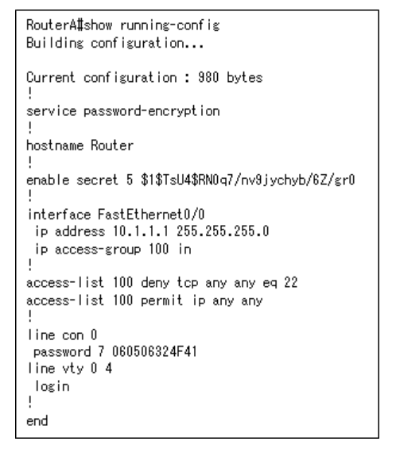
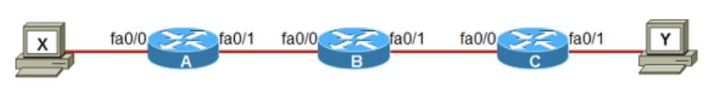
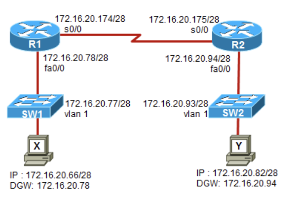
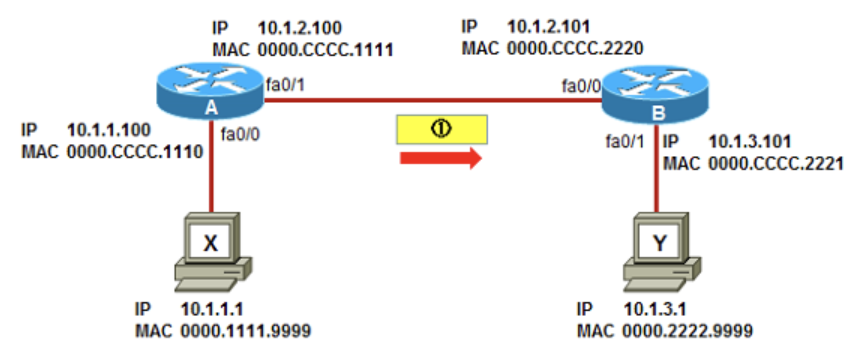
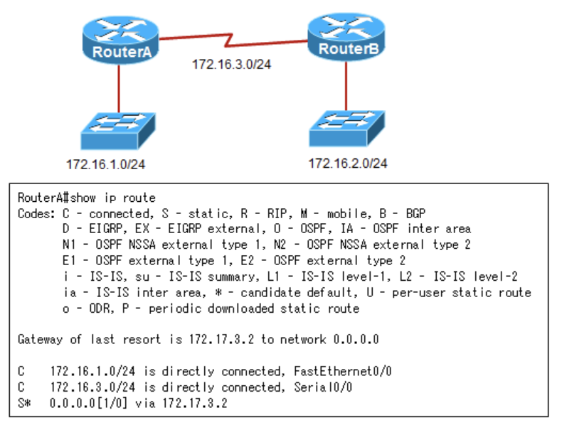

# 過去問
画像からの読み取り問題

---
---
URL:https://www.it-ex.com/distribution/securitynetworksolution/ciscobiz/ccna-rs/

---
2.東京のワークステーションが大阪のワークステーションと通信できるようにする必要がある。もっとも簡単な設定方法は何か。

D.東京ルーターにスタティックルートで宛先ネットワーク172.31.0.0 / 19、ネクストホップ10.1.1.2を設定する

大阪のLAN内の3つのネットワークを集約しスタティックルートで登録する。10(**000**01010), 20(**000**10100), 30(**000**11110)なので3つのネットワークは先頭から19ビットが一致するため172.31.0.0 / 19で集約できる。

---
5.R1ルーターとR2ルーターが通信できていないため、システム管理者がR1 / R2で`show int s0/0/0`で状況を確認した。通信ができない原因を1つ選択

A.カプセル化タイプの設定誤り

インターフェイスが正常に動作しているかは`show interface`コマンドや`show ip interface brief`コマンドのStatusとProtocolで判断できる。~ is up, line protocol is downの場合は「ローカルとリモートのルータ設定の誤り」「ケーブル上のタイミングの問題(ロック信号)」「CSU / DSU障害」「専用回線その他のキャリアサービスの問題」などの原因が考えられる。どちらもdownの場合はルータでCD信号を検出できておらず、「ハードウェア障害」「回線ダウン」「ケーブル接続障害」などがある。*administratively down*の場合は`shutdown`コマンドが有効になっている。

---
8.レイヤ2スイッチYを新しく追加し、管理用ワークステーションからリモート接続して管理する必要がある。このためにスイッチYに設定すべきコマンド

E.`SwitchY(config)#ip default-gateway 192.168.2.254`  
`SwitchY(config)#interface fa0/24`  
`SwitchY(config-if)#ip address 192.168.2.253 255.255.255.0`  
`SwitchY(config-if)#no shutdown`

レイヤ2スイッチにIPアドレスを設定する場合、interface vlan 1に対してIPアドレスを設定する。レイヤ2スイッチのfa0 / 24のような各物理ポートにはIPアドレスを設定できない。またルータのようなIPルーティング機能は備わっていないため、別サブネットと通信を行うには、PCと同様にデフォルトゲートウェイを設定する必要があり、グローバルコンフィギュレーションモードで`ip default-gateway`コマンドで設定する。

---
16.新しいIOSをルータに導入する。既存のIOSを残したままflashに投入できる新しいIOSの最大ファイルサイズ

D.9MB

ログから、9369268 availableとある。単位はバイトなので、約9Mバイト強の空きがあることが分かる。

---
22.ルータに対してTelnetすることができない。トラブルの理由で正しいものを選択

A.vtyにパスワードが設定されていない

B.Level 5パスワードが設定されていない => 存在しない  
C.ACLによってTelnetがブロックされている  
D.コンソールに設定されているパスワードが間違っている

Telnetの接続許可にはline vtyに対してlogin, passwordの設定が必要。ACLが設定されているものの宛先ポート番号が22番で、これはSSHプロトコル。ACLはTelnet接続に影響を与えない。line con 0にパスワードが設定されているが、Telnet接続する場合に使用するlineはvty。

---
27.データフレームを受信した時、R1はどのような動作をするか3つ選択

A.R1はデータパケットをFastEthernet0/2から送信する => 4行目参照  
B.R1は宛先MACアドレスを取り除き、宛先MACアドレスをc200.4444.5555に置き換える => 0 / 0インターフェイスから4行目の宛先へ書き換えている  
E.R1は送信元MACアドレスを取り除き、送信元MACアドレスをc200.4444.1111に置き換える => 2行目のアドレスから0 / 2インターフェイスのMACアドレスに書き換えている

(4行目)192.168.40.5は0 / 2から送信される。イーサネットヘッダは、送信元がR1のFa0 / 2のMACアドレス、宛先がホストのMACアドレスになる。IPヘッダは経路の途中で変更されることはない。

---
29.コマンドの設定を行ったあと、showコマンドで確認したら図のように結果となった。設定内容で正しいもの

D.VTYポートでSSHプロトコルを使用したアクセスが可能になる

VTY回線にSSHを使用したアクセスを許可する設定が行われている。パスワードは暗号化されており、transport input sshより、リモートアクセスにはSSHを使用した接続のみ許可されている。

---
34.このネットワークにおけるブロードキャストドメインの数

D.1

ブロードキャストドメインを分割するのはルータ。ハブやレイヤ2スイッチは分割できない。ハブはコリジョンドメインも分割しないので、合計6個のコリジョンドメインが存在している。

---
37.シリアル回線はデフォルトの速度で、イーサネットリンクは100Mbps。大阪ルータからスタティックルートでインターネットへのルートを設定するとき最も適切なコマンド

B.`ip route 0.0.0.0 0.0.0.0 172.16.100.2`

インターネットへの接続ルートを設定する際には**デフォルトルートを使用**する。デフォルトルートは0.0.0.0を2つの後にネクストホップで設定する。大阪ルータからインターネットへ接続するルートではRouterBの方が速い。

---
38.SW1のコマンド出力から、ネットワーク管理者が次に行う適切なアクションは何か

B.SW2のFa0 / 24のデュプレックスの設定を確認する

CRCエラーが表示されているため、**デュプレックスのミスマッチが想定される**。出力7行目からSW1はFull Duplexに設定されているため、SW2の設定を確認する必要がある。

---
41.ルータ同士で接続した際、認証に失敗する原因

A.2台のルータのパスワードが一致していないため

chap認証ではルータのパスワードが一致している必要がある。ユーザ名には認証相手のホスト名を指定する。

---
46.R1, R2の設定をしたところ、ホストAからホストBへのpingが失敗している。ホストAからR2のs0/0/0インターフェイスへのpingは成功している。トラブルの原因は何か

D.R1に、ネットワーク172.16.1.128 / 26宛のルートがない

R1の設定に、ネットワーク172.16.1.128 / 26へのルートを登録するためのスタティックルートの設定やダイナミックルーティングの設定がされておらず、R1がルートを保持していないことが原因と考えられる。R2のs0/0/0インターフェイスへの**pingは成功していることから、R1 - R2間を接続するシリアルケーブルやシリアルインターフェイスは正常に動作している**。

---
49.新しいルータ設定で`copy startup-config running-config`を実行した。再起動するとダイアログが表示された原因として考えられるもの

B.ネットワーク管理者が設定を保存するのに失敗した

A.`boot config-file`コマンドが設定されていない  
C.`boot system flash`コマンドが設定されていない  
=> 特定のIOSやコンフィギュレーションファイルを指定する場合に使用するため、設定は必須ではない

設定を保存するコマンドは`copy running-config startup-config`なので、設定が正しく保存されていない。パスワードリカバリの際に、設定されたコンフィギュレーションファイルを無視してルータ(スイッチ)を起動させる場合はコンフィギュレーションレジスタ値を0x2142にする(デフォルトは0x2102)。

---
51.ルータにtelnetセッションを確立できない原因  

C.VTYパスワードが設定されていない

A.コンソールパスワードが設定されていない  
B.特権パスワードが暗号化されている  
D.ACLがtelnetアクセスをブロックしている => ブロックされるのはSSH

line vtyの配下でpasswordコマンドが設定されていない

---
53.ホストXからホストYにpingをしている。このとき、ルータCのfa0 / 0で受信したエコー要求パケットのTTL値

D.253

TTL(*Time To Live*)はホストから送信される時点で255、ルータで処理され出力される時点で-1される。ルータCではルータAとルータBが各-1した値を受信する。

---
59.ネットワーク装置Aについて、正しい説明を3つ選択

A.サブネットマスクが255.255.255.0のとき、PCがお互いに通信できるためには、レイヤ3デバイスでなければならない  
D.サブネットマスクが255.255.254.0のとき、各インタフェースはIPアドレスを必要としない  
E.サブネットマスクが255.255.255.128のとき、各インタフェースはユニークなIPサブネットのIPアドレスを必要とする

B.サブネットマスクが255.255.255.0のとき、PCがお互いに通信できるためには、レイヤ2デバイスでなければならない  
C.サブネットマスクが255.255.255.128のとき、各インタフェースはIPアドレスを必要としない

A, Bは/24、C, Eは/25。38は「00100010」、70は「0100110」。  
プレフィックスが/25のとき、左のPCは20.1.0.0 / 25、右のPCは20.1.1.0 / 25のネットワークに所属する。左右のネットワークが異なるためレイヤ3デバイス(ルータやレイヤ3スイッチ)が必要。このため、各インターフェイスはユニークなサブネットのIPアドレスをもつ必要がある。  
プレフィックスが/24のとき、左のPCは20.1.0.0 / 24、右のPCは20.1.1.0 / 24のネットワークに所属する。左右のネットワークが異なるためレイヤ3デバイス(ルータやレイヤ3スイッチ)が必要。  
プレフィックスが/23のときは、どちらも20.1.0.0 / 23のネットワークに所属する。左右のネットワークアドレスが同じ場合、レイヤ2デバイスでないといけない。

---
60.R1がR2にルートをアドバタイズするとき、最も効率的な集約はどれか

E.192.1.4.0/22

R1がもつネットワークの第3オクテットは4(**000001**00)から7(**000001**11)、なので、6ビット目まで集約できる。

---
61.VLSMアドレッシングスキームで、R1から送信される正しい集約ルート

C.192.168.0.0/16

128(10000000)、64(01000000)、32(00100000)のうち、第3オクテットには共通部分はないため、共通部分は16ビット。

---
62.ホストXからホストYに通信している。ホストXに作成されるARPキャッシュのIPアドレスとMACアドレス

E.IPアドレス:172.16.1.1  
MACアドレス:001e.4a60.8a28

別サブネットと通信する場合、レイヤ2ヘッダにはデフォルトゲートウェイのL2アドレスを付けてフレームを送信する。デフォルトゲートウェイのMACアドレスで、このIPアドレスとMACアドレスがホストXのARPキャッシュに作成される。

---
63.ホストXとホストYで通信できない。誤った設定のされている機器

F.R2

R1とR2は172.16.20.160 / 28のネットワークで接続されている。172.16.20.175はブロードキャストアドレスのため、ルータに設定できない。ホスト部が全て0のネットワークアドレスもルータやPCなどのホストのIPアドレスには設定できない。

---
64.このトポロジで、ルータAで`show interface brief`コマンドを実行した結果について

C.インターフェイスは問題なく動作している

`show interface brief`コマンドでは、StatusとProtocolの状態がある。*administratively down*は管理者が意図的に停止させているため、動作に異常はない。Statusはレイヤ1の状態で、Protocolはレイヤ2の状態を示している。レイヤ2のdownには、接続先の機械のレイヤ2とプロトコルが異なる、認証結果が失敗しているなどがある。

---
65.showコマンドの出力を確認し正しい説明を3つ

C.R2のIPアドレスは10.1.1.2である  
E.R2からのCDP情報はSerial0/0/1で受信している  
F.R2のプラットホームは2811である

A.R2ではCDPが無効化されている  
B.R2へのCDP情報はSerial0/0/0から送信している  
D.R1のIPアドレスは10.1.1.2である

このコマンドで隣接するCiscoデバイスの詳細情報を確認できる。Platform部分では対向のCiscoデバイスのプラットフォームが表示される。また、Interface部分には自身のインターフェイス、Port IDには対向ルータのインターフェイスを表す。

---
66.各ルータにスタティックルーティングが設定されている。ホストXからホストYに通信しようとするとルータCのfa0 / 1インターフェイスがダウンした。この時のルータCの動作で正しいものを2つ

E.ルータCはホストXに対して、ホストYには到達できない事をICMPメッセージを使って通知します  
F.ルータCが通知に使用するメッセージは、ICMP Destination Unreachableです

ルータCのfa0 / 1はダウンしているため、ルータCのルーティングテーブルにはホストYが接続されているサブネットの情報(Connectルート)が存在していない。このため、ルータCはIPパケットの送信元であるホストXに対して、*ICMP Destination Unreachable*メッセージを使ってホストYに通信できないことを通知する。

---
67.ホストXからホストY宛に送信されたIPパケットがルータAを通過している。ルータAからルータBに送信された正しいIPパケットのアドレス

D.送信元MACアドレス:0000.CCCC.1111  
宛先MACアドレス:0000.CCCC.2220  
送信元IPアドレス:10.1.1.1  
宛先IPアドレス:10.1.3.1

宛先MACアドレスは、その通信回線内で有効なアドレス。MACアドレスは書き換えられるが、IPアドレスは変更されない。

---
68.図の構成の問題点

B.スタティックルートが適切に設定されていない

スタティックルートのネクストホップの指定が誤っている。ネクストホップには直接接続している同じサブネットのルータのアドレスを指定する必要がある。ネクストホップに直接接続していないサブネットのアドレスを指定すると、そのスタティックルートはルーティングテーブルに反映されない。

---
74.ルータの設定に関する説明で正しいもの

B.`ip nat inside source`コマンドで指定している「1」は、アクセスコントロールリスト1番を参照していることを意味する

これはPAT(*Port Address Translation*)の正しい設定。コマンドの末尾にあるoverloadによりポートアドレス変換が実現される。コマンドで指定されている「1」はACLの番号を参照しており、ACLで許可された内部ホストのアドレスをSerial0 / 0 / 0のアドレス(130.243.78.1)に変換する。ルータに接続しNATに関わっているインターフェイスには、内部インターフェイスであればip nat inside、外部のインターフェイスであればip nat outsideコマンドを設定しなければNAT / PATは動作しない。インターフェイスへの設定は必須で、インターネットへルーティングさせるためには、スタティックデフォルトルートの設定も必要。

---
76.次のようなセキュリティ要件を実現したい。  
・Fa0 / 1に接続を許可するのはホストXのみ  
・Fa0 / 1に他の機器が検出された場合は違反機器から送信されたフレームはドロップする。ただし正しいホストXからのフレームは転送を継続する。  
しかし実装後、正しく動作していなかった。修正項目を2つ選択

B.ただ一つのMACアドレスだけ学習するように、設定を修正する必要がある  
D.ポートセキュリティ機能をインターフェイスで有効にしなければならない

Port Security:Disabledになっており、ポートセキュリティが機能していない。Maximum Mac Address fa0/1ポートに接続を許可するホストの台数設定が3台となっているため、ここを1台に設定変更しないといけない。

---
78.ルータのインターフェイスfa0 / 0に対してACL150番を設定している。このインターフェイスへのACL割り当てを解除するコマンド

B.`no ip access-group 150 out`

ログに「Outgoing access list is 150」とあり、出力方向へACL150が設定されている。

---
80.ルータAの管理者は、以下の要件を満たすセキュリティを設定する。  
・ホストYユーザのみがManagement WebサーバにWebアクセスできるようにする  
・他の如何なるクライアントからのManagement Webサーバへのアクセス、またホストYユーザがWeb以外のプロトコルを使ってManagement Webサーバにアクセスすることを禁止する  
。サーバネットワーク(172.16.254.0 / 24)にはPublicサーバが存在しており、上記以外のトラフィックは全て許可する  
上記要件を満たすACLを一つのインターフェイスにだけ設定する場合、どのインターフェイスに設定するか

A.FastEthernet0/1

FastEthernet0 / 0インターフェイスにACLを適用すると、コアネットワークからサーバへのトラフィックをフィルタできない。Serial0 / 0インターフェイスにACLを適用すると、ホストX ~ Zからサーバへのトラフィックをフィルタできない。FastEthernet0/1であれば、ホストX ~ Zからサーバへのトラフィック、コアネットワークからサーバへのトラフィックも同時に検査できる。

---
89.図のネットワークにおけるVLAN間のルーティングについての正しい説明を2つ選択

A.ルータのfa0/0とスイッチAのfa0/23は同じカプセル化タイプを設定しなければならない  
C.ルータのfa0/0にはサブインターフェイスを設定しなくてはならない

スイッチAとBには複数のVLANが構成されている。同じスイッチに接続していても異なるホスト間での通信は、一旦ルータでルーティングする必要がある。また、ルータのポートはサブインターフェイスを設定し、それぞれにIPアドレスを設定する。

---
92.各スイッチのVLANは正しく構成し、ルータもVLAN間ルーティングを正しく更生している。全ての機器同士が正しく通信できるようにするために、スイッチA / Bのfa0/24はどう設定すれば良いか

A.`interface fa0/24`  
`switchport mode trunk`

VLAN間の通信ではルータを経由する。VLAN10のホストがVLAN20のホストやインターネットと通信するためには、VLAN10の情報がルータまで転送され、ルーティングする必要がある。1つのVLANが複数のスイッチやルータにまたがる場合、スイッチ間やスイッチ - ルータ間をトランクリンクで接続する。今回であればスイッチAのfa0 / 23、fa0 / 24、スイッチBのfa0 / 24はトランクリンクに設定する。ルータのポートはサブインターフェイスを設定し、それぞれにIPアドレスを設定する。

---
93.ホストXとホストYが通信できるようにするために必要な設定を2つ選択

A.設定A => スイッチfa0/24をトランクリンクに設定する  
`Switch(config)#interface fa0/24`  
`Switch(config-if)#switchport mode trunk` => トランクポートの設定  
B.設定F => ルータにサブインターフェイスを作成し、IPアドレスをPCに設定されたデフォルトゲートウェイと一致させる  
`Router(config)#int fa0/0`  
`Router(config-if)#no shutdown`  
`Router(config)#int fa0/0.1`  
`Router(config-subif)#encapsulation dot1q 10` => トランクプロトコルの設定  
`Router(config-subif)#ip address 192.168.10.254 255.255.255.0`  
`Router(config)#int fa0/0.2`  
`Router(config-subif)#encapsulation dot1q 20`  
`Router(config-subif)#ip address 192.168.20.254 255.255.255.0`

既に設定されている:  
・ホストX(Y)のIPアドレスとデフォルトゲートウェイのIPアドレス  
・スイッチのアクセスポートのVLAN設定とスイッチ自身のIPアドレスとスイッチの設定  
ホストXとホストYを通信させるには、VLAN間ルーティングを設定する必要がある。

---
94.全てのホストが互いに通信できている。このネットワークにおけるアドレッシングスキームについて正しい記述を3つ選択

B.IPアドレス192.168.1.27はVLAN10のホストにアサインできる  
E.ルータのLANのインターフェイスには複数のIPアドレスを設定する  
F.サブネットマスクは255.255.255.128を使用する

VLAN10とVLAN20のホストが互いに通信できるようにするには、ネットワークアドレスを別にしてルータを使用してVLAN間ルーティングを行う必要がある。

---
95.R1がVLAN間ルーティングを行うためRouter-on-a-stickとして使われている。全てのサブインターフェイスに正しく設定が行われていてIPルーティングも有効になっている。また、VLAN内のホストも適切なデフォルトゲートウェイが設定されている。このときの設定について正しいもの

A.ルーティングの設定を追加する必要はない

ルータのインターフェイスにIPアドレスを設定すると、ネットワーク情報はルーティングテーブル上でC(直接接続)のルートとして表示される。ルーティングテーブルは正しく作られており、追加でルーティングプロトコルの設定を行う必要はない。

---
96.図のネットワーク構成において、ホストXとホストYの設定項目で正しいものを3つ選択

D.ホストXのデフォルトゲートウェイ = 192.168.1.178  
F.ホストYのIPアドレス = 192.168.1.75  
G.ホストXのIPアドレス = 192.168.1.188

254は「**111111**10(/30)」、178は「**1011**0010(/28)」、85は「**010**10101(/27)」  
VLAN1サブネット:192.168.1.252/30、使用可能アドレスは.253と.254  
VLAN10サブネット:192.168.1.176/28、使用可能アドレスは.177 ~ .190 => ホストXのIPアドレスの条件  
VLAN20サブネット:192.168.1.64/27、使用可能アドレスは.65 ~ 94 => ホストYのIPアドレスの範囲  
ホストXのデフォルトゲートウェイは、ルータのVLAN10のサブインターフェイスのIPアドレス

---
101.図のようなログを持つDHCPサーバで、IPアドレスの重複が検出された場合のDHCPの動作について正しい説明

B.表示されている重複IPアドレスは、重複が解決されるまでDHCPプールから除外される

`show ip dhcp conflict`コマンドでDHCPサーバの重複アドレスについて確認できる。

---
118.SwitchAに接続しているVLAN10とVLAN20のホストがSwitchBの同じVLANに接続しているホストとの通信に失敗する。問題の原因を選択

C.スイッチ間のリンクがトランクで構成されていない

`show vlan brief`の出力で表示されるポートはアクセスポート。fa0/1ポートはアクセスポートとしてVLAN10が割り当てられている。2台のスイッチにまたがって複数のVLANフレームを転送できるようにするためには、スイッチ間を接続するポートはトランクポートでトランクで接続する必要がある。

---
121.SW1のVLAN1のフレームがSW2に送信された時、SW2ではVLAN2として受信された。原因で正しいもの

(A.ネイティブVLANが一致していない)

レイヤ2スイッチのため、VLAN間ルーティングを考慮する必要はなく、VLAN1のホスト同士、VLAN2のホスト同士の通信に注目すれば良い。どのVLANをネイティブVLANにするかは、両方のスイッチで設定が一致していないといけない。

---
124.スイッチAに接続したVLAN10のホストとスイッチBに接続したVLAN10のホストが通信できない。スイッチのVLAN設定は正しく、スイッチAに接続したVLAN10同士は通信できる。どこに修正が必要か

A.スイッチ間の接続リンクはトランクにする

スイッチAとスイッチBには複数のVLANが構成されている。スイッチ間で同じVLAN上のホスト同士を通信させるには、スイッチ間のリンクをトランクポートに設定して複数のVLANトラフィックを一つのリンクで伝達できるようにする。`switchport mode trunk`コマンドでトランクリンクを設定する。`switchport mode access`コマンドはポートをアクセスポートに設定し、さらに所属するVLANを指定する。

---
132.Catalystスイッチでログの出力があった。ポートfa0/5はVLAN10でルートポートになっていない。その理由として正しいもの

B.このスイッチは、ルートブリッジへ向かう高優先度のパスコストをもつポートが別に存在する

このスイッチはVLAN10ではSTPモードはブロック(Altn BLK)になっている。STPにおいてポートがブロックされているのは、スイッチの別のポートがルートポートである場合。
