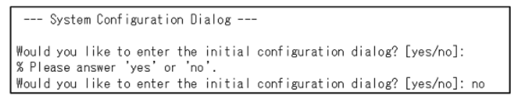
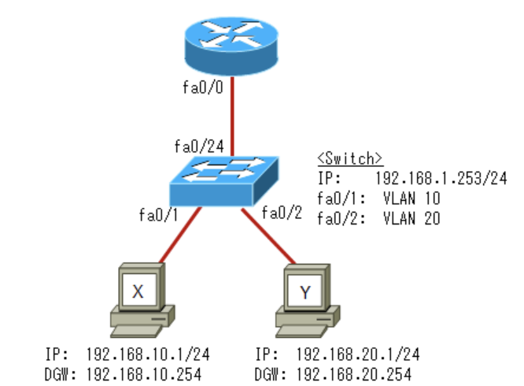
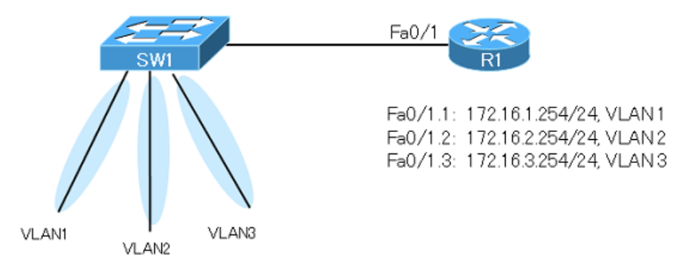
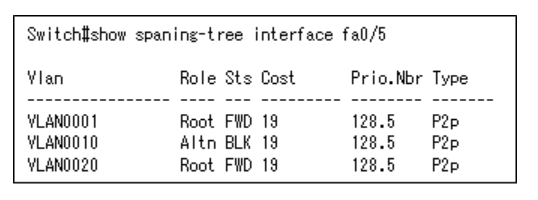

# 過去問

---
---
URL:https://www.it-ex.com/distribution/securitynetworksolution/ciscobiz/ccna-rs/

---
1.IPアドレス172.16.150.240 / 20 が含まれるサブネットのネットワークアドレスはどれか。  
C.172.16.144.0

150 => 「**1001**0110」。/20なので第3オクテット5ビット目以降が0にすることで求められる。

---
2.東京のワークステーションが大阪のワークステーションと通信できるようにする必要がある。もっとも簡単な設定方法は何か。

D.東京ルーターにスタティックルートで宛先ネットワーク172.31.0.0 / 19、ネクストホップ10.1.1.2を設定する

大阪のLAN内の3つのネットワークを集約しスタティックルートで登録する。10(**000**01010), 20(**000**10100), 30(**000**11110)なので3つのネットワークは先頭から19ビットが一致するため172.31.0.0 / 19で集約できる。

---
3.Catalystスイッチで`switchport trunk native vlan 10`コマンドを設定すると、どのように動作するか。  
B.VLAN10の情報はトランクリンクでタグを付けずに転送する

`switchport trunk native vlan 10`コマンドは、トランクポートに設定するコマンド。トランクポートでは各VLANの情報はタグ付けされるが、**Native VLANに限りタグ付けされない**。

---
4.デバッグメッセージにミリ秒単位でタイムスタンプを表示させるためのコマンドを選択  
C.`service timestamps debug datetime msec`

A.`service timestamps log datetime msec` => ログメッセージのタイムスタンプ  

---
5.R1ルーターとR2ルーターが通信できていないため、システム管理者がR1 / R2で`show int s0/0/0`で状況を確認した。通信ができない原因を1つ選択

A.カプセル化タイプの設定誤り

インターフェイスが正常に動作しているかは`show interface`コマンドや`show ip interface brief`コマンドのStatusとProtocolで判断できる。~ is up, line protocol is downの場合は「ローカルとリモートのルータ設定の誤り」「ケーブル上のタイミングの問題(ロック信号)」「CSU / DSU障害」「専用回線その他のキャリアサービスの問題」などの原因が考えられる。どちらもdownの場合はルータでCD信号を検出できておらず、「ハードウェア障害」「回線ダウン」「ケーブル接続障害」などがある。*administratively down*の場合は`shutdown`コマンドが有効になっている。

---
6.正しい拡張IPアクセスコントロールリストを選択  
C.`access-list 150 permit tcp any host 192.168.1.1`

B.`access-list 50 permit host 192.168.1.1`

標準IPアクセスコントロールリストを作成する場合、アクセスリスト番号は1 ~ 99, 1300 ~ 1999までの範囲で指定する。標準アクセスコントロールリストでは、**アドレスとワイルドカードマスクの組み合わせはひとつだけ指定**する。  
拡張IPアクセスコントロールリストを作成する場合、アクセスリスト番号は100 ~ 199, 2000 ~ 2699までの範囲を指定する。プロトコル名を指定した上で、**アドレスとワイルドカードマスクの組み合わせを2つ指定**する。最初のアドレスが送信元、次が宛先アドレス。  
permitは条件に一致した場合に許可、anyは全て許可するの意味。

---
7.ネットワークの利用者が、FTPサーバからファイルをコピーしてる。このファイルコピー操作で使用しているプロトコルスタックの最も高い階層名はどれか  
C.アプリケーション

OSI参照モデルの階層構造名:物理層、データリンク層、ネットワーク層、トランスポート層、セッション層、プレゼンテーション層、アプリケーション層

---
8.レイヤ2スイッチYを新しく追加し、管理用ワークステーションからリモート接続して管理する必要がある。このためにスイッチYに設定すべきコマンド

E.`SwitchY(config)#ip default-gateway 192.168.2.254`  
`SwitchY(config)#interface fa0/24`  
`SwitchY(config-if)#ip address 192.168.2.253 255.255.255.0`  
`SwitchY(config-if)#no shutdown`

レイヤ2スイッチにIPアドレスを設定する場合、interface vlan 1に対してIPアドレスを設定する。レイヤ2スイッチのfa0 / 24のような各物理ポートにはIPアドレスを設定できない。またルータのようなIPルーティング機能は備わっていないため、別サブネットと通信を行うには、PCと同様にデフォルトゲートウェイを設定する必要があり、グローバルコンフィギュレーションモードで`ip default-gateway`コマンドで設定する。

---
9.ダイナミックルーティングが有効な構成において、バックアップルートとしてスタティックルートを選択させたい場合、どのパラメータを調整すればよいか  
C.アドミニストレーティブディスタンス

A.リンクのコスト B.リンクの遅延 D.リンクの帯域幅 E.ホップカウント

アドミニストレーティブディスタンスはルート情報の信頼性を表す数値で、0 ~ 255の間で表現され値が小さいほど信頼性が高く優先的にルーティングテーブルに挿入される。デフォルトのアドミニストレーティブディスタンスはスタティックが1、内部EIGRPが90、OSPFが110、RIPが120。スタティックルートの値が小さいため、ルーティングプロトコルを設定してダイナミックルーティングを有効にしている環境だと、デフォルトではスタティックルートが優先されてルーティングテーブルに挿入される。スタティックルートをバックアップルートとして使用したい場合、スタティックルートのアドミニストレーティブディスタンス値をルーティングプロトコルの値よりも大きくしてスタティックルートの優先度を下げる。

---
10.ルータに対するTelnetアクセスのセキュリティを強化する方法を2つ選択  
B.アクセスコントロールリストを作成し、仮想ポートに`access-class`コマンドを使用して適用する  
C.ラインvtyに対してパスワードを設定し、loginを有効にする

A.アクセスコントロールリストを作成し、仮想ポートに`access-group`コマンドを使用して適用する  
D.インターフェイスを物理的にセキュアにする  
E.アクセスコントロールリストを作成し、物理インターフェイスに`access-group`コマンドを使用して適用する

仮想ポート(VTY)に`access-class`コマンドを使用してアクセスコントロールリストを適用する。ネットワーク192.168.1.0/24内の任意のデバイスからルータへのTelnetアクセスを許可する場合、`access-list 12 permit 192.168.1.0 0.0.0.255 line vty 0 4 access-class 12 in`とすると、VTY回線(0 ~ 4)に対して、ACL12の条件(IPアドレスが192.168.1.x)を許可する。

---
11.PPPが動作するのは、OSI参照モデルのどの階層か  
C.レイヤ2(データリンク層)

pppHDLC(*High-Level Data Link Control*)はSerialインターフェイスのデフォルトのレイヤ2プロトコル。Cisco機器でしかサポートされていない。PPPはCisco以外の機器でもサポートされている。Frame-relayもレイヤ2プロトコル。

---
12.受信したフレームが破損していることが分かった場合にフレームを破棄するOSI階層はどこか  
C.データリンク層

データリンク層では、**フレームを受信するとフレーム全体のエラーチェック**を行う。結果、エラーがあったと判断された場合にはそのフレームを破棄する。

---
13.レイヤ2スイッチが、受信したレイヤ2フレームを転送するかフィルタするか判断する際に使っている情報  
A.宛先MACアドレス

レイヤ2スイッチは、受信したフレームのレイヤ2ヘッダの宛先MACアドレス(*Destination Address*)によって転送先を決定する。DAがブロードキャストやマルチキャストアドレスの時はフラッディング、ユニキャストアドレスでMACアドレステーブルで検索できたときには、MACアドレステーブルに記載されているポートにのみ転送する。検索できなければ受信フレームは全てのポートにフラッドする。

---
14.ダイナミックルーティングより、スタティックルーティングの優れている点を2つ  
D.スタブネットワークにおいて、ルーティングアップデートパケットによるネットワークへの負荷を下げることができる  
G.ネットワーク管理者のみがルーティングテーブルの変更を行うため、セキュリティが確保される

A.ルーティングテーブルの作成や更新にアルゴリズムが使用される  
B.ネットワークに変更があった場合には、ルーティングテーブルが自動的に更新される  
C.自動的にルーティングアップデートがネイバーに送信される  
E.ネットワークの規模が拡大するにつれて、設定が簡単になる  
F.自動的にルート集約がされる  
=> 全てダイナミックルーティングの特徴

ルートの登録・変更は全てネットワーク管理者のみが行う。また、スタブネットワーク(端に位置するネットワーク)の場合はその先にルータがないためルーティングアップデートの送信は必要ない。このような場合にスタティックルートを使用すると不要なルーティングアップデートを送信しなくなりネットワークに負荷を下げることができる。

---
15.アクティブなTelnet接続を確認できるshowコマンド  
B.`show sessions`

このコマンドで、Telnet接続を確立したホストのリストが表示される。また、`show suers`コマンドを使うと、現在アクティブなEXECセッションとしてコンソールからの接続ユーザとTelnetからの接続セッションを同時に確認できる。conだとローカルコンソール、vtyだとリモート接続。ユーザが複数存在する場合は*が現在の端末セッションユーザを示す。

---
16.新しいIOSをルータに導入する。既存のIOSを残したままflashに投入できる新しいIOSの最大ファイルサイズ

D.9MB

ログから、9369268 availableとある。単位はバイトなので、約9Mバイト強の空きがあることが分かる。

---
17.WAN接続で使用する技術に関連するものを3つ選択  
A.DSL  
C.PPP => 同期回線と非同期回線上でルータ間接続と、ホスト / ネットワーク間接続を提供する  
F.フレームリレー => 業界基準のスイッチドデータリンク層プロトコル

B.WAP => *Wireless Application Protocol*の略で、携帯電話インターネットの技術仕様  
D.IPsec E.L2TPv3 => VPN(*Virtual Private Network*)をサポートするために用いられる技術

WAN接続で使用する技術には以下のようなものを含んでいる。  
HDLC:PPP、専用リンク、回線交換接続における、Ciscoのデフォルトのレイヤ2プロトコル  
ATM:セルリレーの国際規格  
ブロードバンド:DSL / PPPoE / PPPoA / ケーブルイーサネットなどの技術がある  

---
18.ネットワーク層に相当するものを3つ  
A.IPアドレス  
D.ルーティング  
F.パケット

レイヤ2(データリンク層):C.フレーム, G.MACアドレス  
レイヤ4(トランスポート層):B.セグメント, E.UDP

ネットワーク層はレイヤ3に相当する。

---
19.新しくアップデートされたIOSをインストールする前に、ルータでチェックする項目と、情報を収集するコマンドを2つ選択  
A.有効なFlashとRAMのメモリーサイズ  
D.`show version`

B.ルータに搭載されている現在のbootstrapソフトウェアのバージョン  
C.有効なROMのサイズ => ROMにはルータを起動するためのプログラムが格納されており、書き込み不可  
E.`show running-config`:ルータの現在の設定情報を表示する  
F.`show processes` => アクティブなプロセス情報や、CPU使用率を確認できる

IOSは圧縮された状態でルータのflashメモリ内に格納される。起動時にはflashメモリ内の圧縮されたIOSをRAMに展開して読み込む。そのため新たにIOSをインストールする場合、事前にflashメモリとRAMに新しいIOSを格納できるサイズを確保できるかどうか確認する必要がある。

---
20.MACアドレスの初めの24ビットの呼び方  
A.OUI

*Organizationally Unique Identifier*の略。OUIはIEEEがベンダごとに重複しない番号を割り当て管理している。後半24ビットはベンダ内で重複しないように管理しているシリアル番号

---
21.ディスタンスベクター型のルーティングプロトコルを動作させているとき、ルータが行うことで正しいものを2つ選択  
C.トポロジー変更の有無にかかわらず、定期的にアップデートを送信する => RIPはトポロジに変更がなくても30s間隔で行う  
D.ネイバーからのアップデートを元にしてルーティングテーブルを更新する

A.ルーティングドメインの全てのルータに対して、全てのルーティングテーブルのエントリを送信する => 隣のルータのみ  
B.全ネットワークのトポロジーをデータベースに維持する  
E.最適パスを決定するために最短パスアルゴリズムを使用する

ディスタンスベクター型のルーティングプロトコルの代表例はRIP(*Routing Information Protocol*)。最短パスアルゴリズム(SPFアルゴリズム)を使用し、全ネットワークのトポロジを作成するのは、リンクステート型プロトコルのOSPFやIS-IS

---
22.ルータに対してTelnetすることができない。トラブルの理由で正しいものを選択

A.vtyにパスワードが設定されていない

B.Level 5パスワードが設定されていない => 存在しない  
C.ACLによってTelnetがブロックされている  
D.コンソールに設定されているパスワードが間違っている

Telnetの接続許可にはline vtyに対してlogin, passwordの設定が必要。ACLが設定されているものの宛先ポート番号が22番で、これはSSHプロトコル。ACLはTelnet接続に影響を与えない。line con 0にパスワードが設定されているが、Telnet接続する場合に使用するlineはvty。

---
23.同期回線と非同期回線をサポートするレイヤ2プロトコル  
C.PPP

A.X.25 B.フレームリレー D.HDLC => 同期回線で動作する

WAN接続で使用するレイヤ2プロトコルで、両方サポートしている。

---
24.ネットワークのパフォーマンスが遅い原因となっているアプリケーションを特定できるCisco IOSの機能  
A.Netflow

B.WCCP => *Web Cache Communication Protocol*。インターネットへ向かうトラフィック量を減らせる  
C.SNMP => ルータやスイッチから監視サーバへ情報を通知できる  
D.IP SLA => 測定用パケットをアクティブに生成する

Netflowはトラフィックの監視機能。宛先(送信元)IPアドレス、宛先(送信元)ポート番号、L3プロトコル、Tosバイト、入力インターフェイスが同じ通信をフローと呼び、フローごとの通信量を測定できる。

---
25.トランスポート層に相当するものを3つ  
A.セグメント  
B.UDP  
F.ウィンドウ制御

レイヤ2(データリンク層):C.フレーム  
レイヤ3(ネットワーク層):D.ルーティング, E.IPアドレス, G.パケット

トランスポート層はレイヤ4に相当する。

---
26.データのカプセル化について正しいもの  
D.パケットは、ネットワーク層がセグメントに対してレイヤ3のアドレスを追加することで作られる

A.プレゼンテーション層は物理リンク上で情報を送信するために、ビットを電圧に変換する => 物理層の役割  
B.パケットは、ネットワーク層がフレームに対して送信元と宛先のホストのアドレスを付けてカプセル化することで作られる => フレームではなくセグメント  
C.データリンク層では、セグメントに対して送信元と宛先の物理アドレス、FCSを追加する => セグメントではなくパケット  

カプセル化の手順(一部)は、トランスポート層(セグメント, レイヤ4) => ネットワーク層(パケット, レイヤ3) => データリンク層(フレーム, レイヤ2)。カプセル化の過程では、上位の層から受け取ったPDUの後続の各階層のプロトコルがカプセル化する。

---
27.データフレームを受信した時、R1はどのような動作をするか3つ選択

A.R1はデータパケットをFastEthernet0/2から送信する => 4行目参照  
B.R1は宛先MACアドレスを取り除き、宛先MACアドレスをc200.4444.5555に置き換える => 0 / 0インターフェイスから4行目の宛先へ書き換えている  
E.R1は送信元MACアドレスを取り除き、送信元MACアドレスをc200.4444.1111に置き換える => 2行目のアドレスから0 / 2インターフェイスのMACアドレスに書き換えている

(4行目)192.168.40.5は0 / 2から送信される。イーサネットヘッダは、送信元がR1のFa0 / 2のMACアドレス、宛先がホストのMACアドレスになる。IPヘッダは経路の途中で変更されることはない。

---
28.ルータへのTelnet接続を1セッションだけに限定したい。この要件を満たす設定  
A.`line vty 1`  
`password cisco login`

Telnetによる同時接続数は、line vtyの番号で管理できる。line vty 1にだけパスワードとloginを設定することで、Telnet接続を1接続だけに限定できる。ACLでTelnet接続するホストのアドレスを限定しても、1ホストから複数のTelnetセッションが同じルータに接続することもあるため、1接続には限定できない。

---
29.コマンドの設定を行ったあと、showコマンドで確認したら図のように結果となった。設定内容で正しいもの

D.VTYポートでSSHプロトコルを使用したアクセスが可能になる

VTY回線にSSHを使用したアクセスを許可する設定が行われている。パスワードは暗号化されており、transport input sshより、リモートアクセスにはSSHを使用した接続のみ許可されている。

---
30.PPPのコンポーネントの中でリンク上のピアIDを認証する際に使用されるもの  
D.LCP

A.SCP B.NCP C.IPCP E.DLCI

PPPには3つの主要なコンポーネントが含まれている。マルチプロトコルデータグラムのカプセル化方式・WANデータリンク接続を確立・設定、テストするための拡張可能なLCP・様々なネットワーク層プロトコルをサポートして構成するためのNCPファミリ、IP用のIPCP、IPv6用のIPv6CP、CDP用のCDPCPなどがある。LCPによってリンク上のピアIDを認証したり、リンクが正常に機能しているか判別するオプション機能が提供されている。また、カプセル化形式のオプションを自動的に決定し、パケットサイズに関する様々な制限を管理し、ループバックリンクを検出してそのリンクを終端される。

---
31.CSU / DSUとモデムの違いを説明しているもの  
D.CSU/DSUはルータからのディジタル信号を専用線の信号に変換します。モデムはルータからのディジタル信号を電話回線の信号に変換します。

モデムはキャリアの電話回線(アナログ通信回線)を終端し、CSU / DSUはキャリアのT1回線(専用線)などのデジタル回線を終端する。どちらも接続するルータとはデジタル信号を交換する。  
モデムは、電話回線のアナログ信号を変調してデジタル情報に符号化してルータなどに伝送したり、ルータから伝送されたデジタル信号を符号化してアナログ信号に変調して電話回線に伝送する。  
CSU / DSUはデジタル回線を終端する。CSUは誤り訂正と回線のモニタリングによって接続の情報制御を保持する。DSUはT1キャリア回線のフレームをLANが解釈できるフレームに変換したり逆の変換を行う。

---
32.デバッグメッセージにミリ秒単位でタイムスタンプを表示させるためのコマンド  
C.`service timestamps debug datetime msec`

コンソールログのタイムスタンプをミリ秒単位で表示させるには、debugをlogに変える。

---
33.ネットワークの状態が変化した時にマネージャに警告するためのSNMPのメッセージ  
B.trap

A.response C.get D.capture

SNMPエージェント(ルータやスイッチなど管理される側)からSNMPマネージャ(監視サーバ)に状態変化を通知するメッセージ。getやresponseはマネージャからエージェントに対してボーリングするときの要求と応答。captureはwiresharkなどでパケットを収集することを表す。

---
34.このネットワークにおけるブロードキャストドメインの数

D.1

ブロードキャストドメインを分割するのはルータ。ハブやレイヤ2スイッチは分割できない。ハブはコリジョンドメインも分割しないので、合計6個のコリジョンドメインが存在している。

---
35.ハブを1つのVLANのみで構成されたレイヤ2スイッチに置き換えた場合の変化  
D.ブロードキャストドメインの数は変わらない  
E.コリジョンドメインの数は増加する

ハブで接続された場合は範囲全体が半二重で動作するため、コリジョンドメインは1つ。レイヤ2スイッチはブロードキャストフレームをフラッドするためハブで接続していても全体に送信される。

---
36.EthernetのCSMA / CDにおいて、データ送信するタイミング  
C.他の機器がデータ送信していない事を検出した時  
E.通信媒体がアイドル状態である時

データ送信を行って良いタイミングは、ケーブルがアイドル(キャリア未探知)状態であること。コリジョンを探知した場合、データ送信を中止し、バックオフ時間待ったあと、再度データ送信を試みる。Tokenは存在しない。キャリアを検知した場合にいはデータを送信せず他者のデータ送信完了を待つ。スイッチがホストへ通信を許可することもない。

---
37.シリアル回線はデフォルトの速度で、イーサネットリンクは100Mbps。大阪ルータからスタティックルートでインターネットへのルートを設定するとき最も適切なコマンド

B.`ip route 0.0.0.0 0.0.0.0 172.16.100.2`

インターネットへの接続ルートを設定する際には**デフォルトルートを使用**する。デフォルトルートは0.0.0.0を2つの後にネクストホップで設定する。大阪ルータからインターネットへ接続するルートではRouterBの方が速い。

---
38.SW1のコマンド出力から、ネット枠管理者が次に行う適切なアクションは何か

B.SW2のFa0 / 24のデュプレックスの設定を確認する

CRCエラーが表示されているため、**デュプレックスのミスマッチが想定される**。出力7行目からSW1はFull Duplexに設定されているため、SW2の設定を確認する必要がある。

---
39.ルータのCPUの負荷率を確認するコマンド

D.`show process`

A.`show version` => 動作しているIOSのバージョンやハードウェア情報、メモリ情報、起動してからの経過時間、コンフィギュレーションレジスタ値などを確認できる  
C.`show protocols` => ルーテッドプロトコルやインターフェイスのIPアドレス / 状態を確認できる

---
40.Ciscoルータが起動してPOSTを完了したところで、ルータはIOSイメージを検出してロードする準備ができた。ルータが次に実行する機能

B.ルータはコンフィギュレーションレジスタ値をチェックする

コンフィギュレーションレジスタ値によって、bootコマンドをチェックするか、IOSイメージをロードせずにROMMONモードで起動するかなどの動作が決まる。

---
41.ルータ同士で接続した際、認証に失敗する原因

A.2台のルータのパスワードが一致していないため

chap認証ではルータのパスワードが一致している必要がある。ユーザ名には認証相手のホスト名を指定する。

---
42.ユーザがインターネットへアクセスできるようにするため、特定のユーザ名・パスワードを使用したユーザの接続を一時的に許可したい。どのACLを使うと良いか  
C.ダイナミックACL

A.リフレキシブACL => 上位層のセッション情報に基づいてルータの内部から開始されたセッションに対して発信トラフィックを許可し、着信トラフィックを制限できる

ダイナミックACLは、認証機能を備えたアクセスリストコントロール(ロックアンドキー)。事前にアクセスを許可するユーザ名・パスワードを設定し、Telnet接続してきたユーザに対して設定されているアクセスを許可・制限することができる。

---
43.Flexible NetFlowのコンポーネントにおいて、トラフィックをトレースし、インターフェイスに適用するもの

D.フローモニター => 事前に作成したフローレコードとフローエクスポーターをまとめ、インターフェイスに適用

A.フローレコード => フローの識別条件を定義  
B.フローエクスポーター => NetFlowで収集したフロー情報を外部コレクタに転送する際に転送先のIPアドレスなどを設定する  
C.フローサンプラー => フロー情報を収集する頻度やモードを設定する

Flexible NetFlowではフローの識別情報を自由に設定できる。

---
44.Ciscoルータではない接続先ルータとシリアル回線で接続設定する際、Ciscoルータに適切な設定コマンド

A.`(config)#interface serial 0/0`  
`(config-if)#ip address 172.16.1.1 255.255.255.252`  
`(config-if)#encapsulation ppp`  
`(config-if)#no shut`

異なるベンダの機器をシリアル回線で接続するときにはPPPを利用することが一般的。カプセル化を指定しない場合、CiscoルータでデフォルトでHDLCが選択される。HDLCはベンダごとに仕様が異なるため他ベンダの製品化では使用できない。カプセル化プロトコルにフレームリレーを選択した際、フレームリレーのカプセル化タイプとしてieftとciscoがある。Ciscoルータではciscoがデフォルトで選択されるが、cisco以外のベンダのルータとは互換性がない。cisco以外のベンダとの接続には`encapsulation frame-relay ieft`でieftを明示的に指定する必要がある。

---
45.スイッチのインターフェイスのコマンドの説明で正しいもの  
`Switch(config-if)#switchport port-security`  
`Switch(config-if)#switchport port-security mac-address sticky`

B.動的に学習したMACアドレスをrunning-configに保存する

1行目で、インターフェイスのポートセキュリティ機能を有効にする。2行目で、そのポートで動的に学習したMACアドレスを自動的にrunning-configに保存する。startup-configには自動保存されないため、保存したい場合は手動で「copy running-config startup-config」を実行する必要がある。

---
46.R1, R2の設定をしたところ、ホストAからホストBへのpingが失敗している。ホストAからR2のs0/0/0インターフェイスへのpingは成功している。トラブルの原因は何か

D.R1に、ネットワーク172.16.1.128 / 26宛のルートがない

R1の設定に、ネットワーク172.16.1.128 / 26へのルートを登録するためのスタティックルートの設定やダイナミックルーティングの設定がされておらず、R1がルートを保持していないことが原因と考えられる。R2のs0/0/0インターフェイスへの**pingは成功していることから、R1 - R2間を接続するシリアルケーブルやシリアルインターフェイスは正常に動作している**。

---
47.MACアドレスの説明で適切なものを2つ選択  
A.同じネットワークに所属するマシン間で通信する際に使用する  
C.レイヤ2の機器を一意に識別する

B.IPアドレスを設定していれば、MACアドレスは使われない  
D.異なるネットワークに所属するマシン間で通信する際に使用する  
E.IPアドレスからコピーして作成される

MACアドレスは16進数で表記される48ビットの番号。24ビットずつOUI番号とシリアル番号に分かれる。

---
48.最後にルータを再起動させた方法を確認するために使用するコマンド  
D.`show version`

---
49.新しいルータ設定で`copy startup-config running-config`を実行した。再起動するとダイアログが表示された原因として考えられるもの

B.ネットワーク管理者が設定を保存するのに失敗した

A.`boot config-file`コマンドが設定されていない  
C.`boot system flash`コマンドが設定されていない  
=> 特定のIOSやコンフィギュレーションファイルを指定する場合に使用するため、設定は必須ではない

設定を保存するコマンドは`copy running-config startup-config`なので、設定が正しく保存されていない。パスワードリカバリの際に、設定されたコンフィギュレーションファイルを無視してルータ(スイッチ)を起動させる場合はコンフィギュレーションレジスタ値を0x2142にする(デフォルトは0x2102)。

---
50.シリアルインターフェイス上でCHAP認証を有効にし、PAPをフォールバックの認証方法として設定するためのコマンド  
A.`(config-if)# ppp authentication chap pap`

シリアルリンクのカプセル化タイプがPPPの場合、オプションで認証の設定を行い、両方のルータで同じパスワードを設定している場合のみリンクアップできる。PAP(*Password Authentication Protocol*)はパスワードの暗号化はしないためセキュアではない。CHAP(*Challenge Handshake Authentication Protocol*)はハッシュ値を送信して認証を行う。対向の機器でCHAPの設定がされていない場合にPAP認証にフォールバックするためにコマンドを使用する。

---
51.ルータにtelnetセッションを確立できない原因  

C.VTYパスワードが設定されていない

A.コンソールパスワードが設定されていない  
B.特権パスワードが暗号化されている  
D.ACLがtelnetアクセスをブロックしている => ブロックされるのはSSH

line vtyの配下でpasswordコマンドが設定されていない

---
52.レイヤ2スイッチについて正しい説明  
A.スイッチを使用するとネットワーク内のコリジョンドメインが増加する  
C.IPアドレスを設定しても、ルーティング機能を実装できない => レイヤ2フレームを処理することはできる  
D.スイッチを使用するとネットワーク内のブロードキャストドメインを増やすことができる

レイヤ2スイッチにIPアドレスを設定する理由は、**リモートからTelnetしたりネットワーク管理サーバにスイッチの状況をレポートさせたりするため**。接続したLANポートは全て独立して動作させることができるため、ハブと比較するとネットワーク内のコリジョンドメイン数は増加する。また、VLANを設定することで、ネットワーク内のブロードキャストドメインを分割し、数を増やすことが可能。

---
53.ホストXからホストYにpingをしている。このとき、ルータCのfa0 / 0で受信したエコー要求パケットのTTL値

D.253

TTL(*Time To Live*)はホストから送信される時点で255、ルータで処理され出力される時点で-1される。ルータCではルータAとルータBが各-1した値を受信する。

---
54.WAN機器の役割で正しいものを3つ  
B.モデムはアナログ加入者線を終端する  
D.ルータはDTE機器である  
E.CSU/DSUはディジタル加入者線を終端する

WAN加入者線を終端する装置がDCE(データ回線終端装置)、ルータなどのユーザ機器がDTE(データ端末装置)。アナログ回線を終端するDCEはモデム、デジタル回線を終端する装置はDSU / CSUがある。

---
55.172.16.1.48 / 29サブネットにおいて、サーバは最初に使用可能なアドレスを、ルータは最後に使用可能なアドレスを使っている。この時、サーバのIP設定パラメータについて正しいもの  
E.IPアドレス:172.16.1.49  
サブネットマスク:255.255.255.248  
デフォルトゲートウェイ:172.16.1.54

48 = 32 + 16。第四オクテットは「**00110**000」。使用可能な最初のホストは001(1)、最後のホストは110(6)。ルータのIPアドレスがサーバのデフォルトゲートウェイとなる。

---
56.192.168.1.0ネットワークをサブネットに分割する。個々のサブネットに接続するホストの最大台数が30台である時、使用可能な最大のサブネットマスク  
C.192.168.1.0 / 27

ホスト部を5ビット使用すると、2の5乗 - 2 = 30個用意できる。

---
57.8つのサブネットで、それぞれのサブネットに5 ~ 26台のホストを接続するために適切なサブネットマスク  
D.255.255.255.224

B.255.255.255.252 => 「11111100」  
C.255.255.255.240 => 「11110000」  
E.255.255.255.0 => 「00000000」

8つのサブネットの作成にはサブネット部に3ビット必要。26台までのホストを接続するためにはホスト部に5ビット必要。第4オクテットは「11100000(/27)」なので、どのクラスのネットワークであっても確保できる。

---
58.階層型のネットワークアドレッシングの使用によって得られる利点  
A.管理やトラブルシューティングが簡単になる  
C.ルーティングテーブルのエントリが少なくなる

B.メディアレートのオートネゴシエーションが可能になる  
D.デバイス間で専用的な通信ができる

ルーティングテーブル上の172.16.1.0 / 24や172.16.2.0 / 24を172.16.0.0 / 16にルート集約できるため、ルーティングテーブルのサイズを小さくすることができる。また、IPアドレスを見るとどの建物のネットワークなのかが判別できるため、管理やトラブルシューティングがしやすくなる。

---
59.ネットワーク装置Aについて、正しい説明を3つ選択

A.サブネットマスクが255.255.255.0のとき、PCがお互いに通信できるためには、レイヤ3デバイスでなければならない  
D.サブネットマスクが255.255.254.0のとき、各インタフェースはIPアドレスを必要としない  
E.サブネットマスクが255.255.255.128のとき、各インタフェースはユニークなIPサブネットのIPアドレスを必要とする

B.サブネットマスクが255.255.255.0のとき、PCがお互いに通信できるためには、レイヤ2デバイスでなければならない  
C.サブネットマスクが255.255.255.128のとき、各インタフェースはIPアドレスを必要としない

A, Bは/24、C, Eは/25。38は「00100010」、70は「0100110」。  
プレフィックスが/25のとき、左のPCは20.1.0.0 / 25、右のPCは20.1.1.0 / 25のネットワークに所属する。左右のネットワークが異なるためレイヤ3デバイス(ルータやレイヤ3スイッチ)が必要。このため、各インターフェイスはユニークなサブネットのIPアドレスをもつ必要がある。  
プレフィックスが/24のとき、左のPCは20.1.0.0 / 24、右のPCは20.1.1.0 / 24のネットワークに所属する。左右のネットワークが異なるためレイヤ3デバイス(ルータやレイヤ3スイッチ)が必要。  
プレフィックスが/23のときは、どちらも20.1.0.0 / 23のネットワークに所属する。左右のネットワークアドレスが同じ場合、レイヤ2デバイスでないといけない。

---
60.R1がR2にルートをアドバタイズするとき、最も効率的いな集約はどれか

E.192.1.4.0/22

R1がもつネットワークの第3オクテットは4(**000001**00)から7(**000001**11)、なので、6ビット目まで集約できる。

---
61.VLSMアドレッシングスキームで、R1から送信される正しい集約ルート

C.192.168.0.0/16

128(10000000)、64(01000000)、32(00100000)のうち、第3オクテットには共通部分はないため、共通部分は16ビット。

---
62.ホストXからホストYに通信している。ホストXに作成されるARPキャッシュのIPアドレスとMACアドレス

E.IPアドレス:172.16.1.1  
MACアドレス:001e.4a60.8a28

別サブネットと通信する場合、レイヤ2ヘッダにはデフォルトゲートウェイのL2アドレスを付けてフレームを送信する。デフォルトゲートウェイのMACアドレスで、このIPアドレスとMACアドレスがホストXのARPキャッシュに作成される。

---
63.ホストXとホストYで通信できない。誤った設定のされている機器

F.R2

R1とR2は172.16.20.160 / 28のネットワークで接続されている。172.16.20.175はブロードキャストアドレスのため、ルータに設定できない。ホスト部が全て0のネットワークアドレスもルータやPCなどのホストのIPアドレスには設定できない。

---
64.このトポロジで、ルータAで`show interface brief`コマンドを実行した結果について

C.インターフェイスは問題なく動作している

`show interface brief`コマンドでは、StatusとProtocolの状態がある。*administratively down*は管理者が意図的に停止させているため、動作に異常はない。Statusはレイヤ1の状態で、Protocolはレイヤ2の状態を示している。レイヤ2のdownには、接続先の機械のレイヤ2とプロトコルが異なる、認証結果が失敗しているなどがある。

---
65.showコマンドの出力を確認し正しい説明を3つ

C.R2のIPアドレスは10.1.1.2である  
E.R2からのCDP情報はSerial0/0/1で受信している  
F.R2のプラットホームは2811である

A.R2ではCDPが無効化されている  
B.R2へのCDP情報はSerial0/0/0から送信している  
D.R1のIPアドレスは10.1.1.2である

このコマンドで隣接するCiscoデバイスの詳細情報を確認できる。Platform部分では対向のCiscoデバイスのプラットフォームが表示される。また、Interface部分には自身のインターフェイス、Port IDには対向ルータのインターフェイスを表す。

---
66.各ルータにスタティックルーティングが設定されている。ホストXからホストYに通信しようとするとルータCのfa0 / 1インターフェイスがダウンした。この時のルータCの動作で正しいものを2つ

E.ルータCはホストXに対して、ホストYには到達できない事をICMPメッセージを使って通知します  
F.ルータCが通知に使用するメッセージは、ICMP Destination Unreachableです

ルータCのfa0 / 1はダウンしているため、ルータCのルーティングテーブルにはホストYが接続されているサブネットの情報(Connectルート)が存在していない。このため、ルータCはIPパケットの送信元であるホストXに対して、*ICMP Destination Unreachable*メッセージを使ってホストYに通信できないことを通知する。

---
67.ホストXからホストY宛に送信されたIPパケットがルータAを通過している。ルータAからルータBに送信された正しいIPパケットのアドレス

D.送信元MACアドレス:0000.CCCC.1111  
宛先MACアドレス:0000.CCCC.2220  
送信元IPアドレス:10.1.1.1  
宛先IPアドレス:10.1.3.1

宛先MACアドレスは、その通信回線内で有効なアドレス。MACアドレスは書き換えられるが、IPアドレスは変更されない。

---
68.図の構成の問題点

B.スタティックルートが適切に設定されていない

スタティックルートのネクストホップの指定が誤っている。ネクストホップには直接接続している同じサブネットのルータのアドレスを指定する必要がある。ネクストホップに直接接続していないサブネットのアドレスを指定すると、そのスタティックルートはルーティングテーブルに反映されない。

---
69.標準IPアクセスコントロールリストで指定できるアドレスとマスクの組み合わせ  
A.送信元アドレスとワイルドカードマスク

---
70.アクセスコントロールリストをインターフェイスに適用する場合の制限についての正しい説明  
C.ひとつのインターフェイス、ひとつの方向、ひとつのレイヤ3プロトコルに対して、アクセスコントロールリストはひとつだけ設定できる

ひとつのインターフェイスの一つの方向 => inboundまたはoutboundのこと

---
71.ISPに接続されるパブリックインターフェイスにプライベートIPアドレスが割り当てられると何が起こるか  
C.プライベートの範囲のIPアドレスは、インターネットバックボーンではルーティングされない

B.このアドレスを正しいIPアドレスに変換するために、NATプロセスが使用される => NATは内部のホストのプライベートIPアドレスをグローバルIPアドレスに変換するもの

インターネット上のルータではBGP(*Border Gateway Protocol*)が動作している。BGPは企業の拠点間を接続するIP-VPNサービスなどの閉域網でも使用されるため、プライベートアドレスをルーティングすることは可能。ただ、インターネット上で動作するルータはプライベートアドレスをルーティングしない。ISPに接続されるルータの外側のインターフェイスには、グローバルIPアドレスを設定する。

---
72.NATを導入する利点を2つ  
C.NATを使えば、外部ネットワークにアクセスするために、全てのホストのIPアドレスをグローバルアドレスに変更する必要がない  
D.NATによってプライベートネットワークを外部にアドバタイズしなくて済むため、ネットワークセキュリティを確保できる

A.NATを使ってもTCP / IPのエンドツーエンドコミュニケーションは保証されるため、IPsec技術も制限なく利用できる  
B.NATを使えばルーティング処理が早くなる  
E.ダイナミックNAT機能を使えば、外部から開始する内部へのアクセスに対してNATを機能させることができる

NATを使うと、企業内はプライベートIPアドレスで運用し、インターネットとの接続部分や公開サーバのみをグローバルIPアドレスで運用できる。このため、NATを使えば企業内はプライベートIPアドレスのまま運用できる。企業内のプライベートIPアドレスはインターネットにアドバタイズされることは一切ない。企業内部からのIPパケットの送信元IPアドレスもグローバルIPアドレスに変換するため、セキュリティを確保できる。

---
73.スタティックNATに関する説明で正しいものを2つ  
A.NATテーブルのエントリは常に存在する  
D.外部から開始されたトラフィックのアドレス変換が可能である

スタティックNATは、NAT変換テーブルをルータ上に静的に設定する。NAT変換エントリが常にルータ内に存在するため、外部(インターネット)側から開始されたトラフィックのアドレスを変換することも可能。設定上はinside / outsideは必要、ACLを設定はできない。

内部インターフェイスと外部インターフェイスを定義する:  
`(config)#interface fa0/0`  
`(config-if)#ip nat inside`  
`(config)#interface s0/0/0(config-if)#ip nat outside`  
スタティックNATを構成する:  
`(config)#ip nat inside source static x.x.x.x y.y.y.y` => x.x.x.xは内部ローカルアドレス(プライベートアドレス)、y.y.y.yは内部グローバルアドレス（グローバルアドレス）

---
74.ルータの設定に関する説明で正しいもの

B.`ip nat inside source`コマンドで指定している「1」は、アクセスコントロールリスト1番を参照していることを意味する

これはPAT(*Port Address Translation*)の正しい設定。コマンドの末尾にあるoverloadによりポートアドレス変換が実現される。コマンドで指定されている「1」はACLの番号を参照しており、ACLで許可された内部ホストのアドレスをSerial0 / 0 / 0のアドレス(130.243.78.1)に変換する。ルータに接続しNATに関わっているインターフェイスには、内部インターフェイスであればip nat inside、外部のインターフェイスであればip nat outsideコマンドを設定しなければNAT / PATは動作しない。インターフェイスへの設定は必須で、インターネットへルーティングさせるためには、スタティックデフォルトルートの設定も必要。

---
75.スイッチのFa0 / 12ポートでポートセキュリティが設定されているかどうかを確認するためのコマンドを2つ選択  
A.`Switch# show running-config`  
C.`Switch# show port-security interface FastEthernet 0/12`

B.`Switch# show switchport port-security interface FastEthernet 0/12` => ポートセキュリティを有効にする

出力結果には、Port Security:Enabledと表示される。

---
76.次のようなセキュリティ要件を実現したい。  
・Fa0 / 1に接続を許可するのはホストXのみ  
・Fa0 / 1に他の機器が検出された場合は違反機器から送信されたフレームはドロップする。ただし正しいホストXからのフレームは転送を継続する。  
しかし実装後、正しく動作していなかった。修正項目を2つ選択

B.ただ一つのMACアドレスだけ学習するように、設定を修正する必要がある  
D.ポートセキュリティ機能をインターフェイスで有効にしなければならない

Port Security:Disabledになっており、ポートセキュリティが機能していない。Maximum Mac Address fa0/1ポートに接続を許可するホストの台数設定が3台となっているため、ここを1台に設定変更しないといけない。

---
77.どのインターフェイスに対してIPアクセスコントロールリストが適用されているか確認するコマンド  
A.`show ip interface`

B.`show access-lists` => 全てのACLを表示、適用は表示されない  
C.`show ip access-lists` => 全てのACLを表示、適用は表示されない  
D.`show interface` => インターフェイスの統計情報を表示、インターフェイスに対するIPACLの適用状況は確認できない

---
78.ルータのインターフェイスfa0 / 0に対してACL150番を設定している。このインターフェイスへのACL割り当てを解除するコマンド

B.`no ip access-group 150 out`

ログに「Outgoing access list is 150」とあり、出力方向へACL150が設定されている。

---
79.192.168.1.192 / 28サブネット内のホストの中で、最初と最後のIPアドレスを持つホスト以外の全ての星とからのアクセスを禁止するため、ACLを作成してインターフェイスに適用した。しかし、全てのホストからのアクセスは許可されたままで、目的のホストからのアクセスを禁止できていない。正しいACLステートメントの順序を選択  
a.`access-list permit any`  
b.`access-list 1 deny 192.168.1.192 0.0.0.15`  
c.`access-list 1 permit 192.168.1.192 0.0.0.0`  
d.`access-list 1 permit 192.168.1.206 0.0.0.0`

B.c -> d -> b -> a

a:任意からのパケットを許可  
b:denyはパケットを拒否の意味  
c, d:パケットを許可  
**permitは許可**、**denyは拒否**。ACLステートメントは具体的なステートメントを最初に記載し、大まかなステートメントを後に記載することで順序誤りを防ぐことができる。cとdはホスト、bはサブネット、aは全体を示している。

---
80.ルータAの管理者は、以下の要件を満たすセキュリティを設定する。  
・ホストYユーザのみがManagement WebサーバにWebアクセスできるようにする  
・他の如何なるクライアントからのManagement Webサーバへのアクセス、またホストYユーザがWeb以外のプロトコルを使ってManagement Webサーバにアクセスすることを禁止する  
。サーバネットワーク(172.16.254.0 / 24)にはPublicサーバが存在しており、上記以外のトラフィックは全て許可する  
上記要件を満たすACLを一つのインターフェイスにだけ設定する場合、どのインターフェイスに設定するか

A.FastEthernet0/1

FastEthernet0 / 0インターフェイスにACLを適用すると、コアネットワークからサーバへのトラフィックをフィルタできない。Serial0 / 0インターフェイスにACLを適用すると、ホストX ~ Zからサーバへのトラフィックをフィルタできない。FastEthernet0/1であれば、ホストX ~ Zからサーバへのトラフィック、コアネットワークからサーバへのトラフィックも同時に検査できる。

---
81.「192.168.146.0」「192.168.147.0」「192.168.148.0」「192.168.149.0」のネットワーク上のホストからのトラフィックだけを許可するACLを設定するACLの記述を2つ  
C.`access-list 10 permit ip 192.168.148.0 0.0.1.255`  
E.`access-list 10 permit ip 192.168.146.0 0.0.1.255`

146 => 「10010010」、147 => 「10010011」、148 => 「10010100」、149 => 「10010101」。1が任意なので、Cの記述をすると148と149、Eの記述をすると146と147を指定できる。

---
82.802.1Qトランキングに関して正しい説明を3つ  
B.アクセスポートで受信したイーサネットフレームにタグを挿入し、FCSを再計算してフレームを修正する => 4バイトのタグが挿入され、FCSは再計算される  
D.2つのデバイス間で複数のVLANフレームを転送する  
E.ネイティブVLANにタグをつけない => VLAN1がデフォルトのネイティブVLANであり、ネイティブVLANのタグにはタグをつけない

A.トランキングプロトコルの事で、スイッチ間でVLAN情報を共有するために使う  
C.トランク化するためには、ギガビットイーサネットをサポートしたポートを使用する

トランキングはスイッチ間、またはスイッチとルータなどのデバイス間で複数のVLANフレームを転送する方法。イーサネットポートをトランクポートに設定できる。

---
83.PVST+について正しい説明  
C.PVST+はVLAN毎に異なるルートブリッジを設定できる

A.PVST+はスイッチのCPU負荷を軽減する => 増えるがVLAN毎にルートブリッジやブロックポートを変更でき、VLAN単位で負荷分散できる  
B.PVST+は負荷を測定して、最適なルートブリッジを自動選択する => 回線負荷を測定する機能はない  
D.PVST+はレイヤ3負荷分散をサポートする => レイヤ2の冗長化技術

*Per VLAN Spanning-tree Prus*で、Ciscoが拡張したスパニングツリープロトコル。VLAN毎に別個のスパニングツリートポロジを運用管理できる。

---
84.2台のスイッチ間を802.1Qトランクで接続している。ただし片側のスイッチのネイティブVLANは10に設定し、もう一台にはネイティブVLANは特に設定していない。この時に発生する現象  
D.スイッチのコンソールに、"Native VLAN Mismatch"エラーメッセージが出力される

CatalystスイッチにおけるデフォルトのネイティブVLAN番号は1番。片側のスイッチだけネイティブVLANを10に設定すると、双方でネイティブVLAN番号が異なる。この場合、ネイティブVLANが1のスイッチはVLAN1タグなしで、ネイティブVLAN10に設定されたスイッチはVLAN10をタグなしで送受信する。正常に動作しなくなりコンソールにエラーメッセージを出力するようになる。

---
85.120個のポイントツーポイントリンク用に最も効率の良いIPアドレス割り当て  
C./30のマスクで10.1.0.0/23をサブネット化する

2台のルータにのみIPアドレスが必要なため、最適なサブネットマスクは/30。7ビットあれば120個のリンクを識別できる。

---
86.VLANを導入する利点を3つ選択  
B.論理ネットワークを分割することで、帯域幅を効果的に使用できる  
D.機密性を高めるべきデータを他のネットワークトラフィックから分離することで、セキュリティを向上させることができる  
F.ブロードキャストドメインを分割することができる

VLANを構成すると、**VLANごとにブロードキャストトラフィックを分離でき、1つのスイッチを複数の独立したレイヤ2スイッチのように使用できる**。また、VLANは複数のスイッチにわたり使用できる。VLAN機能はトラフィックの制御が可能なため、導入するとネットワークを区切り、1つのネットワーク内のトラフィック量を減少させることができ、機密性を必要とするデータと一般ネットワークトラフィックを分離できる。

---
87.VLANについて正しい説明文を3つ選択  
A.トランクリンクは複数のVLANトラフィックを転送する  
C.VLANは仮想的に1つのスイッチを複数の独立したレイヤ2スイッチに分割する  
D.VLANは複数のスイッチにわたり使用することができる

トランクリンクは複数のスイッチにまたがってVLANを構成した時に**複数のVLANトラフィックを転送するリンク**。トラフィックの制御が可能のため、導入することで**ネットワークを区切り、1つのネットワーク内のトラフィック調を減少させる**ことができる。LANにおいて必要となるスイッチの数はネットワークの規模に依存し、VLANを使用するかどうかはスイッチの数には無関係。

---
88.あるスイッチの全てのポートがVLAN2にアサインされていて、そのポートは全二重のFastEthernet。スイッチ上のポートを別の新しいVLANに割り当てたとき、どのような結果になるか  
C.ブロードキャストドメインが追加される

A.以前よりも多くの帯域幅が必要になる => 関係しない  
B.コリジョンドメインが追加される => 全二重なのでコリジョンドメインは無関係  
D.IPアドレスの使用率がより効率的になる => VLSM(可変長サブネットマスク)

始めの状態では全てのポートがVLAN2に属しているため、ブロードキャストドメインは1つ。別の新しいVLANを割り当てると、ブロードキャストドメインは2つになる。

---
89.図のネットワークにおけるVLAN間のルーティングについての正しい説明を2つ選択

A.ルータのfa0/0とスイッチAのfa0/23は同じカプセル化タイプを設定しなければならない  
C.ルータのfa0/0にはサブインターフェイスを設定しなくてはならない

スイッチAとBには複数のVLANが構成されている。同じスイッチに接続していても異なるホスト間での通信は、一旦ルータでルーティングする必要がある。また、ルータのポートはサブインターフェイスを設定し、それぞれにIPアドレスを設定する。

---
90.802.1Qトランキングに関して正しい説明を3つ選択  
B.802.1Qトランク接続した双方のスイッチのネイティブVLAN番号は同じでなければならない  
C.ネイティブVLANはデフォルトではタギングされない  
D.10Mbpsのポートに設定することもできる

A.イーサネットフレームをトランクでカプセル化する => オリジナルなフレームに新しいヘッダとトレーラを付与する動作のため異なる  
E.トランキングポートは安全なポートである

Catalystスイッチでは、イーサネットポートをトランクポートに設定できる。

---
91.スイッチネットワークに4つのVLANを構成しており、VLAN間でルーティングを行いたい。手元には2つのFastEthernetインターフェイスをもつルータが1台ある。最も少ないハードウェア投資でVLAN間ルーティングを実現する手段  
C.Stick上のルータ(router-on-stick)設定を行う => 一台のスイッチと一台のルータとをトランクリンクで接続してVLAN間ルーティングを行う方式

D.ルータのFastEthernetインターフェイスと4つのVLANをハブを使って接続する => 異なるサブネットがひとつのコリジョンドメイン内に存在することになるため誤り

---
92.各スイッチのVLANは正しく構成し、ルータもVLAN間ルーティングを正しく更生している。全ての機器同士が正しく通信できるようにするために、スイッチA / Bのfa0/24はどう設定すれば良いか

A.`interface fa0/24`  
`switchport mode trunk`

VLAN間の通信ではルータを経由する。VLAN10のホストがVLAN20のホストやインターネットと通信するためには、VLAN10の情報がルータまで転送され、ルーティングする必要がある。1つのVLANが複数のスイッチやルータにまたがる場合、スイッチ間やスイッチ - ルータ間をトランクリンクで接続する。今回であればスイッチAのfa0 / 23、fa0 / 24、スイッチBのfa0 / 24はトランクリンクに設定する。ルータのポートはサブインターフェイスを設定し、それぞれにIPアドレスを設定する。

---
93.ホストXとホストYが通信できるようにするために必要な設定を2つ選択

A.設定A => スイッチfa0/24をトランクリンクに設定する  
`Switch(config)#interface fa0/24`  
`Switch(config-if)#switchport mode trunk` => トランクポートの設定  
B.設定F => ルータにサブインターフェイスを作成し、IPアドレスをPCに設定されたデフォルトゲートウェイと一致させる  
`Router(config)#int fa0/0`  
`Router(config-if)#no shutdown`  
`Router(config)#int fa0/0.1`  
`Router(config-subif)#encapsulation dot1q 10` => トランクプロトコルの設定  
`Router(config-subif)#ip address 192.168.10.254 255.255.255.0`  
`Router(config)#int fa0/0.2`  
`Router(config-subif)#encapsulation dot1q 20`  
`Router(config-subif)#ip address 192.168.20.254 255.255.255.0`

既に設定されている:  
・ホストX(Y)のIPアドレスとデフォルトゲートウェイのIPアドレス  
・スイッチのアクセスポートのVLAN設定とスイッチ自身のIPアドレスとスイッチの設定  
ホストXとホストYを通信させるには、VLAN間ルーティングを設定する必要がある。

---
94.全てのホストが互いに通信できている。このネットワークにおけるアドレッシングスキームについて正しい記述を3つ選択

B.IPアドレス192.168.1.27はVLAN10のホストにアサインできる  
E.ルータのLANのインターフェイスには複数のIPアドレスを設定する  
F.サブネットマスクは255.255.255.128を使用する

VLAN10とVLAN20のホストが互いに通信できるようにするには、ネットワークアドレスを別にしてルータを使用してVLAN間ルーティングを行う必要がある。

---
95.R1がVLAN間ルーティングを行うためRouter-on-a-stickとして使われている。全てのサブインターフェイスに正しく設定が行われていてIPルーティングも有効になっている。また、VLAN内のホストも適切なデフォルトゲートウェイが設定されている。このときの設定について正しいもの

A.ルーティングの設定を追加する必要はない

ルータのインターフェイスにIPアドレスを設定すると、ネットワーク情報はルーティングテーブル上でC(直接接続)のルートとして表示される。ルーティングテーブルは正しく作られており、追加でルーティングプロトコルの設定を行う必要はない。

---
96.図のネットワーク構成において、ホストXとホストYの設定項目で正しいものを3つ選択

D.ホストXのデフォルトゲートウェイ = 192.168.1.178  
F.ホストYのIPアドレス = 192.168.1.75  
G.ホストXのIPアドレス = 192.168.1.188

254は「**111111**10(/30)」、178は「**1011**0010(/28)」、85は「**010**10101(/27)」  
VLAN1サブネット:192.168.1.252/30、使用可能アドレスは.253と.254  
VLAN10サブネット:192.168.1.176/28、使用可能アドレスは.177 ~ .190 => ホストXのIPアドレスの条件  
VLAN20サブネット:192.168.1.64/27、使用可能アドレスは.65 ~ 94 => ホストYのIPアドレスの範囲  
ホストXのデフォルトゲートウェイは、ルータのVLAN10のサブインターフェイスのIPアドレス

---
97.DHCPについて正しい説明  
C.アドレスはホストにリース(貸し出し)される。リース期限が切れる前に、ホストはDHCPサーバに定期的に接続して、アドレスの再リースを受ける

DHCPクライアントはDHCPサーバに対してRequestメッセージを定期的に送信することで、アドレスの再リースを受ける。

---
98.DHCPの説明で正しいものを2つ選択  
B.DHCPサーバからホストへ、IPアドレスとデフォルトゲートウェイなどのパラメータがリースされる  
E.DHCPサーバはアドレスプールからホストにリースするアドレスを選択する

DHCPはアプリケーションプロトコルで、UDPを使って動作している。DHCPホストは、最初にDiscoverメッセージをブロードキャストでDHCPサーバを検索し、サーバはOfferでホストへIPアドレスやIPパラメータを通知する。ホストはRequestで受信したアドレスの取得を要求し、サーバがACKメッセージで割り当てを通知する。なお、DHCPを使ってIPパフォーマンスのモニタを行うことはできない。

---
99.DHCPサーバがホストにリースしないIPアドレスを2つ選択  
A.サブネットワークのアドレス => ホスト部が全て0  
D.ネットワークのブロードキャストアドレス => ホスト部が全て1

サブネット内で既に手動で設定されているサーバやクライアントマシンのIPアドレスについては、予め除外アドレスに設定されていない限り、同じアドレスを誤ってDHCPホストにリースする可能性がある。

---
100.DHCPの動作に関する説明で正しいもの  
B.DHCPサーバは配布するIPアドレスの重複を検出した場合、プールからアドレスを除外する

DHCPサーバは、DHCPホストにリースするアドレスが既存のマシンのIPアドレスと重複していないか、リース予定のIPアドレスへpingして検査する。エコー応答を受信してアドレス重複を検出した場合、重複アドレスはDHCPプールから自動的に削除される。Gratuitous ARPは自身のIPアドレスへ向けたARP要求であり、自身のIPアドレスの重複アドレス検査として使用する。ARP応答があれば、自身のアドレスが別マシンと重複していることが判明する。DHCPクライアントは、DHCPサーバからリースされたIPアドレスが重複していないか、Gratuitous ARPwp実行して検査する。重複が検出された場合、DHCPサーバに対してDHCP Decileメッセージを送信して、DHCPサーバにアドレス重複を検出を通知し、DHCPサーバからDHCP Offerメッセージで別のIPアドレスがリースされるのを待つ。

---
101.図のようなログを持つDHCPサーバで、IPアドレスの重複が検出された場合のDHCPの動作について正しい説明

B.表示されている重複IPアドレスは、重複が解決されるまでDHCPプールから除外される

`show ip dhcp conflict`コマンドでDHCPサーバの重複アドレスについてかくにんできる。

---
102.IPv4からIPv6に移行する利点を2つ選択  
A.ブロードキャストがなくなる => これによって、サブネットの全体に対して負荷をかけることが無くなった  
E.アドレスの自動コンフィグレーション機能 => ルータから広報される64ビットのプレフィックス情報を基に、ホストはDHCPサーバが無くても使用するIPv6アドレスを自動的に設定できる

B.NATをより簡単に使用できるようになる => アドレス変換は不要になった  
C.IPアドレスが簡素化され、短くなる => 32ビットから128ビットに長くなった  
D.Telnetアクセスでパスワードが不要になる

---
103.有効なIPv6アドレス  
D.2001:dead:beef:19f::face

A.2001:db8:deed:beef:face:1:2:3:4 => フィールドが9つ存在している  
B.2001:db8::1234::1 => ::を複数箇所で使用している  
C.2001:db8:beef:book:19f::1 => oやkは16進数ではない

128ビット16ビットずつを:で区切り16進数で表記する。先頭の0は省略でき、一箇所でのみゼロが連続するフィールドを::で省略可能。

---
104.IPv6アドレス「B614:62C1:0000:0000:0039:CE8B:0000:CE27」の別の表記  
C.B614:62C1::0039:CE8B:0:CE27

---
105.IPv6マルチキャストアドレスの中で全ルータを示すマルチキャストアドレス  
B.ff02::2

IPv6マルチキャストアドレスは先頭8ビットがff00::/8から始まるアドレス。  
ff02::5, ff02::6 => OSPFv3  
ff02::9 => RIPng  
ff02::a => EIGRP

---
106.IPv6マルチキャストアドレスの中で全ルータを示すマルチキャストアドレス  
C.ipv6 address 2001:11::22/64

B.ipv6 address fe80::11:22/64 => fe80::/10はリンクローカルアドレス。プレフィックスの概念はない。インターフェイスにリンクローカルアドレスを設定するコマンドは`ipv6 address fe80::11:22 link-local`  
D.ipv6 autoconfig 2001:11::/64 => IPv6アドレスを自動構成するコマンドは`ipv6 address autoconfig default`

---
107.正しいリンクローカルアドレス  
A.fe80::0123:4567:89ab:cdef => 先頭の10ビットがfe80::/10で始まるアドレス。

---
108.IPv6アドレスで使用されるアドレスの種類で正しいものを2つ選択  
A.エニーキャスト => 複数の機器が設定した同じユニキャストアドレス。これに向けた通信は、そのエニーキャストアドレスが設定された最も近いマシンに配送される  
B.マルチキャスト => グループアドレスとも呼ばれ、複数の機器が同時に受信するアドレス

ipv6アドレスでは128ビット長で、他にユニキャストの3種類のアドレスが存在する。ユニキャストアドレスは通常一つのインターフェイスに設定する。

---
109.CiscoルータでIPv6ルーティング機能を有効にするコマンド  
C.`ipv6 unicast-routing` => グローバルコンフィギュレーションモードで実行する

---
110.IPv4アドレスの127:0:0:1に相当するIPv6アドレス  
C.::1 => ループバックアドレスとして定義

IPv4アドレスではループバックネットワーク上で自身を表すIPアドレスとして使用されていた(RFC6890)。

---
111.IPv6アドレスの各フィールドのビット数  
D.16 => 合計128ビットで構成され、128個のビット列を16ビットずつ:で区切って16進数に変換して表現する。

---
112.IPv6の特長を3つ選択  
C.自動設定 => ホストが自ら自動設定できる  
D.プラグ・アンド・プレイ => IPアドレスだけでなくデフォルトゲートウェイとなるルータのIPv6アドレスも自動取得し、エンドユーザが特別な初期設定をしなくても動作させられる  
F.ブロードキャストは使用しない => マルチキャストに置き換えられた

A.IPsecはオプションで使用可 => 拡張ヘッダを利用し実装できる  
B.ヘッダが複雑 => アドレスは長くなったがヘッダ構造は簡略化されている  
E.チェックサムを使用 => フラグメントフィールドも廃止されている

---
113.IPv6アドレスに関する正しい説明を2つ  
B.各インターフェイスには、ひとつのリンクローカルアドレスがあります。  
C.ひとつのインターフェイスに複数のIPv6アドレスを設定することができます。

A.IPv6アドレスの先頭64ビットはインターフェイスIDと呼び、動的に生成することができます。 => インターフェイスIDは後半64ビット。EUI-64やランダムな数字で動的に生成でき、手動でも可能  
D.IPv6アドレスは4種類存在します。それはユニキャスト、マルチキャスト、ブロードキャスト、エニーキャストです。 => ブロードキャストは廃止されている

正:ひとつのインターフェイスには一つのリンクローカルアドレスと、複数のグローバルユニキャストアドレスというように、複数のIPv6アドレスを設定することが可能。

---
114.EUI-64形式のインターフェイスIDは、48ビットのMACアドレスからどのように作成されるか  
B.MACアドレスの上位3バイトと下位3バイトの間に0xFFFEを挿入する

IPv6アドレスは128ビットの数値で、ネットワークプレフィックスとインターフェイスIDから構成される。インターフェイスIDはユニークな値で、IPv4アドレスのホスト部に相当する。PCやサーバなどのホストが存在するネットワークのマスクは一般的には/64を使用する。MACアドレスは48ビットで、EUI-64形式のインターフェイスIDは64ビットなので16ビット補う必要があるため、24ビット(3バイト)の間に0xFFFEを補い、先頭から7ビット目のユニバーサルにユニークであることを表す1に変更する(反転?)。

---
115.IPv4からIPv6への移行技術として適切なものを3つ選択  
C.IPv6パケットをIPv4パケットに変換する => 相互に変換するための技術(トランスレーター)  
D.デュアルスタックルーティングを有効にする => 単一のデバイスに両方のプロトコルスタックを実現させる仕組み  
E.IPv6ネットワーク間を接続するIPv4トンネルを構成する => IPv4ネットワークを経由してIPv6の通信を行う通信方式

A.IPv4アドレスをIPv6アドレスに手動でマッピングする  
B.IPv4アドレスをIPv6アドレスにマップするDHCPv6を使用する

---
116.トランクになりうるスイッチポートの設定モードを3つ選択  
D.auto E.desirable F.trunk

インターフェイスにswitchport modeで設定できるコマンドは次の通り。  
access:無条件にスイッチポートをアクセスモードにする、trunkではトランクモードにする  
dynamic auto:DTP(*Dynamic Trunking Protocol*)において、相手から要求があればトランクモードに、要求がなければアクセスモードにする。dynamic desirable / trunkの場合トランクモードになる。  
dynamic desirable:DTPにおいて、相手に対してトランクになるよう要求する。要求に応じなければアクセスモードにする。相手がdynamic auto / desirable / trunkのいずれかの場合トランクモードになる。

---
117.`switchport mode`コマンドを使用して、スイッチのポートをトランクポートとして使用したい。入力するとトランクポートとして動作する可能性のあるモードを3つ選択  
E.On => ポートの設定を行う場合trunk(on)を入力するとトランクが有効になる  
F.Desirable => 接続先がtrunk / auto / desirableいずれかの設定の場合トランクポートになる  
G.Auto => 接続先がtrunk / desirableの場合トランクポートになる

---
118.SwitchAに接続しているVLAN10とVLAN20のホストがSwitchBの同じVLANに接続しているホストとの通信に失敗する。問題の原因を選択

C.スイッチ間のリンクがトランクで構成されていない

`show vlan brief`の出力で表示されるポートはアクセスポート。fa0/1ポートはアクセスポートとしてVLAN10が割り当てられている。2台のスイッチにまたがって複数のVLANフレームを転送できるようにするためには、スイッチ間を接続するポートはトランクポートでトランクで接続する必要がある。

---
119.FastEthernetのスイッチでDTPのネゴシエーションが成功した時、どのIEEE標準のプロトコルが開始されるか  
A.802.1Q => トランクポートで使用する

802.1w => *Rapid Spanning-tree*  
C.802.3ad => リンクアグリゲーション(LACP)  
D.802.1D => *Spanning-tree*

DTPはスイッチのポートをトランクポートにするか、アクセスポートにするかをネゴシエートするプロトコル。

---
120.Cisco CatalystスイッチのVLANの動作について正しいもの  
D.宛先不明のユニキャストフレームは、同じVLANに所属するポートにだけ送信される

VLANはブロードキャストドメインを分割するため、ブロードキャスト、マルチキャスト、宛先不明のユニキャストフレームは受信したポートと同じVLANに所属するポートだけに送信される。スイッチ間で複数のVLANのトラフィックをやり取りするためには、トランクポートに設定する必要がある。トランクポートでは、フレームに802.1Qタグが挿入され、タグ内にフレームの所属するVLAN番号が含まれる。

---
121.SW1のVLAN1のフレームがSW2に送信された時、SW2ではVLAN2として受信された。原因で正しいもの

(A.ネイティブVLANが一致していない)

レイヤ2スイッチのため、VLAN間ルーティングを考慮する必要はなく、VLAN1のホスト同士、VLAN2のホスト同士の通信に注目すれば良い。どのVLANをネイティブVLANにするかは、両方のスイッチで設定が一致していないといけない。

---
122.デフォルトの設定の時、Cisco Catalystスイッチではどの範囲のVLANを追加・修正・削除できるか  
A.2から1001

VLAN1002 ~ 1005は用途が決まっており、事実上使われていない。VLAN1は削除できておらず、エラーが表示される。拡張VLANの場合はVLAN1006 ~ 4094も設定できるようになる。

---
123.シングルリンク上で複数のVLANを運ぶために使われるプロトコルを2つ選択  
D.ISL => *Inter Switch Link*。Cisco独自のカプセル化タイプ  
E.802.1Q

A.IGP => *Interior Gateway Protocol*はOSPFやEIGRPなどの、ルーティングプロトコルの総称  
B.802.3u => 100Mbpsのイーサネットの規格  
C.DTP => *Dynamic Trunking Protocol*はスイッチ間のポートをアクセスポート / トランクポートにするかネゴシエートするプロトコル  
F.VTP => *VLAN Trunking Protocol*はVLANデータベースの情報を同期するためのプロトコル

---
124.スイッチAに接続したVLAN10のホストとスイッチBに接続したVLAN10のホストが通信できない。スイッチのVLAN設定は正しく、スイッチAに接続したVLAN10同士は通信できる。どこに修正が必要か

A.スイッチ間の接続リンクはトランクにする

スイッチAとスイッチBには複数のVLANが構成されている。スイッチ間で同じVLAN上のホスト同士を通信させるには、スイッチ間のリンクをトランクポートに設定して複数のVLANトラフィックを一つのリンクで伝達できるようにする。`switchport mode trunk`コマンドでトランクリンクを設定する。`switchport mode access`コマンドはポートをアクセスポートに設定し、さらに所属するVLANを指定する。

---
125.スパニングツリートポロジ内の非ルートブリッジにおいて、ルートポートを決定するために最初にチェックされるパラメータ  
D.パスコスト

非ルートブリッジはルートブリッジまでの合計パスコストが最小になるポートをルートポートに選択する。

---
126.RSTPにおいて、収束している時のポートの状態を2つ選択  
A.discarding => 受信したフレームをブロックして転送しない  
F.forwarding => ポートはフレームを転送する

*Rapid Spanning Tree Protocol*のポートステータスには3つの状態が定義されている。LearningはDiscardingからForwardingへの移行途中の状態で、MACアドレスを学習している。

---
127.Catalystスイッチで、RSTPを有効にするコマンド  
D.`spanning-tree mode rapid-pvst` => 問題の解答となる動作モード。収束が高速になる

STP動作モードを変更するには、グローバルコンフィギュレーションモードでmodeの後にモード名を使って変更する。  
`pvst`:デフォルトの動作モード  
`mst`:スパニングツリーが、設定されたインスタンス単位で動作する。  
`portfast`:インターフェイスに設定するコマンド。コンピュータが接続されたポートがListeningやLearningを経ずにforwardingに移行するための設定  
backbonefast / uplinkfast:IEEE 802.1Dで特定状況での収束を早めるためのオプション

---
128.RSTPがループを防止する機能はどこで実現しているか  
A.データリンク層 => STPは、BPDUを使ってループを防止している。レイヤ2のSTP独自に定義されたフレーム

---
129.Rapid-PVSTで新しく導入されたポート状態  
B.discarding

RSTP(802.1w)は802.1Dと比較してネットワーク収束時間を短く改良されている。

|802.1Dのポート状態|802.1wのポート状態    |
|----------------|--------------------|
|disabled        |**discarding**      |
|blocking        |**discarding**      |
|listening       |**discarding**      |
|learning        |learning            |
|forwarding      |forwarding          |

---
130.スイッチドLANで、ユニキャストフレームの複数のコピーが宛先ステーションに伝送されている原因  
C.不誠実に実装された冗長トポロジ

スイッチドネットワークにおいて、STPが動作していれば冗長トポロジでも問題なく動作する。ただ、スパニングツリーが動作していない、不適切に実装されたスイッチドネットワークにおいては、レイヤ2ループが起こるため次の事象が発生する。  
・ブロードキャストストーム:宛先がブロードキャストのフレームをスイッチは無限にフラッディングし、ループする。  
・フレームの重複転送:ユニキャストフレームの複数コピーが宛先ステーションに伝送される場合がある。  
MACアドレステーブルが完成していない状態でユニキャストが送信された場合、ループする不適切なポートを経由したユニキャストフレームが同じ宛先に伝送されることで起こる。  
MACデータベースの不安定性:同じフレームのコピーがスイッチの別のポートで受信されることが原因。

---
131.Catalystスイッチにおいて、portfast設定したポートがBPDUを受信した際、自動的に無効化する機能

D.BPDU Guard

Catalystスイッチではスパニングツリーがデフォルトで有効なので、スイッチのループ結線によるブロードキャストストームを防止している。ポートは起動時はListeningフェーズに入り、他スイッチからのBPDUを受信して自身のポートをスイッチネットワークに参加させて問題ないかを確認する。portfastを設定することでListeningなどを経ずにforwarding状態になる。このため、設定をしているにも関わらずホストではなくスイッチを接続した場合、ブロードキャストストームが起こる可能性がある。この状況を防止するための機能。

---
132.Catalystスイッチでログの出力があった。ポートfa0/5はVLAN10でルートポートになっていない。その理由として正しいもの

B.このスイッチは、ルートブリッジへ向かう高優先度のパスコストをもつポートが別に存在する

このスイッチはVLAN10ではSTPモードはブロック(Altn BLK)になっている。STPにおいてポートがブロックされているのは、スイッチの別のポートがルートポートである場合。
